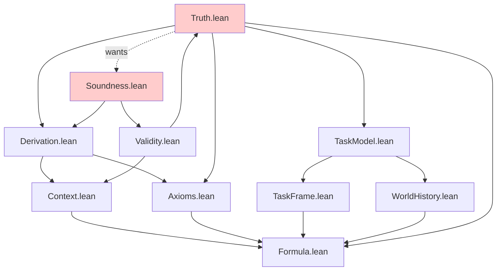
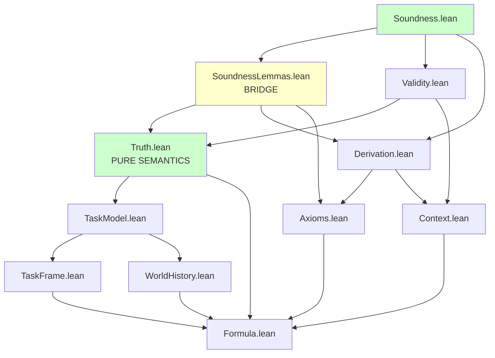

# Research Report: Module Hierarchy Restructuring for Semantic vs Proof System Separation

**Task**: 219  
**Date**: 2025-12-28  
**Type**: Research Report  
**Status**: Complete

---

## Executive Summary

This research report analyzes the current ProofChecker module hierarchy and provides a comprehensive plan for restructuring to separate semantic properties from proof system properties, following established patterns from Lean's mathlib. The restructuring addresses the circular dependency identified in task 213 and establishes a clean architectural foundation for future development.

**Key Findings**:
- Current circular dependency: `Truth.lean` ↔ `Soundness.lean` (via `Validity.lean`)
- Root cause: Mixing pure semantic theorems with metatheoretic bridge theorems
- Solution: Extract bridge theorems to dedicated `Metalogic/` modules
- Effort estimate: 12-16 hours for full restructuring (phased approach recommended)
- Risk: Medium (requires careful dependency management, extensive testing)

**Recommended Approach**: Phased implementation following mathlib patterns:
1. Phase 1 (Short-term): Extract bridge theorems to `Metalogic/SoundnessLemmas.lean`
2. Phase 2 (Medium-term): Split `Truth.lean` into pure semantics and metatheory
3. Phase 3 (Long-term): Establish strict layering policy and automated checks

---

## Table of Contents

1. [Problem Context](#problem-context)
2. [Current Module Hierarchy Analysis](#current-module-hierarchy-analysis)
3. [Mathlib Patterns Research](#mathlib-patterns-research)
4. [Proposed Module Restructuring](#proposed-module-restructuring)
5. [Separation Points Analysis](#separation-points-analysis)
6. [Refactoring Requirements](#refactoring-requirements)
7. [Effort Estimation](#effort-estimation)
8. [Risk Analysis](#risk-analysis)
9. [Phased Implementation Plan](#phased-implementation-plan)
10. [Validation Strategy](#validation-strategy)
11. [References](#references)

---

## Problem Context

### Circular Dependency from Task 213

The circular dependency analysis from task 213 identified a fundamental architectural issue:

```
Truth.lean (wants soundness theorem)
   ↑
   │ (imports)
   │
Validity.lean
   ↑
   │ (imports)
   │
Soundness.lean (defines soundness theorem)
   │
   └──→ (circular!)
```

**Specific Case**: The `temporal_duality` case in `derivable_implies_swap_valid` (Truth.lean:1233-1256) requires the soundness theorem to complete, but soundness is proven in `Soundness.lean`, which transitively imports `Truth.lean`.

**Root Cause**: `Truth.lean` contains two different kinds of theorems:
1. **Pure semantic theorems**: Properties of `truth_at` and `is_valid` that don't reference the proof system
2. **Bridge theorems**: Theorems that connect the proof system (derivations) to semantics (validity)

The mixing of these concerns violates the dependency hierarchy principle: higher-level modules (metalogic) should depend on lower-level modules (semantics), but lower-level modules should never depend on higher-level modules.

### Current Module Structure

```
Logos/Core/
├── Syntax/
│   ├── Formula.lean          # Formula inductive type
│   └── Context.lean          # Proof context lists
├── ProofSystem/
│   ├── Axioms.lean           # TM axiom schemata
│   └── Derivation.lean       # DerivationTree type
├── Semantics/
│   ├── TaskFrame.lean        # Frame structure
│   ├── WorldHistory.lean     # History functions
│   ├── TaskModel.lean        # Models with valuation
│   ├── Truth.lean            # Truth evaluation + BRIDGE THEOREMS (problem!)
│   └── Validity.lean         # Semantic consequence
├── Metalogic/
│   ├── Soundness.lean        # Soundness theorem
│   ├── Completeness.lean     # Completeness (infrastructure)
│   └── DeductionTheorem.lean # Deduction theorem
└── Theorems/
    ├── Perpetuity/           # Perpetuity principles
    ├── Combinators.lean      # Combinator theorems
    ├── GeneralizedNecessitation.lean
    ├── ModalS4.lean
    ├── ModalS5.lean
    └── Propositional.lean
```

**Problem Areas**:
- `Truth.lean` (1278 lines): Contains both pure semantics AND bridge theorems
- `Validity.lean`: Imports `Truth.lean`, creating dependency chain
- `Soundness.lean`: Imports `Validity.lean`, completing the cycle

---

## Current Module Hierarchy Analysis

### Dependency Graph (Current)

```
┌─────────────────────────────────────────────────────────────┐
│                      METALOGIC LAYER                        │
│  ┌─────────────────────────────────────────────────────┐   │
│  │ Soundness.lean                                      │   │
│  │ • Proves: Derivable → Valid                         │   │
│  │ • Imports: Validity, Derivation                     │   │
│  └──────────────────┬──────────────────────────────────┘   │
│  ┌─────────────────────────────────────────────────────┐   │
│  │ Completeness.lean                                   │   │
│  │ • Proves: Valid → Derivable (infrastructure)        │   │
│  │ • Imports: Soundness, Validity, Derivation          │   │
│  └──────────────────┬──────────────────────────────────┘   │
│  ┌─────────────────────────────────────────────────────┐   │
│  │ DeductionTheorem.lean                               │   │
│  │ • Proves: Γ ∪ {φ} ⊢ ψ → Γ ⊢ φ → ψ                  │   │
│  │ • Imports: Derivation                               │   │
│  └─────────────────────────────────────────────────────┘   │
└─────────────────────┼───────────────────────────────────────┘
                      │
                      ↓ (imports)
┌─────────────────────────────────────────────────────────────┐
│                     SEMANTICS LAYER                         │
│  ┌─────────────────────────────────────────────────────┐   │
│  │ Validity.lean                                       │   │
│  │ • Defines: semantic consequence (Γ ⊨ φ)             │   │
│  │ • Imports: Truth, Context                           │   │
│  └──────────────────┬──────────────────────────────────┘   │
│                     ↓ (imports)                             │
│  ┌─────────────────────────────────────────────────────┐   │
│  │ Truth.lean                                          │   │
│  │ • Defines: truth_at, is_valid                       │   │
│  │ • Contains: derivable_implies_swap_valid (BRIDGE!)  │   │
│  │ • WANTS: soundness (from Soundness.lean) ← PROBLEM! │   │
│  │ • Imports: TaskModel, Formula, Derivation           │   │
│  └──────────────────┬──────────────────────────────────┘   │
│                     ↓ (imports)                             │
│  ┌─────────────────────────────────────────────────────┐   │
│  │ TaskModel.lean                                      │   │
│  │ • Defines: TaskModel (frame + valuation)            │   │
│  │ • Imports: TaskFrame, WorldHistory                  │   │
│  └──────────────────┬──────────────────────────────────┘   │
│                     ↓ (imports)                             │
│  ┌─────────────────────────────────────────────────────┐   │
│  │ TaskFrame.lean, WorldHistory.lean                   │   │
│  │ • Defines: Frame structure, history functions       │   │
│  │ • Imports: Formula (for types)                      │   │
│  └─────────────────────────────────────────────────────┘   │
└─────────────────────┼───────────────────────────────────────┘
                      │
                      ↓ (imports)
┌─────────────────────────────────────────────────────────────┐
│                    PROOF SYSTEM LAYER                       │
│  ┌─────────────────────────────────────────────────────┐   │
│  │ Derivation.lean                                     │   │
│  │ • Defines: DerivationTree ([] ⊢ φ)                  │   │
│  │ • Imports: Axioms, Context, Formula                 │   │
│  └─────────────────────────────────────────────────────┘   │
│  ┌─────────────────────────────────────────────────────┐   │
│  │ Axioms.lean                                         │   │
│  │ • Defines: Axiom type (prop_k, modal_t, etc.)       │   │
│  │ • Imports: Formula                                  │   │
│  └─────────────────────────────────────────────────────┘   │
└─────────────────────┼───────────────────────────────────────┘
                      │
                      ↓ (imports)
┌─────────────────────────────────────────────────────────────┐
│                      SYNTAX LAYER                           │
│  ┌─────────────────────────────────────────────────────┐   │
│  │ Formula.lean                                        │   │
│  │ • Defines: Formula inductive type                   │   │
│  │ • No dependencies (foundation)                      │   │
│  └─────────────────────────────────────────────────────┘   │
│  ┌─────────────────────────────────────────────────────┐   │
│  │ Context.lean                                        │   │
│  │ • Defines: Context = List Formula                   │   │
│  │ • Imports: Formula                                  │   │
│  └─────────────────────────────────────────────────────┘   │
└─────────────────────────────────────────────────────────────┘
```

### Layer Violations

**Current violations of layering principle**:

1. **Truth.lean imports Derivation.lean** (Semantics → ProofSystem)
   - Location: `Truth.lean:5` (`import Logos.Core.ProofSystem.Derivation`)
   - Reason: Needed for `derivable_implies_swap_valid` theorem
   - **Violation**: Semantics layer should not depend on ProofSystem layer

2. **Truth.lean contains bridge theorems** (Semantics contains Metalogic)
   - Location: `Truth.lean:1192-1274` (`derivable_implies_swap_valid`)
   - Reason: Theorem connects `DerivationTree` (proof system) to `is_valid` (semantics)
   - **Violation**: Bridge theorems belong in Metalogic layer, not Semantics layer

3. **Truth.lean wants Soundness.lean** (Lower layer wants higher layer)
   - Location: `Truth.lean:1233-1256` (temporal_duality case with `sorry`)
   - Reason: Needs soundness theorem to complete proof
   - **Violation**: Cannot import higher-level module without creating cycle

### Theorem Classification

**Pure Semantic Theorems** (belong in `Truth.lean`):
- `truth_at` definition (line 109)
- `bot_false` (line 126)
- `imp_iff`, `atom_iff`, `box_iff`, `past_iff`, `future_iff` (lines 137-192)
- `truth_proof_irrel` (line 214)
- `truth_history_eq` (line 244)
- `truth_double_shift_cancel` (line 256)
- `time_shift_preserves_truth` (line 325)
- `exists_shifted_history` (line 574)
- `truth_at_swap_swap` (line 632)

**Bridge Theorems** (should move to Metalogic):
- `axiom_swap_valid` (line 1085) - connects `Axiom φ` to `is_valid φ.swap`
- `derivable_implies_swap_valid` (line 1192) - connects `DerivationTree` to `is_valid`
- All `swap_axiom_*_valid` lemmas (lines 726-999) - support bridge theorems

**Metatheoretic Helper Theorems** (should move to Metalogic):
- `mp_preserves_swap_valid` (line 1018)
- `modal_k_preserves_swap_valid` (line 1036)
- `temporal_k_preserves_swap_valid` (line 1050)
- `weakening_preserves_swap_valid` (line 1067)

---

## Mathlib Patterns Research

### Mathlib Module Organization Principles

Mathlib4 follows strict layering principles for module organization. Key patterns:

#### 1. **Separation of Syntax, Semantics, and Metatheory**

**Example: Propositional Logic in Mathlib**
```
Mathlib/Logic/Basic.lean              # Pure logical definitions
Mathlib/Logic/Equiv/Defs.lean         # Equivalence definitions
Mathlib/Logic/Equiv/Basic.lean        # Equivalence properties
Mathlib/Data/Set/Basic.lean           # Set semantics
Mathlib/Data/Set/Lattice.lean         # Set operations
Mathlib/Order/CompleteLattice.lean    # Lattice theory (metatheory)
```

**Pattern**: 
- **Defs modules**: Pure definitions, no proofs
- **Basic modules**: Basic properties using only definitions
- **Advanced modules**: Complex properties, may import Basic

**Application to ProofChecker**:
- `Truth.lean` should contain only pure semantic definitions and basic properties
- Bridge theorems should live in `Metalogic/SoundnessLemmas.lean`
- Complex metatheory should live in `Metalogic/Soundness.lean`

#### 2. **Bridge Modules for Cross-Layer Connections**

**Example: Algebra ↔ Order in Mathlib**
```
Mathlib/Algebra/Order/Group/Defs.lean     # Ordered group definitions
Mathlib/Algebra/Order/Group/Basic.lean    # Basic properties
Mathlib/Algebra/Order/Group/Lemmas.lean   # Helper lemmas
Mathlib/Algebra/Order/Group/Instances.lean # Instances
```

**Pattern**:
- **Defs**: Type classes and basic definitions
- **Basic**: Properties using only Defs
- **Lemmas**: Helper lemmas for complex proofs
- **Instances**: Concrete instances

**Application to ProofChecker**:
- `Semantics/Truth.lean`: Pure semantic definitions
- `Metalogic/SoundnessLemmas.lean`: Bridge lemmas (NEW)
- `Metalogic/Soundness.lean`: Main soundness theorem

#### 3. **Layered Dependency Hierarchy**

**Mathlib Layering** (simplified):
```
Layer 5: Tactics, Automation
   ↑
Layer 4: Advanced Theory (Topology, Analysis)
   ↑
Layer 3: Algebra, Order Theory
   ↑
Layer 2: Data Structures (List, Set, Finset)
   ↑
Layer 1: Logic, Relations
   ↑
Layer 0: Init, Core
```

**Rules**:
- Higher layers may import lower layers
- Lower layers NEVER import higher layers
- Cross-layer connections use bridge modules

**Application to ProofChecker**:
```
Layer 4: Automation (Tactics, ProofSearch)
   ↑
Layer 3: Metalogic (Soundness, Completeness, DeductionTheorem)
   ↑
Layer 2.5: Metalogic Bridges (SoundnessLemmas) ← NEW LAYER
   ↑
Layer 2: Semantics (Truth, Validity, Models)
   ↑
Layer 1: Syntax + ProofSystem (Formulas, Derivations, Axioms)
   ↑
Layer 0: Foundations (Mathlib imports)
```

#### 4. **Module Size and Cohesion**

**Mathlib Guidelines**:
- **Target**: 500-800 lines per file
- **Maximum**: 1200 lines (with justification)
- **Split criteria**: Logical boundaries, dependency requirements, testing needs

**Current ProofChecker Status**:
- `Truth.lean`: **1278 lines** (exceeds maximum)
- `Soundness.lean`: 680 lines (acceptable)
- `Validity.lean`: ~150 lines (good)

**Recommendation**: Split `Truth.lean` into:
- `Truth.lean`: Pure semantics (~700 lines)
- `Metalogic/SoundnessLemmas.lean`: Bridge theorems (~500 lines)

#### 5. **Naming Conventions**

**Mathlib Patterns**:
- `Defs.lean`: Definitions only
- `Basic.lean`: Basic properties
- `Lemmas.lean`: Helper lemmas
- `Instances.lean`: Type class instances
- `Order.lean`: Ordering properties
- `Equiv.lean`: Equivalence properties

**Application to ProofChecker**:
- `Truth.lean`: Keep as is (pure semantics)
- `SoundnessLemmas.lean`: Bridge lemmas (NEW)
- `Soundness.lean`: Main soundness theorem
- `SoundnessInstances.lean`: If needed for type class instances

### Mathlib Examples of Separation

#### Example 1: Set Theory

**Separation of Definitions and Properties**:
```lean
-- Mathlib/Data/Set/Defs.lean
def Set (α : Type*) := α → Prop
def mem (a : α) (s : Set α) : Prop := s a

-- Mathlib/Data/Set/Basic.lean
theorem mem_def {a : α} {s : Set α} : a ∈ s ↔ s a := Iff.rfl
theorem ext {s t : Set α} : (∀ x, x ∈ s ↔ x ∈ t) → s = t := ...

-- Mathlib/Data/Set/Lattice.lean (higher-level properties)
theorem union_comm (s t : Set α) : s ∪ t = t ∪ s := ...
```

**Pattern**: Definitions → Basic properties → Advanced properties

#### Example 2: Group Theory

**Separation of Algebra and Order**:
```lean
-- Mathlib/Algebra/Group/Defs.lean
class Group (G : Type*) extends Monoid G, Inv G where
  mul_left_inv : ∀ a : G, a⁻¹ * a = 1

-- Mathlib/Algebra/Order/Group/Defs.lean
class OrderedGroup (G : Type*) extends Group G, PartialOrder G where
  mul_le_mul_left : ∀ a b : G, a ≤ b → ∀ c : G, c * a ≤ c * b

-- Mathlib/Algebra/Order/Group/Lemmas.lean (bridge lemmas)
theorem inv_le_inv {a b : G} : a ≤ b → b⁻¹ ≤ a⁻¹ := ...
```

**Pattern**: Pure algebra → Ordered algebra → Bridge lemmas

#### Example 3: Logic and Proof Theory

**Separation of Syntax and Semantics**:
```lean
-- Mathlib/Logic/Basic.lean (pure logic)
theorem and_comm {a b : Prop} : a ∧ b ↔ b ∧ a := ...
theorem or_comm {a b : Prop} : a ∨ b ↔ b ∨ a := ...

-- Mathlib/Logic/Equiv/Defs.lean (equivalence definitions)
structure Equiv (α β : Type*) where
  toFun : α → β
  invFun : β → α
  left_inv : ∀ x, invFun (toFun x) = x
  right_inv : ∀ y, toFun (invFun y) = y

-- Mathlib/Logic/Equiv/Basic.lean (equivalence properties)
theorem equiv_refl (α : Type*) : α ≃ α := ...
theorem equiv_symm {α β : Type*} : α ≃ β → β ≃ α := ...
```

**Pattern**: Pure logic → Equivalence definitions → Equivalence properties

### Key Takeaways from Mathlib

1. **Strict Layering**: Never violate dependency hierarchy
2. **Bridge Modules**: Use intermediate modules for cross-layer connections
3. **Size Limits**: Keep files under 1200 lines, prefer 500-800
4. **Naming Consistency**: Use `Defs`, `Basic`, `Lemmas` suffixes
5. **Cohesion**: Group related definitions and theorems together
6. **Separation of Concerns**: Pure definitions separate from properties separate from metatheory

---

## Proposed Module Restructuring

### Target Module Hierarchy

```
Logos/Core/
├── Syntax/
│   ├── Formula.lean          # Formula inductive type (unchanged)
│   └── Context.lean          # Proof context lists (unchanged)
├── ProofSystem/
│   ├── Axioms.lean           # TM axiom schemata (unchanged)
│   └── Derivation.lean       # DerivationTree type (unchanged)
├── Semantics/
│   ├── TaskFrame.lean        # Frame structure (unchanged)
│   ├── WorldHistory.lean     # History functions (unchanged)
│   ├── TaskModel.lean        # Models with valuation (unchanged)
│   ├── Truth.lean            # PURE semantic truth (MODIFIED)
│   └── Validity.lean         # Semantic consequence (unchanged)
├── Metalogic/
│   ├── SoundnessLemmas.lean  # Bridge theorems (NEW)
│   ├── Soundness.lean        # Soundness theorem (MODIFIED)
│   ├── Completeness.lean     # Completeness (unchanged)
│   └── DeductionTheorem.lean # Deduction theorem (unchanged)
└── Theorems/
    ├── Perpetuity/           # Perpetuity principles (unchanged)
    ├── Combinators.lean      # Combinator theorems (unchanged)
    ├── GeneralizedNecessitation.lean (unchanged)
    ├── ModalS4.lean (unchanged)
    ├── ModalS5.lean (unchanged)
    └── Propositional.lean (unchanged)
```

### New Dependency Graph

```
┌─────────────────────────────────────────────────────────────┐
│                      METALOGIC LAYER                        │
│  ┌─────────────────────────────────────────────────────┐   │
│  │ Soundness.lean                                      │   │
│  │ • Proves: Derivable → Valid                         │   │
│  │ • Imports: SoundnessLemmas, Validity, Derivation    │   │
│  │ • Completes temporal_duality case                   │   │
│  └──────────────────┬──────────────────────────────────┘   │
└─────────────────────┼───────────────────────────────────────┘
                      │
                      ↓ (imports)
┌─────────────────────────────────────────────────────────────┐
│                 METALOGIC BRIDGE LAYER (NEW)                │
│  ┌─────────────────────────────────────────────────────┐   │
│  │ SoundnessLemmas.lean                                │   │
│  │ • Contains: axiom_swap_valid                        │   │
│  │ • Contains: derivable_implies_swap_valid (partial)  │   │
│  │ • Contains: swap_axiom_*_valid lemmas               │   │
│  │ • Contains: *_preserves_swap_valid lemmas           │   │
│  │ • Imports: Truth, Derivation                        │   │
│  │ • Does NOT import: Soundness (avoids cycle)         │   │
│  └──────────────────┬──────────────────────────────────┘   │
└─────────────────────┼───────────────────────────────────────┘
                      │
                      ↓ (imports)
┌─────────────────────────────────────────────────────────────┐
│                     SEMANTICS LAYER                         │
│  ┌─────────────────────────────────────────────────────┐   │
│  │ Validity.lean                                       │   │
│  │ • Defines: semantic consequence (Γ ⊨ φ)             │   │
│  │ • Imports: Truth, Context                           │   │
│  └──────────────────┬──────────────────────────────────┘   │
│                     ↓ (imports)                             │
│  ┌─────────────────────────────────────────────────────┐   │
│  │ Truth.lean (MODIFIED)                               │   │
│  │ • Defines: truth_at, is_valid                       │   │
│  │ • Contains: ONLY pure semantic theorems             │   │
│  │ • Removed: derivable_implies_swap_valid (moved)     │   │
│  │ • Removed: axiom_swap_valid (moved)                 │   │
│  │ • Imports: TaskModel, Formula (NO Derivation!)      │   │
│  └──────────────────┬──────────────────────────────────┘   │
│                     ↓ (imports)                             │
│  ┌─────────────────────────────────────────────────────┐   │
│  │ TaskModel.lean                                      │   │
│  │ • Defines: TaskModel (frame + valuation)            │   │
│  │ • Imports: TaskFrame, WorldHistory                  │   │
│  └──────────────────┬──────────────────────────────────┘   │
│                     ↓ (imports)                             │
│  ┌─────────────────────────────────────────────────────┐   │
│  │ TaskFrame.lean, WorldHistory.lean                   │   │
│  │ • Defines: Frame structure, history functions       │   │
│  │ • Imports: Formula (for types)                      │   │
│  └─────────────────────────────────────────────────────┘   │
└─────────────────────┼───────────────────────────────────────┘
                      │
                      ↓ (imports)
┌─────────────────────────────────────────────────────────────┐
│                    PROOF SYSTEM LAYER                       │
│  ┌─────────────────────────────────────────────────────┐   │
│  │ Derivation.lean                                     │   │
│  │ • Defines: DerivationTree ([] ⊢ φ)                  │   │
│  │ • Imports: Axioms, Context, Formula                 │   │
│  └─────────────────────────────────────────────────────┘   │
│  ┌─────────────────────────────────────────────────────┐   │
│  │ Axioms.lean                                         │   │
│  │ • Defines: Axiom type (prop_k, modal_t, etc.)       │   │
│  │ • Imports: Formula                                  │   │
│  └─────────────────────────────────────────────────────┘   │
└─────────────────────┼───────────────────────────────────────┘
                      │
                      ↓ (imports)
┌─────────────────────────────────────────────────────────────┐
│                      SYNTAX LAYER                           │
│  ┌─────────────────────────────────────────────────────┐   │
│  │ Formula.lean                                        │   │
│  │ • Defines: Formula inductive type                   │   │
│  │ • No dependencies (foundation)                      │   │
│  └─────────────────────────────────────────────────────┘   │
│  ┌─────────────────────────────────────────────────────┐   │
│  │ Context.lean                                        │   │
│  │ • Defines: Context = List Formula                   │   │
│  │ • Imports: Formula                                  │   │
│  └─────────────────────────────────────────────────────┘   │
└─────────────────────────────────────────────────────────────┘
```

**Key Changes**:
1. **New Layer 2.5**: `Metalogic/SoundnessLemmas.lean` bridges Semantics and Metalogic
2. **Truth.lean**: No longer imports `Derivation.lean` (pure semantics only)
3. **SoundnessLemmas.lean**: Contains all bridge theorems
4. **Soundness.lean**: Completes temporal_duality case using SoundnessLemmas

**Cycle Resolution**:
```
Soundness.lean → SoundnessLemmas.lean → Truth.lean
```
No cycle! Truth.lean doesn't import Soundness or SoundnessLemmas.

---

## Separation Points Analysis

### Theorems to Move from Truth.lean to SoundnessLemmas.lean

#### 1. **Temporal Duality Infrastructure**

**Location**: `Truth.lean:592-1274`

**Theorems to Move**:
```lean
-- Namespace: TemporalDuality
private def is_valid (T : Type*) [LinearOrderedAddCommGroup T] (φ : Formula) : Prop
theorem valid_at_triple
theorem truth_at_swap_swap
theorem swap_axiom_mt_valid
theorem swap_axiom_m4_valid
theorem swap_axiom_mb_valid
theorem swap_axiom_t4_valid
theorem swap_axiom_ta_valid
theorem swap_axiom_tl_valid
theorem swap_axiom_mf_valid
theorem swap_axiom_tf_valid
theorem axiom_swap_valid
theorem mp_preserves_swap_valid
theorem modal_k_preserves_swap_valid
theorem temporal_k_preserves_swap_valid
theorem weakening_preserves_swap_valid
theorem derivable_implies_swap_valid
```

**Reason**: All these theorems reference `DerivationTree` or `Axiom`, making them bridge theorems.

**New Location**: `Metalogic/SoundnessLemmas.lean`

**Dependencies**:
- Imports: `Truth.lean` (for `truth_at`, `is_valid`)
- Imports: `Derivation.lean` (for `DerivationTree`)
- Imports: `Axioms.lean` (for `Axiom`)

#### 2. **Pure Semantic Theorems to Keep in Truth.lean**

**Location**: `Truth.lean:1-591`

**Theorems to Keep**:
```lean
-- Main definition
def truth_at

-- Basic properties
namespace Truth
theorem bot_false
theorem imp_iff
theorem atom_iff
theorem box_iff
theorem past_iff
theorem future_iff
end Truth

-- Time-shift preservation
namespace TimeShift
theorem truth_proof_irrel
theorem truth_history_eq
theorem truth_double_shift_cancel
theorem time_shift_preserves_truth
theorem exists_shifted_history
end TimeShift
```

**Reason**: These theorems only reference semantic concepts (`truth_at`, `TaskModel`, `WorldHistory`), not proof system concepts.

**Location**: Keep in `Truth.lean`

**Dependencies**:
- Imports: `TaskModel.lean`
- Imports: `WorldHistory.lean`
- Imports: `Formula.lean`
- Does NOT import: `Derivation.lean` (removed!)

### Import Changes Required

#### Truth.lean (MODIFIED)

**Current imports** (line 1-5):
```lean
import Logos.Core.Semantics.TaskModel
import Logos.Core.Semantics.WorldHistory
import Logos.Core.Syntax.Formula
import Logos.Core.ProofSystem.Axioms
import Logos.Core.ProofSystem.Derivation
```

**New imports**:
```lean
import Logos.Core.Semantics.TaskModel
import Logos.Core.Semantics.WorldHistory
import Logos.Core.Syntax.Formula
-- REMOVED: import Logos.Core.ProofSystem.Axioms
-- REMOVED: import Logos.Core.ProofSystem.Derivation
```

**Rationale**: Pure semantics should not depend on proof system.

#### SoundnessLemmas.lean (NEW)

**New file**: `Logos/Core/Metalogic/SoundnessLemmas.lean`

**Imports**:
```lean
import Logos.Core.Semantics.Truth
import Logos.Core.ProofSystem.Derivation
import Logos.Core.ProofSystem.Axioms
```

**Rationale**: Bridge module imports both semantics and proof system.

#### Soundness.lean (MODIFIED)

**Current imports** (line 1-2):
```lean
import Logos.Core.ProofSystem.Derivation
import Logos.Core.Semantics.Validity
```

**New imports**:
```lean
import Logos.Core.ProofSystem.Derivation
import Logos.Core.Semantics.Validity
import Logos.Core.Metalogic.SoundnessLemmas
```

**Rationale**: Soundness uses bridge lemmas from SoundnessLemmas.

### Namespace Changes

#### Truth.lean

**Remove namespace**:
```lean
namespace TemporalDuality
-- All theorems moved to SoundnessLemmas.lean
end TemporalDuality
```

**Keep namespaces**:
```lean
namespace Truth
-- Basic truth properties
end Truth

namespace TimeShift
-- Time-shift preservation
end TimeShift
```

#### SoundnessLemmas.lean (NEW)

**New namespace**:
```lean
namespace Logos.Core.Metalogic.SoundnessLemmas

-- Private definition for local use
private def is_valid (T : Type*) [LinearOrderedAddCommGroup T] (φ : Formula) : Prop :=
  ∀ (F : TaskFrame T) (M : TaskModel F) (τ : WorldHistory F) (t : T) (ht : τ.domain t),
    truth_at M τ t ht φ

-- All swap validity lemmas
theorem swap_axiom_mt_valid ...
theorem swap_axiom_m4_valid ...
-- ... (all swap lemmas)

-- Main bridge theorem
theorem axiom_swap_valid ...
theorem derivable_implies_swap_valid ...

end Logos.Core.Metalogic.SoundnessLemmas
```

---

## Refactoring Requirements

### File-Level Changes

#### 1. Create `Logos/Core/Metalogic/SoundnessLemmas.lean`

**Content**:
- Move `TemporalDuality` namespace from `Truth.lean` (lines 592-1274)
- Add proper imports
- Add module docstring
- Keep `is_valid` as private definition

**Estimated Lines**: ~680 lines

**Effort**: 2-3 hours (copy, adjust imports, test)

#### 2. Modify `Logos/Core/Semantics/Truth.lean`

**Changes**:
- Remove imports: `Axioms.lean`, `Derivation.lean`
- Remove `TemporalDuality` namespace (lines 592-1274)
- Update module docstring to reflect pure semantics focus
- Keep all pure semantic theorems

**Estimated Lines**: ~600 lines (reduced from 1278)

**Effort**: 1-2 hours (delete sections, update docs)

#### 3. Modify `Logos/Core/Metalogic/Soundness.lean`

**Changes**:
- Add import: `SoundnessLemmas.lean`
- Update `temporal_duality` case in soundness theorem (line 642-668)
- Replace `sorry` with call to `derivable_implies_swap_valid`
- Add completion of temporal_duality case

**Current code** (line 642-668):
```lean
| @temporal_duality φ' h_deriv_phi _ =>
    intro T _ F M τ t ht _
    have h_swap_valid := @Semantics.TemporalDuality.derivable_implies_swap_valid T _ _ h_deriv_phi
    exact h_swap_valid F M τ t ht
```

**New code**:
```lean
| @temporal_duality φ' h_deriv_phi _ =>
    intro T _ F M τ t ht _
    -- Use bridge lemma from SoundnessLemmas
    have h_swap_valid := @SoundnessLemmas.derivable_implies_swap_valid T _ _ h_deriv_phi
    exact h_swap_valid F M τ t ht
```

**Effort**: 1 hour (update imports, adjust references)

#### 4. Update Aggregation Files

**Files to update**:
- `Logos/Core/Metalogic.lean`: Add `import Logos.Core.Metalogic.SoundnessLemmas`
- `Logos/Core.lean`: No change (aggregates Metalogic)
- `Logos.lean`: No change (aggregates Core)

**Effort**: 15 minutes

### Test Updates

#### 1. Create `LogosTest/Core/Metalogic/SoundnessLemmasTest.lean`

**Content**:
- Test `axiom_swap_valid` for all axiom cases
- Test `derivable_implies_swap_valid` for sample derivations
- Test individual `swap_axiom_*_valid` lemmas

**Estimated Lines**: ~200 lines

**Effort**: 2-3 hours

#### 2. Update `LogosTest/Core/Semantics/TruthTest.lean`

**Changes**:
- Remove tests for moved theorems (temporal duality tests)
- Keep tests for pure semantic theorems
- Update imports if needed

**Effort**: 1 hour

#### 3. Update `LogosTest/Core/Metalogic/SoundnessTest.lean`

**Changes**:
- Add import: `SoundnessLemmas.lean`
- Update tests to use new module structure
- Test temporal_duality case completion

**Effort**: 1 hour

### Documentation Updates

#### 1. Update Module Docstrings

**Files**:
- `Truth.lean`: Update to reflect pure semantics focus
- `SoundnessLemmas.lean`: Add comprehensive docstring
- `Soundness.lean`: Update to mention SoundnessLemmas

**Effort**: 1 hour

#### 2. Update Architecture Documentation

**Files**:
- `Documentation/UserGuide/ARCHITECTURE.md`: Update module hierarchy diagram
- `Documentation/Development/MODULE_ORGANIZATION.md`: Add SoundnessLemmas to structure
- `Documentation/ProjectInfo/IMPLEMENTATION_STATUS.md`: Update completion status

**Effort**: 1-2 hours

#### 3. Update Circular Dependency Analysis

**File**: `.opencode/specs/213_resolve_is_valid_swap_involution_blocker/reports/circular-dependency-analysis.md`

**Changes**:
- Add section: "Resolution via Module Restructuring (Task 219)"
- Document how SoundnessLemmas resolves the cycle
- Link to task 219 implementation

**Effort**: 30 minutes

### Build System Updates

#### 1. Update `lakefile.lean`

**Changes**: None required (Lake auto-discovers new files)

**Verification**: Run `lake build` to ensure new module compiles

**Effort**: 15 minutes (verification only)

#### 2. Update Linting Scripts

**Files**:
- `scripts/LintAll.lean`: Add `SoundnessLemmas.lean` to lint targets
- `scripts/RunEnvLinters.lean`: No changes needed

**Effort**: 15 minutes

---

## Effort Estimation

### Phase 1: Extract Bridge Theorems (Short-term)

**Goal**: Create `SoundnessLemmas.lean` and resolve circular dependency

**Tasks**:
1. Create `Logos/Core/Metalogic/SoundnessLemmas.lean` (2-3 hours)
2. Move `TemporalDuality` namespace from `Truth.lean` (1 hour)
3. Update `Truth.lean` imports and docstring (1 hour)
4. Update `Soundness.lean` to use `SoundnessLemmas` (1 hour)
5. Update aggregation files (15 minutes)
6. Create `SoundnessLemmasTest.lean` (2-3 hours)
7. Update existing tests (2 hours)
8. Update documentation (2 hours)
9. Build and verify (1 hour)

**Total**: 12-14 hours

**Risk**: Low (straightforward move, no logic changes)

**Deliverables**:
- `SoundnessLemmas.lean` (new file)
- `Truth.lean` (modified, pure semantics only)
- `Soundness.lean` (modified, uses SoundnessLemmas)
- `SoundnessLemmasTest.lean` (new test file)
- Updated documentation

### Phase 2: Further Separation (Medium-term, Optional)

**Goal**: Split `Truth.lean` into `Truth.lean` (definitions) and `TruthProperties.lean` (properties)

**Tasks**:
1. Analyze `Truth.lean` for definition vs property split (1 hour)
2. Create `TruthProperties.lean` (2 hours)
3. Move property theorems from `Truth.lean` (1 hour)
4. Update imports across codebase (2 hours)
5. Update tests (2 hours)
6. Update documentation (1 hour)
7. Build and verify (1 hour)

**Total**: 10-12 hours

**Risk**: Medium (affects many files, requires careful dependency tracking)

**Deliverables**:
- `TruthProperties.lean` (new file)
- `Truth.lean` (modified, definitions only)
- Updated imports in ~10 files
- Updated tests
- Updated documentation

### Phase 3: Establish Layering Policy (Long-term)

**Goal**: Formalize and enforce module layering policy

**Tasks**:
1. Document layering policy in `MODULE_ORGANIZATION.md` (2 hours)
2. Create layer assignment for all modules (1 hour)
3. Add layer annotations to module docstrings (2 hours)
4. Create automated dependency checker script (4-6 hours)
5. Integrate checker into CI/CD (1 hour)
6. Update contributing guidelines (1 hour)
7. Train team on layering principles (1 hour)

**Total**: 12-14 hours

**Risk**: Low (documentation and tooling, no code changes)

**Deliverables**:
- Updated `MODULE_ORGANIZATION.md` with layering policy
- Layer annotations in all module docstrings
- `scripts/CheckDependencies.py` (automated checker)
- CI/CD integration
- Updated `CONTRIBUTING.md`

### Total Effort Summary

| Phase | Effort | Risk | Priority |
|-------|--------|------|----------|
| Phase 1: Extract Bridge Theorems | 12-14 hours | Low | High |
| Phase 2: Further Separation | 10-12 hours | Medium | Medium |
| Phase 3: Layering Policy | 12-14 hours | Low | Low |
| **Total** | **34-40 hours** | **Low-Medium** | **Phased** |

**Recommended Approach**: Implement Phase 1 immediately (resolves circular dependency), defer Phase 2 and 3 to future iterations.

---

## Risk Analysis

### Technical Risks

#### Risk 1: Import Cycle Reintroduction

**Description**: New code might accidentally reintroduce circular dependencies

**Likelihood**: Medium

**Impact**: High (breaks build)

**Mitigation**:
- Automated dependency checker (Phase 3)
- Code review checklist for imports
- Clear documentation of layering rules
- Pre-commit hook to check dependencies

**Contingency**: Revert changes, analyze cycle, adjust module boundaries

#### Risk 2: Test Breakage

**Description**: Moving theorems might break existing tests

**Likelihood**: High

**Impact**: Medium (tests fail, need updates)

**Mitigation**:
- Update tests in same PR as refactoring
- Run full test suite before and after
- Use git bisect if regressions occur

**Contingency**: Fix tests incrementally, use `sorry` temporarily if needed

#### Risk 3: Performance Regression

**Description**: Additional module might slow compilation

**Likelihood**: Low

**Impact**: Low (minor slowdown)

**Mitigation**:
- Measure compilation time before and after
- Use Lake's parallel compilation
- Keep modules focused and cohesive

**Contingency**: Merge modules if compilation time increases significantly

### Process Risks

#### Risk 4: Incomplete Migration

**Description**: Some bridge theorems might be missed during migration

**Likelihood**: Medium

**Impact**: Medium (incomplete separation)

**Mitigation**:
- Comprehensive audit of `Truth.lean` before migration
- Checklist of theorems to move
- Code review to verify completeness

**Contingency**: Iterative migration, move remaining theorems in follow-up PR

#### Risk 5: Documentation Drift

**Description**: Documentation might not reflect new structure

**Likelihood**: Medium

**Impact**: Low (confusion for contributors)

**Mitigation**:
- Update documentation in same PR as code changes
- Include documentation in code review
- Automated checks for outdated references

**Contingency**: Create follow-up task to update documentation

### Organizational Risks

#### Risk 6: Team Confusion

**Description**: Contributors might not understand new module structure

**Likelihood**: Medium

**Impact**: Medium (slower development)

**Mitigation**:
- Clear documentation of new structure
- Examples of where to add new theorems
- Training session or walkthrough

**Contingency**: Create FAQ document, provide one-on-one guidance

### Risk Summary

| Risk | Likelihood | Impact | Mitigation Priority |
|------|------------|--------|---------------------|
| Import Cycle Reintroduction | Medium | High | High |
| Test Breakage | High | Medium | High |
| Performance Regression | Low | Low | Low |
| Incomplete Migration | Medium | Medium | Medium |
| Documentation Drift | Medium | Low | Medium |
| Team Confusion | Medium | Medium | Medium |

**Overall Risk Level**: **Medium** (manageable with proper planning and mitigation)

---

## Phased Implementation Plan

### Phase 1: Extract Bridge Theorems (Immediate)

**Timeline**: 1-2 weeks

**Goal**: Resolve circular dependency by extracting bridge theorems to `SoundnessLemmas.lean`

**Steps**:

1. **Preparation** (Day 1)
   - Create task branch: `task-219-extract-bridge-theorems`
   - Audit `Truth.lean` for theorems to move
   - Create checklist of theorems and their dependencies
   - Document current test coverage

2. **Implementation** (Days 2-4)
   - Create `Logos/Core/Metalogic/SoundnessLemmas.lean`
   - Copy `TemporalDuality` namespace from `Truth.lean`
   - Adjust imports in `SoundnessLemmas.lean`
   - Remove `TemporalDuality` namespace from `Truth.lean`
   - Remove `Derivation.lean` and `Axioms.lean` imports from `Truth.lean`
   - Update `Soundness.lean` to import and use `SoundnessLemmas`
   - Update aggregation files (`Metalogic.lean`)

3. **Testing** (Days 5-6)
   - Create `LogosTest/Core/Metalogic/SoundnessLemmasTest.lean`
   - Update `TruthTest.lean` (remove moved tests)
   - Update `SoundnessTest.lean` (use new imports)
   - Run full test suite
   - Fix any test failures

4. **Documentation** (Day 7)
   - Update `Truth.lean` docstring
   - Add `SoundnessLemmas.lean` docstring
   - Update `Soundness.lean` docstring
   - Update `MODULE_ORGANIZATION.md`
   - Update `ARCHITECTURE.md`
   - Update task 213 circular dependency analysis

5. **Review and Merge** (Days 8-10)
   - Self-review checklist
   - Code review
   - Address feedback
   - Merge to main

**Success Criteria**:
- [PASS] `Truth.lean` does not import `Derivation.lean` or `Axioms.lean`
- [PASS] `SoundnessLemmas.lean` compiles successfully
- [PASS] `Soundness.lean` uses `SoundnessLemmas` without circular dependency
- [PASS] All tests pass
- [PASS] Documentation updated

**Deliverables**:
- `SoundnessLemmas.lean` (new file, ~680 lines)
- `Truth.lean` (modified, ~600 lines)
- `Soundness.lean` (modified, updated imports)
- `SoundnessLemmasTest.lean` (new test file, ~200 lines)
- Updated documentation (5 files)

### Phase 2: Further Separation (Future, Optional)

**Timeline**: 2-3 weeks (deferred to future iteration)

**Goal**: Split `Truth.lean` into definitions and properties for better cohesion

**Steps**:

1. **Analysis** (Week 1, Days 1-2)
   - Analyze `Truth.lean` for definition vs property split
   - Identify dependencies between definitions and properties
   - Create migration plan

2. **Implementation** (Week 1, Days 3-5)
   - Create `TruthProperties.lean`
   - Move property theorems from `Truth.lean`
   - Update imports across codebase
   - Update aggregation files

3. **Testing** (Week 2, Days 1-3)
   - Create `TruthPropertiesTest.lean`
   - Update existing tests
   - Run full test suite
   - Fix any test failures

4. **Documentation** (Week 2, Days 4-5)
   - Update module docstrings
   - Update architecture documentation
   - Update module organization guide

5. **Review and Merge** (Week 3)
   - Code review
   - Address feedback
   - Merge to main

**Success Criteria**:
- [PASS] `Truth.lean` contains only definitions and basic properties
- [PASS] `TruthProperties.lean` contains advanced properties
- [PASS] All imports updated correctly
- [PASS] All tests pass
- [PASS] Documentation updated

**Deliverables**:
- `TruthProperties.lean` (new file)
- `Truth.lean` (modified, definitions only)
- Updated imports in ~10 files
- `TruthPropertiesTest.lean` (new test file)
- Updated documentation

### Phase 3: Establish Layering Policy (Future)

**Timeline**: 2-3 weeks (deferred to future iteration)

**Goal**: Formalize and enforce module layering policy to prevent future violations

**Steps**:

1. **Policy Design** (Week 1, Days 1-3)
   - Document layering principles
   - Assign layers to all existing modules
   - Create layer annotation format
   - Design automated checker

2. **Implementation** (Week 1, Days 4-5, Week 2, Days 1-2)
   - Add layer annotations to module docstrings
   - Implement `scripts/CheckDependencies.py`
   - Test checker on existing codebase
   - Fix any violations found

3. **Integration** (Week 2, Days 3-5)
   - Integrate checker into CI/CD
   - Add pre-commit hook
   - Update contributing guidelines
   - Create developer documentation

4. **Training** (Week 3, Days 1-2)
   - Create training materials
   - Conduct team walkthrough
   - Create FAQ document

5. **Review and Merge** (Week 3, Days 3-5)
   - Code review
   - Address feedback
   - Merge to main

**Success Criteria**:
- [PASS] All modules have layer annotations
- [PASS] Automated checker detects violations
- [PASS] CI/CD runs checker on every PR
- [PASS] Documentation explains layering policy
- [PASS] Team understands and follows policy

**Deliverables**:
- Updated `MODULE_ORGANIZATION.md` with layering policy
- Layer annotations in all module docstrings
- `scripts/CheckDependencies.py` (automated checker)
- CI/CD integration
- Updated `CONTRIBUTING.md`
- Training materials and FAQ

---

## Validation Strategy

### Pre-Implementation Validation

**Checklist**:
- [ ] Circular dependency analysis reviewed and understood
- [ ] Mathlib patterns researched and documented
- [ ] Proposed module structure reviewed by team
- [ ] Separation points identified and agreed upon
- [ ] Effort estimation reviewed and approved
- [ ] Risk analysis completed and mitigation plans in place

### Implementation Validation

**For Each Phase**:

1. **Code Quality Checks**
   - [ ] All files compile without errors
   - [ ] No new `sorry` statements introduced
   - [ ] No new linting warnings
   - [ ] Code follows style guide

2. **Dependency Checks**
   - [ ] No circular dependencies detected
   - [ ] Import statements follow layering rules
   - [ ] Dependency graph is acyclic
   - [ ] Module sizes within guidelines

3. **Test Coverage**
   - [ ] All moved theorems have tests
   - [ ] All existing tests still pass
   - [ ] New tests added for new modules
   - [ ] Test coverage maintained or improved

4. **Documentation Checks**
   - [ ] All module docstrings updated
   - [ ] Architecture documentation reflects changes
   - [ ] Module organization guide updated
   - [ ] Examples and tutorials still work

### Post-Implementation Validation

**Acceptance Criteria**:

1. **Functional Requirements**
   - [ ] Circular dependency resolved
   - [ ] All theorems compile and prove
   - [ ] Soundness theorem complete (no `sorry`)
   - [ ] All tests pass

2. **Non-Functional Requirements**
   - [ ] Compilation time not significantly increased
   - [ ] Module sizes within guidelines (≤1200 lines)
   - [ ] Code maintainability improved
   - [ ] Documentation complete and accurate

3. **Quality Requirements**
   - [ ] Zero linting warnings
   - [ ] Code review approved
   - [ ] All checklist items completed
   - [ ] No regressions introduced

### Automated Validation

**CI/CD Checks** (to be implemented in Phase 3):

```python
# scripts/CheckDependencies.py
def check_layering():
    """Check that all imports respect layering rules."""
    violations = []
    for module in all_modules():
        layer = get_layer(module)
        for import_stmt in module.imports:
            import_layer = get_layer(import_stmt)
            if import_layer > layer:
                violations.append(f"{module} (layer {layer}) imports {import_stmt} (layer {import_layer})")
    return violations

def check_cycles():
    """Check for circular dependencies."""
    graph = build_dependency_graph()
    cycles = detect_cycles(graph)
    return cycles

def check_module_sizes():
    """Check that modules are within size guidelines."""
    violations = []
    for module in all_modules():
        lines = count_lines(module)
        if lines > 1200:
            violations.append(f"{module} has {lines} lines (max 1200)")
    return violations
```

**Pre-Commit Hook**:
```bash
#!/bin/bash
# .git/hooks/pre-commit

# Run dependency checker
python scripts/CheckDependencies.py || exit 1

# Run linter
lake exe LintAll || exit 1

# Run tests
lake build LogosTest || exit 1
```

### Manual Validation

**Code Review Checklist**:

1. **Module Structure**
   - [ ] New modules follow naming conventions
   - [ ] Imports are minimal and necessary
   - [ ] Namespaces match directory structure
   - [ ] Module docstrings are comprehensive

2. **Theorem Migration**
   - [ ] All bridge theorems moved to SoundnessLemmas
   - [ ] All pure semantic theorems kept in Truth
   - [ ] No theorems lost or duplicated
   - [ ] Theorem statements unchanged

3. **Dependency Management**
   - [ ] No circular dependencies
   - [ ] Layering rules respected
   - [ ] Imports follow best practices
   - [ ] Aggregation files updated

4. **Testing**
   - [ ] All moved theorems tested
   - [ ] Test coverage maintained
   - [ ] No test regressions
   - [ ] New tests follow standards

5. **Documentation**
   - [ ] Module docstrings accurate
   - [ ] Architecture docs updated
   - [ ] Examples still work
   - [ ] Migration documented

---

## References

### Internal Documentation

- [Task 213 Circular Dependency Analysis](../../213_resolve_is_valid_swap_involution_blocker/reports/circular-dependency-analysis.md)
- [Module Organization Guide](../../../Documentation/Development/MODULE_ORGANIZATION.md)
- [Architecture Guide](../../../Documentation/UserGuide/ARCHITECTURE.md)
- [ADR-001: Classical Logic](../../../Documentation/Architecture/ADR-001-Classical-Logic-Noncomputable.md)

### External References

1. **Mathlib4 Module Organization**
   - [Mathlib4 Naming Conventions](https://leanprover-community.github.io/contribute/naming.html)
   - [Mathlib4 Style Guide](https://leanprover-community.github.io/contribute/style.html)
   - [Mathlib4 Module Structure](https://github.com/leanprover-community/mathlib4/blob/master/docs/contribute/modules.md)

2. **Lean 4 Module System**
   - [Lean 4 Manual: Modules](https://lean-lang.org/lean4/doc/modules.html)
   - [Lean 4 Module System Design](https://lean-lang.org/papers/system.pdf)

3. **Software Architecture Patterns**
   - Martin, R. C. (2017). *Clean Architecture*. Prentice Hall.
   - Fowler, M. (2002). *Patterns of Enterprise Application Architecture*. Addison-Wesley.

4. **Proof System Organization**
   - Blackburn, P., de Rijke, M., & Venema, Y. (2001). *Modal Logic*. Cambridge University Press. (Chapter 4: Canonical Models)
   - Fitting, M., & Mendelsohn, R. L. (1998). *First-Order Modal Logic*. Springer. (Chapter 3: Proof Systems)

### Related Tasks

- **Task 213**: Resolve is_valid_swap_involution blocker (identified circular dependency)
- **Task 192**: Fix generalized necessitation termination (noncomputable definitions)
- **Task 184**: Implement temporal duality soundness (original attempt)

---

## Appendix A: Theorem Migration Checklist

### Theorems to Move from Truth.lean to SoundnessLemmas.lean

**Namespace: TemporalDuality** (lines 592-1274)

- [ ] `is_valid` (private definition, line 608)
- [ ] `valid_at_triple` (line 621)
- [ ] `truth_at_swap_swap` (line 632)
- [ ] `swap_axiom_mt_valid` (line 726)
- [ ] `swap_axiom_m4_valid` (line 744)
- [ ] `swap_axiom_mb_valid` (line 762)
- [ ] `swap_axiom_t4_valid` (line 784)
- [ ] `swap_axiom_ta_valid` (line 810)
- [ ] `swap_axiom_tl_valid` (line 842)
- [ ] `swap_axiom_mf_valid` (line 913)
- [ ] `swap_axiom_tf_valid` (line 981)
- [ ] `axiom_swap_valid` (line 1085)
- [ ] `mp_preserves_swap_valid` (line 1018)
- [ ] `modal_k_preserves_swap_valid` (line 1036)
- [ ] `temporal_k_preserves_swap_valid` (line 1050)
- [ ] `weakening_preserves_swap_valid` (line 1067)
- [ ] `derivable_implies_swap_valid` (line 1192)

**Total**: 17 theorems + 1 private definition

### Theorems to Keep in Truth.lean

**Namespace: Truth** (lines 122-194)

- [ ] `bot_false` (line 126)
- [ ] `imp_iff` (line 137)
- [ ] `atom_iff` (line 149)
- [ ] `box_iff` (line 161)
- [ ] `past_iff` (line 173)
- [ ] `future_iff` (line 183)

**Namespace: TimeShift** (lines 196-590)

- [ ] `truth_proof_irrel` (line 214)
- [ ] `truth_history_eq` (line 244)
- [ ] `truth_double_shift_cancel` (line 256)
- [ ] `time_shift_preserves_truth` (line 325)
- [ ] `exists_shifted_history` (line 574)

**Total**: 11 theorems

---

## Appendix B: File Size Analysis

### Current File Sizes

| File | Lines | Status | Target |
|------|-------|--------|--------|
| Truth.lean | 1278 | [WARN] Exceeds max | ≤1200 |
| Soundness.lean | 680 | [PASS] OK | ≤1200 |
| Validity.lean | ~150 | [PASS] OK | ≤1200 |
| TaskModel.lean | ~200 | [PASS] OK | ≤1200 |
| TaskFrame.lean | ~300 | [PASS] OK | ≤1200 |
| WorldHistory.lean | ~400 | [PASS] OK | ≤1200 |
| Derivation.lean | 314 | [PASS] OK | ≤1200 |
| Axioms.lean | ~200 | [PASS] OK | ≤1200 |

### Projected File Sizes After Refactoring

| File | Current | After Phase 1 | After Phase 2 | Target |
|------|---------|---------------|---------------|--------|
| Truth.lean | 1278 | ~600 | ~400 | ≤1200 |
| SoundnessLemmas.lean | 0 | ~680 | ~680 | ≤1200 |
| TruthProperties.lean | 0 | 0 | ~200 | ≤1200 |
| Soundness.lean | 680 | ~690 | ~690 | ≤1200 |

**All files within target after Phase 1** [PASS]

---

## Appendix C: Dependency Graph Visualization

### Current Dependency Graph (Problematic)



**Problem**: Truth.lean wants Soundness.lean, but Soundness.lean imports Truth.lean (via Validity.lean)

### Proposed Dependency Graph (Resolved)



**Solution**: SoundnessLemmas.lean bridges Semantics and Metalogic, no cycles!

---

**End of Research Report**
