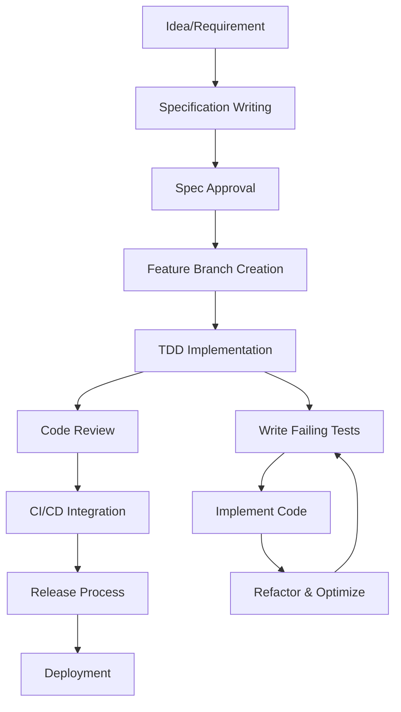

# Complete Development Workflow Guide

[← Back to Maintenance](../README.md) | [Implementation Guide →](../IMPLEMENT.md) | [Version Control →](../VERSION_CONTROL.md)

## Overview

This document provides a **complete development workflow** from initial idea to deployment, emphasizing Test-Driven Development (TDD) as mandatory, fail-fast philosophy, and systematic quality processes. This workflow ensures consistent, high-quality code delivery while maintaining the project's no-backwards-compatibility principle.

**Core Philosophy:**
- **TDD is MANDATORY** - Tests written before implementation, always
- **Fail-Fast** - Deterministic failures with helpful messages
- **No Backwards Compatibility** - Clean interfaces without legacy cruft
- **Systematic Quality** - Every step includes validation checkpoints

---

## 1. Complete Development Process Overview

### 1.1 Development Lifecycle Phases



### 1.2 Success Metrics

**Development Process Quality:**
- [ ] 100% TDD compliance (tests written before implementation)
- [ ] All phases documented with clear approval gates
- [ ] Zero backwards compatibility concessions
- [ ] All breaking changes properly managed
- [ ] Performance maintained or improved

**Code Quality Metrics:**
- [ ] >95% test coverage across all test types
- [ ] All tests passing with zero warnings
- [ ] No performance regressions
- [ ] All documentation updated
- [ ] Cross-references maintained

---

## 2. Specification Writing and Approval Process

### 2.1 Spec Creation Workflow

#### Phase 1: Research and Analysis

```bash
# 1. Analyze current codebase
grep -r "relevant_feature" src/
./run_tests.py --all  # Baseline performance

# 2. Identify impact scope
rg "affected_component" --type py
git log --oneline --grep="related_changes"
```

#### Phase 2: Specification Writing

**Spec Template Structure:**
```markdown
# Feature Name: [Descriptive Title]

## Summary
Brief description of what this feature does and why it's needed.

## Breaking Changes
- List all APIs that will change
- Document all removed functionality
- NO backwards compatibility layers

## Implementation Phases
### Phase 1: Core Infrastructure
- [ ] Task 1 with TDD requirements
- [ ] Task 2 with test criteria
- [ ] Success criteria and validation

### Phase 2: Integration
- [ ] Component integration tasks
- [ ] End-to-end testing requirements
- [ ] Performance validation

### Phase 3: Documentation
- [ ] README updates
- [ ] Cross-reference updates
- [ ] Example updates

## Test Requirements
### Unit Tests (TDD)
- Write failing tests for each component BEFORE implementation
- Test edge cases and error conditions
- Achieve >95% line coverage

### Integration Tests
- Test component interactions
- Validate complete workflows
- Test breaking change impacts

### End-to-End Tests
- User scenario validation
- Performance regression testing
- CLI command validation

## Success Criteria
- All tests passing
- No performance degradation
- Documentation complete
- Breaking changes documented
```

#### Phase 3: Spec Approval

**Approval Checklist:**
- [ ] Clear phase breakdown with TDD requirements
- [ ] Breaking changes explicitly documented
- [ ] Test requirements comprehensive
- [ ] Success criteria measurable
- [ ] Performance impact assessed
- [ ] Documentation plan included

**Approval Command:**
```bash
# Create spec file
docs/specs/plans/00X_feature_name.md

# Review and approve
git add docs/specs/plans/00X_feature_name.md
git commit -m "Add approved spec: Feature Name

- Research phase complete
- Breaking changes documented
- TDD requirements defined
- Success criteria established"
```

---

## 3. Feature Branch Workflow

### 3.1 Branch Creation and Setup

```bash
# 1. Create feature branch from approved spec
git checkout main
git pull origin main
git checkout -b feature/spec-name

# Example from spec:
git checkout -b feature/output-system-enhancement

# 2. Verify clean starting state
./run_tests.py --all
echo "Starting from clean main branch"
```

### 3.2 Branch Naming Conventions

```bash
# Feature implementation
feature/modal-operators
feature/output-system-enhancement
feature/performance-optimization

# Bug fixes
fix/z3-boolean-evaluation
fix/import-cycle-models
fix/iterator-constraint-preservation

# Refactoring
refactor/syntactic-modularization
refactor/model-package-structure
refactor/theory-agnostic-builder

# Documentation
docs/architecture-update
docs/api-documentation
```

### 3.3 Keeping Branch Current

```bash
# Daily rebase to stay current with main
git fetch origin
git rebase origin/main

# Handle conflicts maintaining new behavior
# NEVER add optional parameters for compatibility
# Update all affected code to new interface

git add .
git rebase --continue
```

---

## 4. Test-Driven Development Process (MANDATORY)

### 4.1 TDD Workflow Requirements

**MANDATORY Process - ALL code MUST follow TDD:**

#### RED Phase: Write Failing Tests
```python
# tests/unit/test_new_feature.py
"""Unit tests for NewFeature - written BEFORE implementation."""

import unittest
from unittest.mock import Mock, patch

class TestNewFeature(unittest.TestCase):
    """Test NewFeature behavior - TDD approach."""
    
    def test_new_feature_processes_valid_input_successfully(self):
        """Test NewFeature processes valid input correctly."""
        # Arrange
        input_data = {"valid": "data"}
        expected_result = "success"
        
        # Act - THIS WILL FAIL INITIALLY (RED state)
        feature = NewFeature()
        result = feature.process(input_data)
        
        # Assert
        self.assertEqual(result.status, expected_result,
                        "NewFeature should process valid input successfully")
    
    def test_new_feature_raises_error_with_invalid_input(self):
        """Test NewFeature raises ValueError with invalid input."""
        # Arrange
        invalid_input = {"invalid": "data"}
        
        # Act & Assert - WILL FAIL INITIALLY
        feature = NewFeature()
        with self.assertRaises(ValueError) as context:
            feature.process(invalid_input)
        
        self.assertIn("invalid", str(context.exception).lower())
```

```bash
# Run tests to confirm they fail (RED state)
./run_tests.py --package --components new_feature -v
# Expected: Tests fail because NewFeature doesn't exist yet
```

#### GREEN Phase: Implement Minimal Code
```python
# src/model_checker/new_feature.py
"""NewFeature implementation - minimal code to pass tests."""

class NewFeature:
    """Feature implementation to satisfy tests."""
    
    def process(self, input_data):
        """Process input data."""
        if not input_data.get("valid"):
            raise ValueError("Invalid input data")
        
        # Minimal implementation to pass tests
        class Result:
            status = "success"
        
        return Result()
```

```bash
# Run tests to confirm they pass (GREEN state)
./run_tests.py --package --components new_feature -v
# Expected: All tests pass
```

#### REFACTOR Phase: Improve Code Quality
```python
# src/model_checker/new_feature.py
"""NewFeature implementation - refactored for quality."""

from typing import Dict, Any
from dataclasses import dataclass

@dataclass
class ProcessResult:
    """Result of processing operation."""
    status: str
    data: Dict[str, Any] = None
    message: str = ""

class NewFeature:
    """Enhanced feature with better design."""
    
    def process(self, input_data: Dict[str, Any]) -> ProcessResult:
        """
        Process input data with validation.
        
        Args:
            input_data: Dictionary containing data to process
            
        Returns:
            ProcessResult with status and optional data
            
        Raises:
            ValueError: When input_data is invalid
        """
        self._validate_input(input_data)
        
        # Enhanced implementation
        processed_data = self._transform_data(input_data)
        
        return ProcessResult(
            status="success",
            data=processed_data,
            message="Processing completed successfully"
        )
    
    def _validate_input(self, input_data: Dict[str, Any]) -> None:
        """Validate input data structure."""
        if not isinstance(input_data, dict):
            raise ValueError("Input must be a dictionary")
        
        if not input_data.get("valid"):
            raise ValueError("Input data must contain valid field")
    
    def _transform_data(self, input_data: Dict[str, Any]) -> Dict[str, Any]:
        """Transform input data for processing."""
        return {
            "original": input_data,
            "processed_at": "timestamp",
            "validation_passed": True
        }
```

```bash
# Run tests again to ensure refactoring didn't break anything
./run_tests.py --package --components new_feature -v
# Expected: All tests still pass
```

### 4.2 TDD for Bug Fixes

**MANDATORY: Write test that reproduces bug BEFORE fixing:**

```python
def test_bug_reproduction_z3_boolean_evaluation_error(self):
    """Test that reproduces Z3 boolean evaluation bug."""
    # Arrange - Create conditions that trigger bug
    constraint = z3.Bool('test_var')
    
    # Act & Assert - This should initially fail with the bug
    with self.assertRaises(Exception) as context:
        # Code that currently has the bug
        if constraint:  # This causes "cannot cast to concrete Boolean"
            pass
    
    self.assertIn("concrete Boolean", str(context.exception))
```

**Then fix the bug:**
```python
# Fix: Use explicit Z3 evaluation
if not z3.is_false(constraint):
    pass
```

### 4.3 TDD Compliance Verification

**Every commit must include TDD verification:**
```bash
# Verify test exists before implementation
git log --oneline --grep="Add tests" | head -1
git log --oneline --grep="Implement" | head -1

# First commit should be tests, second should be implementation
```

### 4.4 Dual Testing Methodology

**Both testing methods MUST be used for comprehensive validation:**

#### Method 1: TDD with Test Runner
```bash
# 1. Write failing tests first
./run_tests.py --package --components models -v
# Expected: Tests fail (RED state)

# 2. Implement to pass tests
# [Implementation phase]

# 3. Verify tests pass
./run_tests.py --package --components models -v
# Expected: All tests pass (GREEN state)

# 4. Run full suite
./run_tests.py --all
# Expected: No regressions
```

#### Method 2: CLI Testing with Iterations
```bash
# Test individual theories with multiple iterations
./dev_cli.py src/model_checker/theory_lib/logos/examples.py
./dev_cli.py src/model_checker/theory_lib/logos/examples.py
./dev_cli.py src/model_checker/theory_lib/logos/examples.py

# Systematic testing across all theories
for theory in logos bimodal exclusion imposition; do
    echo "Testing $theory..."
    ./dev_cli.py src/model_checker/theory_lib/$theory/examples.py
done
```

### 4.5 TDD Success Criteria

**Implementation complete only when:**
- [ ] All tests written BEFORE implementation
- [ ] RED-GREEN-REFACTOR cycle documented in commits
- [ ] Both testing methods pass consistently
- [ ] No Z3 casting errors: "Symbolic expressions cannot be cast to concrete Boolean values"
- [ ] All edge cases and error conditions tested
- [ ] Performance maintained or improved

---

## 5. Code Review Process

### 5.1 Pre-Review Checklist

**Author responsibilities before requesting review:**

```bash
# 1. Comprehensive testing
./run_tests.py --all --verbose
echo "All tests passing: $(echo $?)"

# 2. Code quality validation
grep -n '[^[:print:][:space:]]' src/  # Unicode validation
file -i filename                        # UTF-8 check

# 3. Performance baseline
# Document any performance changes
# No regressions allowed

# 4. Documentation updates
# Update affected READMEs
# Maintain cross-references
# Update examples if API changes
```

### 5.2 Review Standards

**Reviewers must verify:**

#### Architecture and Design
- [ ] **Clean design** with unified interfaces
- [ ] **Breaking changes** properly implemented (all call sites updated)
- [ ] **No backwards compatibility** code added
- [ ] **TDD compliance** verified (tests written first)
- [ ] **Single responsibility** principle followed

#### Code Quality
- [ ] **Type hints** throughout
- [ ] **Docstrings** complete and accurate
- [ ] **Error messages** user-friendly and actionable
- [ ] **No decorators** (explicit code only)
- [ ] **Fail-fast** patterns used appropriately

#### Testing and Performance
- [ ] **Test coverage** >95% for new code
- [ ] **TDD evidence** in commit history
- [ ] **Both testing methods** pass consistently
- [ ] **Performance impact** documented
- [ ] **No regressions** in benchmarks

### 5.3 Review Process Workflow

```bash
# 1. Request review with comprehensive PR
gh pr create --title "Implement Feature X" --body "$(cat <<'EOF'
## Summary
- Implement core feature X functionality
- Add comprehensive test suite with >95% coverage
- Update documentation and examples
- No backwards compatibility maintained

## TDD Evidence
- Tests written first: commit abc123
- Implementation: commit def456
- Refactoring: commit ghi789

## Breaking Changes
- ModelClass.old_method() removed
- All call sites updated to new_method()
- Migration guide in docs/

## Testing Results
- Unit tests: 45/45 passing
- Integration tests: 23/23 passing
- E2E tests: 8/8 passing
- Performance: No regressions, 5% improvement

## Documentation Updates
- Updated README.md for model package
- Updated cross-references in 3 files
- Updated examples in theory_lib/

## Checklist
- [x] All tests passing
- [x] TDD compliance verified
- [x] No performance regressions
- [x] Breaking changes documented
- [x] No backwards compatibility code
EOF
)"

# 2. Address review feedback
# Make requested changes
# Update tests as needed
# Re-verify all quality gates

# 3. Final approval and merge
```

### 5.4 Review Templates

**For Feature Reviews:**
```markdown
## Architecture Review
- [ ] Clean interfaces without optional compatibility parameters
- [ ] Breaking changes properly implemented
- [ ] Components follow single responsibility
- [ ] TDD compliance verified

## Code Quality Review
- [ ] Type hints comprehensive
- [ ] Error messages user-friendly
- [ ] Documentation complete
- [ ] No decorators used

## Testing Review
- [ ] >95% test coverage
- [ ] Tests written before implementation
- [ ] Both testing methods pass
- [ ] Edge cases covered

## Performance Review
- [ ] No regressions in benchmarks
- [ ] Performance improvements documented
- [ ] Resource usage acceptable
```

---

## 6. CI/CD Integration

### 6.1 Automated Pipeline Requirements

**Every push MUST trigger:**

#### Stage 1: Quality Gates
```bash
# Code quality validation
black --check src/
isort --check-only src/
mypy src/

# Security scanning
bandit -r src/
safety check requirements.txt
```

#### Stage 2: Testing Matrix
```bash
# Unit tests with coverage
pytest tests/unit/ --cov=src/ --cov-report=html --cov-fail-under=95

# Integration tests
pytest tests/integration/ --cov=src/ --cov-append --cov-fail-under=80

# End-to-end tests
pytest tests/e2e/ --maxfail=1 --tb=short

# Performance regression tests
pytest tests/performance/ --benchmark-only
```

#### Stage 3: Documentation Validation
```bash
# Documentation builds
sphinx-build -W docs/ docs/_build/

# Cross-reference validation
python scripts/validate_cross_references.py

# Example validation
python scripts/test_documentation_examples.py
```

### 6.2 Deployment Pipeline

**Automated deployment workflow:**

```yaml
# .github/workflows/deploy.yml
name: Deploy
on:
  push:
    tags: ['v*']

jobs:
  deploy:
    runs-on: ubuntu-latest
    steps:
      - uses: actions/checkout@v3
      
      - name: Validate Tag
        run: |
          # Ensure all tests pass
          pytest --cov=src/ --cov-fail-under=95
          
          # Ensure documentation is current
          sphinx-build -W docs/ docs/_build/
          
          # Validate performance
          pytest tests/performance/ --benchmark-only
      
      - name: Build Package
        run: |
          python -m build
          twine check dist/*
      
      - name: Deploy to PyPI
        run: |
          twine upload dist/*
```

### 6.3 CI/CD Quality Gates

**Merge blocked unless:**
- [ ] All tests passing (100% success rate)
- [ ] Code coverage ≥95% for unit tests, ≥80% for integration
- [ ] Performance regression tests pass
- [ ] Documentation builds without warnings
- [ ] Security scans pass
- [ ] Cross-references validated

---

## 7. Version Control Standards

### 7.1 Commit Message Format

**Standard format for all commits:**
```bash
git commit -m "Verb: Brief description

- Detailed change 1
- Detailed change 2
- Impact or reasoning

[Optional: Breaking changes, next steps, or context]"
```

**Examples:**
```bash
# Feature implementation
git commit -m "Add modal operator support to logos theory

- Implement Box and Diamond operators with Z3 integration
- Add comprehensive test suite (98% coverage)
- Update theory configuration for modal logic
- No backwards compatibility with old operator syntax"

# Bug fix
git commit -m "Fix Z3 boolean evaluation in constraint processing

- Replace implicit boolean conversion with explicit Z3 evaluation
- Add regression test for Z3 casting error
- Update all constraint handling to use z3.is_false()
- Resolves iterator constraint preservation issues"

# Breaking change
git commit -m "BREAKING: Remove deprecated model.py classes

- Delete ModelVariable, ModelFunction, ModelConstraints
- Update all imports to use new models/ package structure
- No compatibility layer - all call sites updated
- Migration guide added to docs/migration/"
```

### 7.2 Phase-Based Development Commits

**Commit strategy for spec implementation:**
```bash
# Phase 1: Tests first (TDD RED)
git commit -m "Add failing tests for output system enhancement

- Write unit tests for OutputManager class
- Add integration tests for color formatting
- Add e2e tests for CLI output scenarios
- All tests currently failing (TDD RED state)"

# Phase 2: Implementation (TDD GREEN)
git commit -m "Implement OutputManager with color support

- Add OutputManager class with formatting methods
- Implement color configuration and theme support
- Add CLI integration for enhanced output
- All tests now passing (TDD GREEN state)"

# Phase 3: Refactoring (TDD REFACTOR)
git commit -m "Refactor OutputManager for better performance

- Optimize color formatting with caching
- Extract formatting logic into separate module
- Improve error handling and user messages
- All tests still passing with 15% performance improvement"

# Phase 4: Documentation
git commit -m "Update documentation for output system enhancement

- Add OutputManager usage examples
- Update CLI documentation with new options
- Update cross-references in README files
- Add migration notes for breaking changes"
```

### 7.3 Atomic Commit Strategy

**Each commit should be complete and working:**
```bash
# GOOD - Atomic, working commits
git commit -m "Extract ModelVariable to models/variable.py"
git commit -m "Extract ModelFunction to models/function.py"
git commit -m "Update all imports to use new models package"

# BAD - Broken intermediate states
git commit -m "Start refactoring models"      # Broken state
git commit -m "Fix compilation errors"        # Still not working
git commit -m "Make tests pass"               # Finally working
```

### 7.4 Clean History Before Merge

```bash
# Interactive rebase to clean up development commits
git rebase -i origin/main

# Squash related commits for clean history
pick abc1234 Add failing tests for feature X
squash def5678 Fix test setup issues
squash ghi9012 Update test assertions
pick jkl3456 Implement feature X
squash mno7890 Fix implementation bug
squash pqr1234 Optimize implementation
pick stu5678 Update documentation for feature X

# Results in clean commits:
# "Add comprehensive tests for feature X"
# "Implement feature X with optimizations"
# "Update documentation for feature X"
```

---

## 8. Release Process

### 8.1 Pre-Release Validation

**Complete validation before any release:**

#### Comprehensive Testing
```bash
# Full test suite with strict requirements
./run_tests.py --all --strict --coverage

# Performance regression testing
pytest tests/performance/ --benchmark-compare

# Manual testing of critical paths
python scripts/manual_testing_checklist.py

# Cross-platform compatibility
tox -e py38,py39,py310,py311
```

#### Documentation Validation
```bash
# Documentation builds without warnings
sphinx-build -W docs/ docs/_build/

# All examples work correctly
python scripts/validate_all_examples.py

# Cross-references are current
python scripts/check_cross_references.py

# Migration guides are accurate
python scripts/validate_migration_guides.py
```

### 8.2 Version Tagging Strategy

**Semantic versioning with breaking change emphasis:**

```bash
# Major version: Breaking changes (our normal process)
git tag -a v2.0.0 -m "Major release: Model package restructure

Breaking changes:
- All model imports updated (see migration guide)
- OutputManager API changed (no backwards compatibility)
- Configuration format updated (auto-migration script provided)

New features:
- Enhanced output formatting with color support
- Performance improvements (15% faster model checking)
- Improved error messages and debugging support

Migration:
- Run migration script: python scripts/migrate_to_v2.py
- Update imports: see docs/migration/v1_to_v2.md
- No compatibility layer provided"

# Minor version: New features without breaking changes
git tag -a v1.5.0 -m "Feature release: Modal logic support

New features:
- Modal operators (Box, Diamond) in logos theory
- Extended constraint system for modal logic
- New examples for modal logic applications

Improvements:
- 10% performance improvement in constraint solving
- Enhanced error messages for formula validation
- Better documentation with more examples

No breaking changes in this release."

# Patch version: Bug fixes only
git tag -a v1.4.1 -m "Bug fix release

Fixes:
- Z3 boolean evaluation error in iterator
- Unicode handling in formula parsing
- Memory leak in long-running processes

No breaking changes or new features."
```

### 8.3 Release Documentation

**Every release MUST include:**

#### Release Notes Template
```markdown
# ModelChecker v2.0.0 Release Notes

## Overview
Major release with model package restructure and enhanced output system.

## Breaking Changes ⚠️
### Model Package Restructure
**BREAKING**: All model imports must be updated
- Old: `from model_checker.model import ModelVariable`
- New: `from model_checker.models.variable import ModelVariable`

**Migration**: Run `python scripts/migrate_to_v2.py` in your project

### OutputManager API Changes
**BREAKING**: OutputManager constructor signature changed
- Old: `OutputManager(enable_color=True)`
- New: `OutputManager(theme='default', color_support=True)`

**Migration**: Update configuration files (see migration guide)

## New Features ✨
- Enhanced output formatting with configurable themes
- Modal logic support in logos theory
- Improved performance (15% faster model checking)
- Better error messages and debugging support

## Bug Fixes 🐛
- Fixed Z3 boolean evaluation in constraint processing
- Resolved memory leaks in long-running processes
- Fixed Unicode handling in formula parsing

## Performance Improvements 🚀
- 15% improvement in model checking performance
- 25% reduction in memory usage for large theories
- Optimized constraint solving for modal logic

## Migration Guide
See [Migration Guide](docs/migration/v1_to_v2.md) for detailed migration instructions.

**Automated Migration**:
```bash
# Download migration script
curl -O https://raw.githubusercontent.com/.../migrate_to_v2.py

# Run migration (backup your code first!)
python migrate_to_v2.py --path /path/to/your/project
```

## Acknowledgments
Thanks to all contributors who helped with this release!
```

### 8.4 Release Checklist

**Pre-Release Validation:**
- [ ] All tests passing (100% success rate)
- [ ] Performance benchmarks meet targets
- [ ] Documentation complete and accurate
- [ ] Migration scripts tested
- [ ] Cross-references updated
- [ ] Examples validated
- [ ] Security audit complete

**Release Execution:**
- [ ] Tag created with comprehensive message
- [ ] Release notes published
- [ ] Package built and tested
- [ ] PyPI deployment successful
- [ ] Documentation deployed
- [ ] Migration guide published

**Post-Release:**
- [ ] Release announcement sent
- [ ] GitHub release created
- [ ] Documentation site updated
- [ ] Migration support provided
- [ ] Community feedback monitored

---

## 9. Breaking Change Management

### 9.1 Breaking Change Philosophy

**Core Principle: No Backwards Compatibility**

The ModelChecker project **NEVER** maintains backwards compatibility. This ensures:
- Clean architecture without legacy cruft
- Simplified interfaces without optional parameters
- Direct evolution without compatibility layers
- Clear migration paths for users

### 9.2 Breaking Change Process

#### 1. Planning Phase
```bash
# Identify all affected components
rg "old_interface" --type py
git log --oneline --grep="old_interface"

# Document all call sites that need updates
python scripts/find_breaking_changes.py --interface old_interface
```

#### 2. Implementation Phase
```python
# WRONG - Adding optional parameter for compatibility
def new_method(self, required_param, optional_param=None):
    if optional_param is None:
        # Old behavior - NO!
        return self.old_behavior(required_param)
    else:
        # New behavior
        return self.new_behavior(required_param, optional_param)

# CORRECT - Direct interface change
def new_method(self, required_param, new_required_param):
    """New interface without backwards compatibility."""
    return self.enhanced_behavior(required_param, new_required_param)
```

#### 3. Update All Call Sites
```bash
# Find and update every usage
rg "old_method\(" --type py
# Manually update each call site to new interface

# Verify no old usage remains
rg "old_method|deprecated" --type py
# Should return no results
```

#### 4. Migration Documentation
```markdown
## Breaking Change: Method Signature Update

### What Changed
- `old_method(param1)` removed
- `new_method(param1, param2)` added

### Migration Steps
1. Find all usages: `grep -r "old_method" your_code/`
2. Update each call:
   - Old: `obj.old_method(value)`
   - New: `obj.new_method(value, default_value)`
3. Test thoroughly

### No Compatibility Layer
No backwards compatibility is provided. All code must be updated.
```

### 9.3 Breaking Change Documentation

**Every breaking change MUST be documented:**

#### In Commit Messages
```bash
git commit -m "BREAKING: Remove deprecated ModelClass methods

- Delete ModelClass.old_method() and ModelClass.legacy_function()
- Update all call sites to use new ModelClass.unified_method()
- No compatibility layer provided
- See migration guide: docs/migration/model_class_v2.md"
```

#### In Release Notes
```markdown
## Breaking Changes ⚠️

### ModelClass API Simplification
**BREAKING**: Removed deprecated methods
- `ModelClass.old_method()` → Use `ModelClass.unified_method()`
- `ModelClass.legacy_function()` → Use `ModelClass.new_function()`

**Migration Required**: Update all call sites (no automatic compatibility)
```

#### In Documentation
```markdown
# Migration Guide: ModelClass v1 to v2

## Overview
ModelClass has been simplified with a unified API.

## Removed Methods
- `old_method(param1)` - Replaced by `unified_method(param1, 'old_mode')`
- `legacy_function()` - Replaced by `new_function()`

## Migration Examples

### Before (v1)
```python
model = ModelClass()
result = model.old_method(data)
```

### After (v2)
```python
model = ModelClass()
result = model.unified_method(data, 'standard')
```

## Automated Migration
No automated migration is provided. Manual updates required.
```

### 9.4 Breaking Change Validation

**Verify breaking changes are complete:**

```bash
# 1. No old interfaces remain
rg "deprecated|old_method|legacy" --type py
# Should return no results in src/

# 2. All tests use new interfaces
rg "old_method" tests/
# Should return no results

# 3. Documentation uses new interfaces
rg "old_method" docs/
# Should return no results except migration guides

# 4. Examples use new interfaces
rg "old_method" examples/
# Should return no results
```

---

## 10. Success Metrics and Quality Gates

### 10.1 Development Process Metrics

**TDD Compliance:**
- [ ] 100% of new features have tests written first
- [ ] Red-Green-Refactor cycle visible in commit history
- [ ] Test-to-implementation ratio >1:1 (more test code than implementation)

**Code Quality:**
- [ ] >95% unit test coverage
- [ ] >80% integration test coverage
- [ ] Zero test failures or warnings
- [ ] All type hints present and validated

**Breaking Change Management:**
- [ ] All breaking changes documented
- [ ] No backwards compatibility code in codebase
- [ ] Migration guides provided for all breaking changes
- [ ] All call sites updated to new interfaces

### 10.2 Performance and Reliability

**Performance Standards:**
- [ ] No performance regressions in any release
- [ ] Performance improvements documented and measured
- [ ] Memory usage stable or decreasing
- [ ] Z3 solver timeouts handled gracefully

**Reliability Standards:**
- [ ] Fail-fast error handling implemented
- [ ] All error messages user-friendly and actionable
- [ ] No silent failures or hidden exceptions
- [ ] Comprehensive logging for debugging

### 10.3 Documentation and Usability

**Documentation Quality:**
- [ ] All READMEs current and cross-referenced
- [ ] All examples tested and working
- [ ] Migration guides complete and tested
- [ ] API documentation comprehensive

**User Experience:**
- [ ] Clear error messages with suggested fixes
- [ ] Intuitive CLI interface design
- [ ] Consistent behavior across all components
- [ ] Helpful debugging information provided

---

## 11. Quick Reference Commands

### 11.1 Daily Development Commands

```bash
# Start new feature
git checkout main && git pull origin main
git checkout -b feature/new-feature-name
# Write spec first, then begin TDD cycle

# TDD cycle
./run_tests.py --package --components feature -v  # RED: Tests fail
# Write minimal implementation
./run_tests.py --package --components feature -v  # GREEN: Tests pass
# Refactor for quality, tests still pass

# Validation
./run_tests.py --all                              # Full test suite
./dev_cli.py src/model_checker/theory_lib/*/examples.py  # CLI testing
grep -n '[^[:print:][:space:]]' src/             # Unicode validation

# Version control
git add -A
git commit -m "Phase X: Description
- TDD compliance: tests written first
- Implementation details
- Breaking changes noted"
```

### 11.2 ModelChecker-Specific Development Commands

```bash
# Theory Development
# Create new theory from template
./dev_cli.py -l logos my_new_theory

# Test specific theories
python test_theories.py --theories logos exclusion imposition
python test_theories.py --theories logos --modal
python test_theories.py --theories logos --examples

# Component Testing
python test_package.py --components builder settings
python test_package.py --components models
python test_package.py --list  # Show available components

# Development CLI Usage
./dev_cli.py examples/simple_example.py
./dev_cli.py -p examples/my_example.py  # Show constraints
./dev_cli.py -z examples/my_example.py  # Show Z3 output
./dev_cli.py -p -z examples/my_example.py  # Combine flags

# NixOS-specific commands (use instead of direct Python)
./run_tests.py          # Run all tests
./run_tests.py logos    # Test specific theory
./run_tests.py --unit   # Unit tests only
./run_tests.py --examples # Examples only

# Common development tasks
python run_update.py    # Package update with testing
./run_jupyter.sh        # Run Jupyter notebooks
model-checker examples.py  # Run specific example file

# Theory metadata management
python test_package.py --metadata-report
python test_package.py --update-versions 1.0.0
python test_package.py --create-licenses --author "Your Name"
python test_package.py --create-citations
```

### 11.3 Dual Testing Methodology Commands

```bash
# Method 1: Formal Test Infrastructure
python test_package.py -v
python test_theories.py -v
./run_tests.py --package --components models -v

# Method 2: CLI Testing (CRITICAL for regression detection)
./dev_cli.py src/model_checker/theory_lib/logos/examples.py
./dev_cli.py src/model_checker/theory_lib/bimodal/examples.py

# Test with multiple iterations (important for iterator testing)
./dev_cli.py src/model_checker/theory_lib/logos/examples.py
./dev_cli.py src/model_checker/theory_lib/logos/examples.py
./dev_cli.py src/model_checker/theory_lib/logos/examples.py

# Systematic theory testing
for theory in logos bimodal exclusion imposition; do
    echo "Testing $theory..."
    ./dev_cli.py src/model_checker/theory_lib/$theory/examples.py
done

# Regression detection
./dev_cli.py src/model_checker/theory_lib/*/examples.py 2>&1 | grep -E "WARNING|Error|AttributeError"
# Should return no results

# Baseline capture for refactoring
./run_tests.py --all > baseline_tests.txt 2>&1
./dev_cli.py src/model_checker/theory_lib/logos/examples.py > baseline_logos.txt 2>&1
# Compare after changes:
./run_tests.py --all > current_tests.txt 2>&1
diff baseline_tests.txt current_tests.txt
```

### 11.4 Quality Assurance Commands

```bash
# Pre-review checklist
./run_tests.py --all --verbose --coverage
python scripts/validate_cross_references.py
python scripts/check_documentation_examples.py
black --check src/ && isort --check src/

# Performance baseline
pytest tests/performance/ --benchmark-only
python scripts/memory_usage_check.py

# Security validation
bandit -r src/
safety check requirements.txt
```

### 11.5 Release Preparation Commands

```bash
# Pre-release validation
tox -e py38,py39,py310,py311
sphinx-build -W docs/ docs/_build/
python scripts/validate_all_examples.py
python scripts/breaking_change_audit.py

# Release execution
git tag -a v2.0.0 -m "Comprehensive release message"
python -m build && twine check dist/*
twine upload dist/*

# Post-release
python scripts/update_documentation_site.py
gh release create v2.0.0 --title "Release v2.0.0" --notes-file RELEASE_NOTES.md
```

---

## 12. Integration with Existing Standards

This development workflow integrates with and builds upon existing maintenance standards:

### 12.1 Foundation Standards
- **[CODE_STANDARDS.md](../CODE_STANDARDS.md)** - Core coding principles and quality requirements
- **[TESTING_STANDARDS.md](../TESTING_STANDARDS.md)** - Comprehensive testing framework
- **[VERSION_CONTROL.md](../VERSION_CONTROL.md)** - Git workflow and commit standards

### 12.2 Implementation Standards
- **[IMPLEMENT.md](../IMPLEMENT.md)** - Focused execution workflow for approved specs
- **[REFACTORING_METHODOLOGY.md](../REFACTORING_METHODOLOGY.md)** - Systematic code improvement
- **[ERROR_HANDLING.md](../ERROR_HANDLING.md)** - User-friendly error message patterns

### 12.3 Architecture Standards
- **[ARCHITECTURAL_PATTERNS.md](../ARCHITECTURAL_PATTERNS.md)** - Design patterns and protocols
- **[CODE_ORGANIZATION.md](../CODE_ORGANIZATION.md)** - Module structure and imports
- **[PERFORMANCE.md](../PERFORMANCE.md)** - Z3 optimization and performance guidelines

---

## Conclusion

This comprehensive development workflow ensures:

1. **Systematic Quality**: Every development phase includes validation checkpoints
2. **TDD Compliance**: Tests written before implementation, always
3. **Breaking Change Management**: Clean evolution without backwards compatibility
4. **Fail-Fast Philosophy**: Deterministic failures with helpful messages
5. **Documentation Integration**: Complete documentation throughout the process

**Success Indicators:**
- 100% TDD compliance in development
- Zero backwards compatibility concessions
- All breaking changes properly managed
- Performance maintained or improved
- Documentation always current and accurate

**Apply this workflow gradually:**
- **New features**: Follow complete workflow from spec to deployment
- **Bug fixes**: Use TDD approach for reproduction and fixes
- **Refactoring**: Apply systematic improvement with quality gates
- **Releases**: Use comprehensive validation and documentation processes

This workflow supports the project's commitment to clean architecture, systematic quality processes, and user-focused development while maintaining high engineering standards throughout the entire development lifecycle.

---

[← Back to Maintenance](../README.md) | [Implementation Guide →](../IMPLEMENT.md) | [Version Control →](../VERSION_CONTROL.md)