# Interactive Exploration Architecture

[← Back to Architecture](README.md) | [Theory Framework →](THEORY_LIB.md) | [Utils →](UTILS.md)

## Overview

The Jupyter integration provides an interactive environment for exploring logical models, testing formulas, and visualizing semantic structures. This architecture enables researchers and students to experiment with model theory concepts through intuitive interfaces and real-time feedback.

## System Architecture

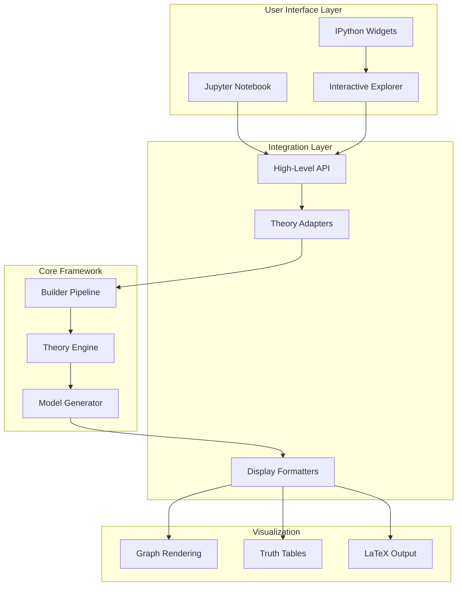

## Component Structure

### Interactive Explorer Framework

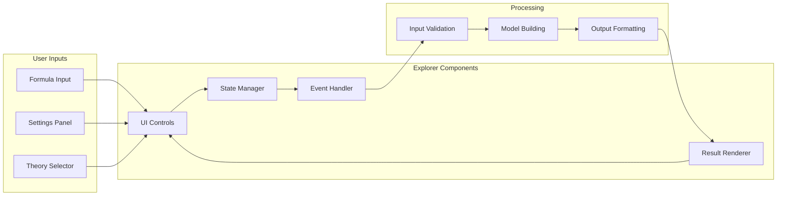

## Interaction Flow

### Formula Checking Sequence

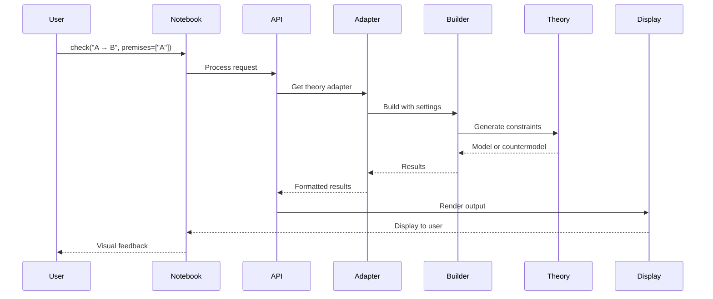

### Interactive Explorer Session

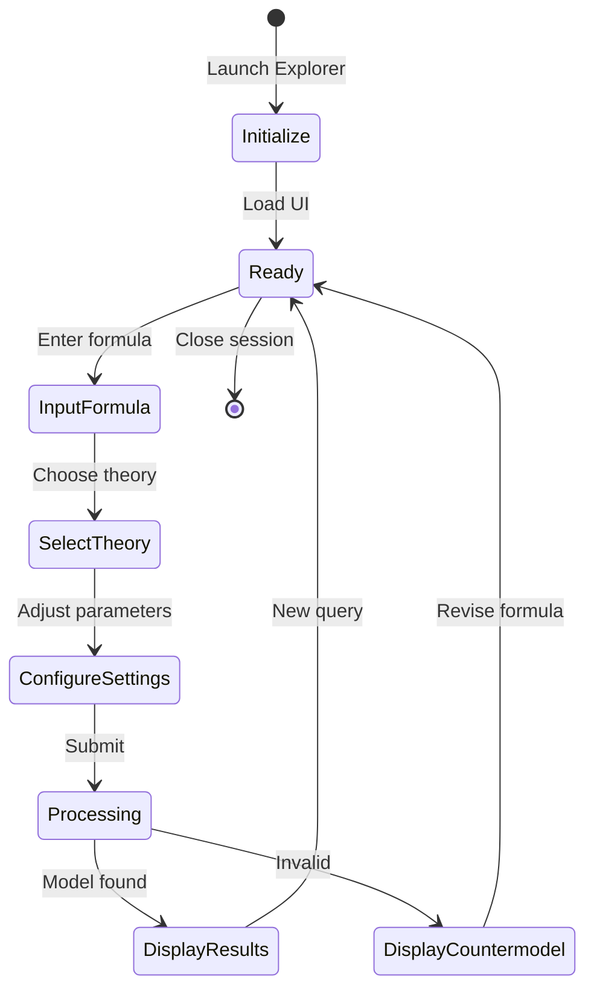

## API Architecture

### High-Level Functions

```mermaid
graph TD
    subgraph "Public API"
        check[check()]
        explore[explore()]
        visualize[visualize()]
        load_examples[load_examples()]
    end
    
    subgraph "Core Functions"
        validate_formula[validate_formula()]
        build_model[build_model()]
        find_countermodel[find_countermodel()]
        format_output[format_output()]
    end
    
    subgraph "Helper Functions"
        parse_input[parse_input()]
        get_theory[get_theory()]
        apply_settings[apply_settings()]
        render_display[render_display()]
    end
    
    check --> validate_formula
    check --> build_model
    explore --> validate_formula
    explore --> find_countermodel
    visualize --> format_output
    load_examples --> get_theory
    
    validate_formula --> parse_input
    build_model --> apply_settings
    find_countermodel --> get_theory
    format_output --> render_display
```

## Theory Adapter Pattern

### Adapter Architecture

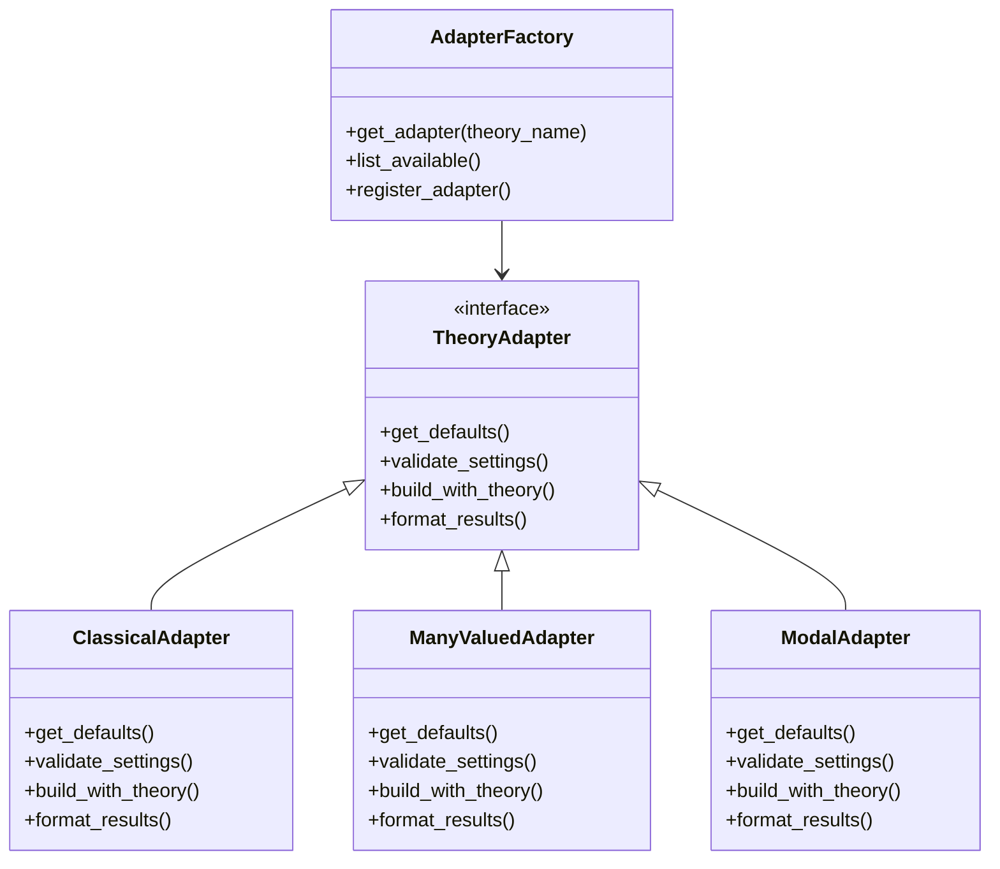

## Widget Architecture

### Interactive UI Components

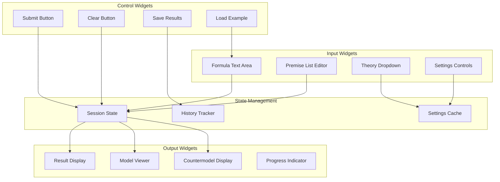

## Visualization Pipeline

### Model Visualization Flow

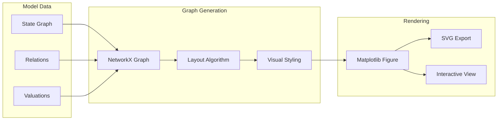

## Display Formatting

### Output Format Selection

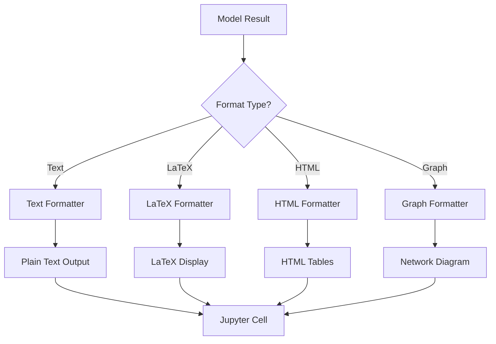

## Session Management

### Explorer Session Lifecycle

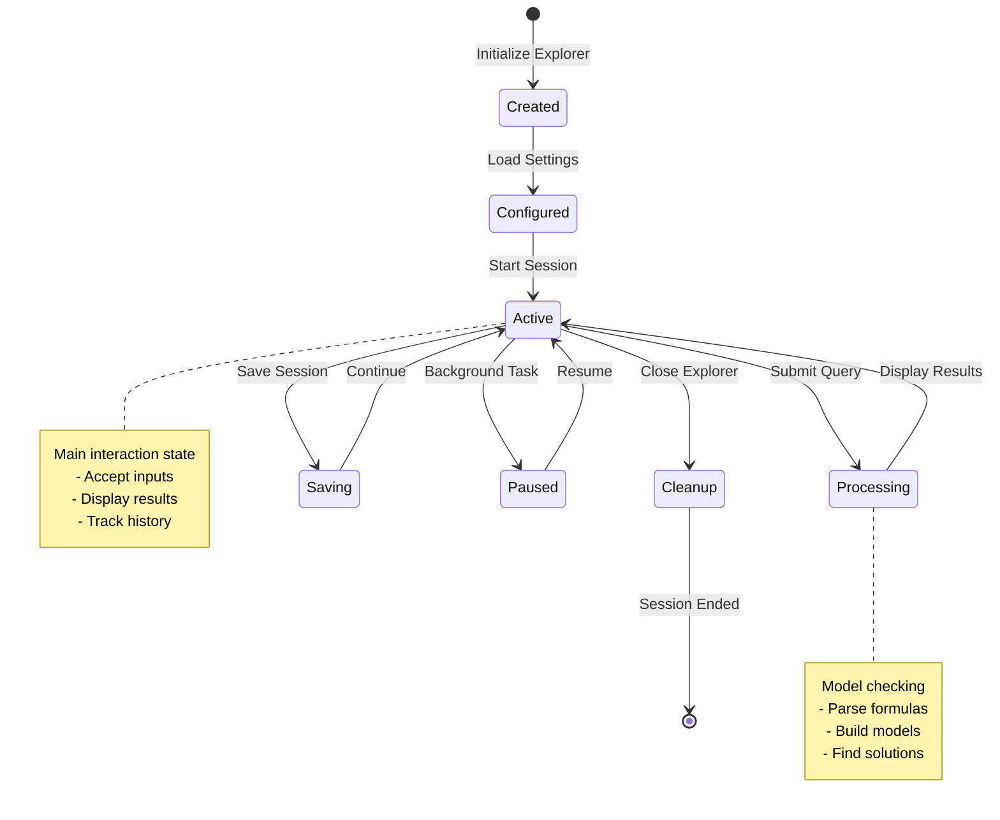

## Error Handling

### Error Flow Architecture

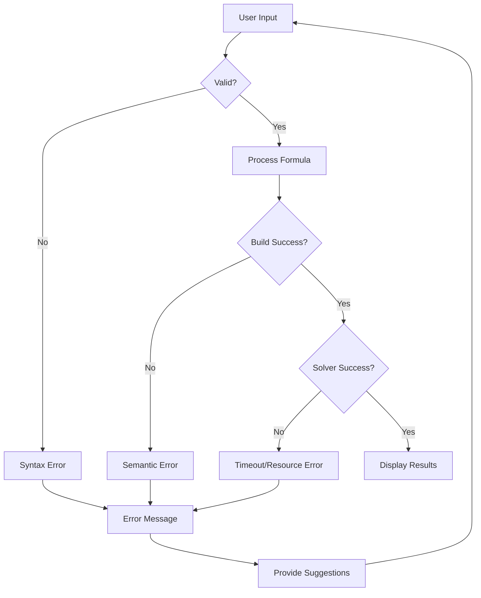

## Performance Optimization

### Caching Strategy

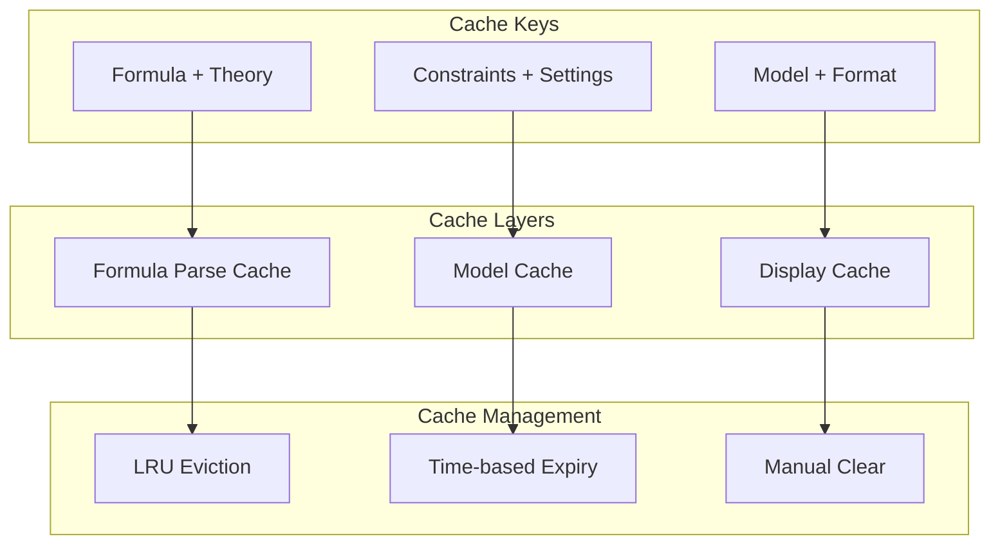

## Extension Points

### Plugin Architecture

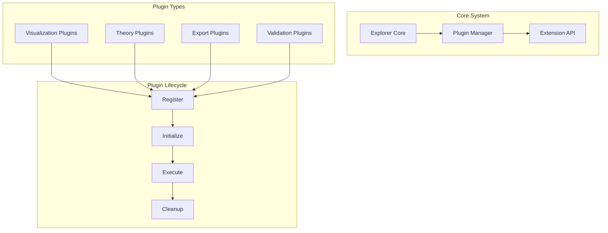

## Integration Examples

### Notebook Workflow

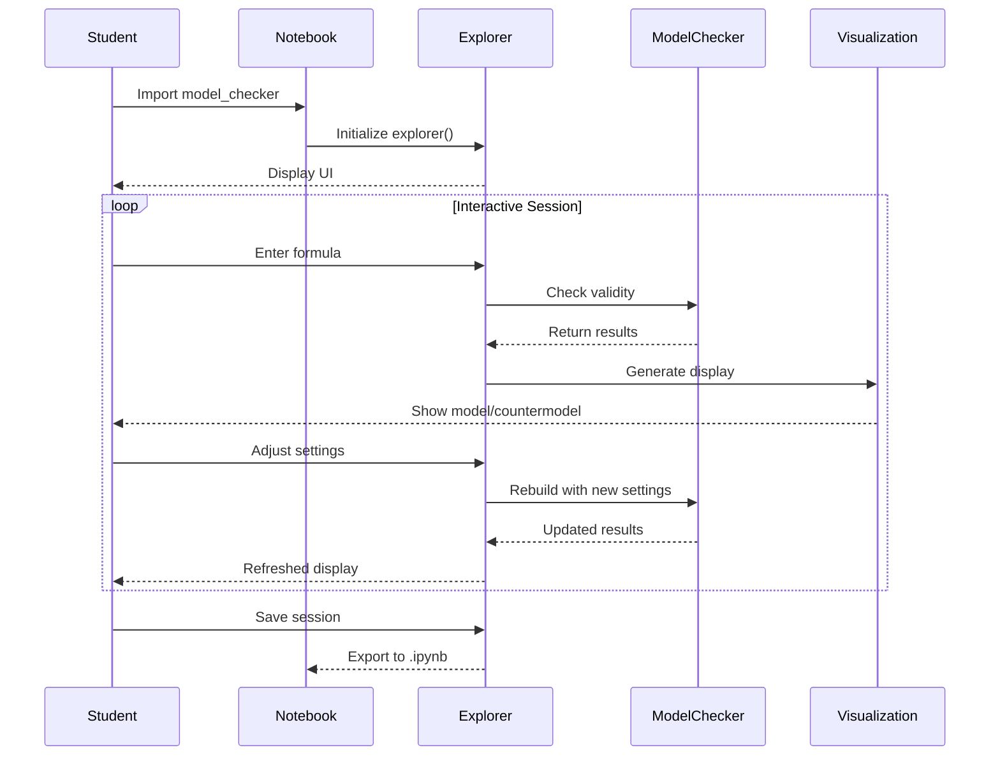

## Best Practices

### Design Principles

1. **Immediate Feedback**: Provide instant validation and results
2. **Progressive Disclosure**: Show basic options first, advanced on demand
3. **Error Recovery**: Guide users to fix issues with helpful suggestions
4. **State Persistence**: Maintain session state across cell executions
5. **Theory Agnostic**: Adapt interface to theory capabilities

### Performance Guidelines

1. **Lazy Loading**: Load components only when needed
2. **Result Caching**: Cache expensive computations
3. **Incremental Updates**: Update only changed portions of display
4. **Resource Limits**: Set timeouts and memory limits for solver
5. **Background Processing**: Use async for long-running operations

## Technical Implementation

For detailed implementation information, see:
- [Jupyter Package Documentation](../../Code/src/model_checker/jupyter/README.md)
- [UI Components](../../Code/src/model_checker/jupyter/ui_components.py)
- [Theory Adapters](../../Code/src/model_checker/jupyter/adapters.py)

## See Also

- [Builder Architecture](BUILDER.md) - Core pipeline orchestration
- [Output Generation](OUTPUT.md) - Display formatting systems
- [Theory Framework](THEORY_LIB.md) - Theory implementation architecture

---

[← Back to Architecture](README.md) | [Theory Framework →](THEORY_LIB.md) | [Utils →](UTILS.md)