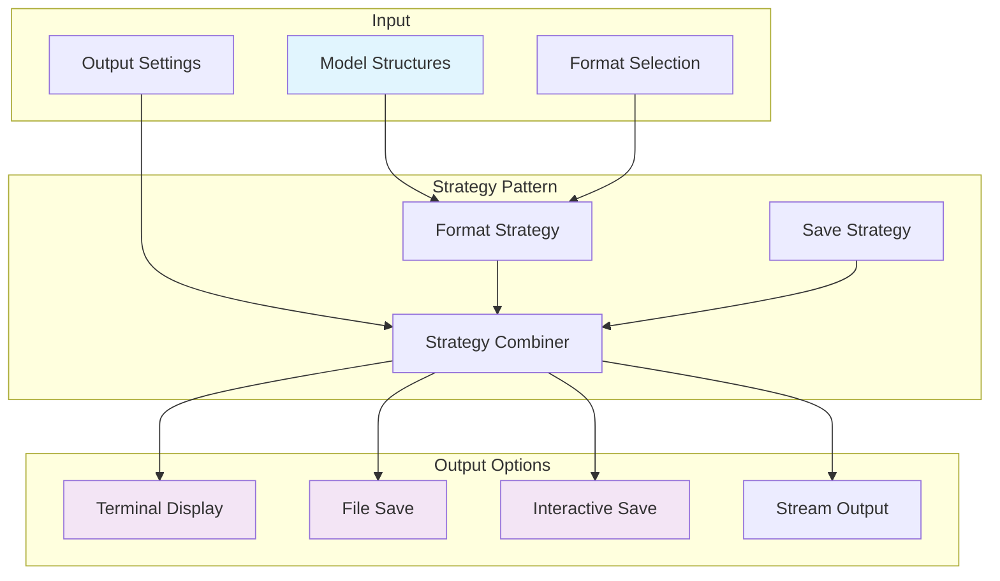
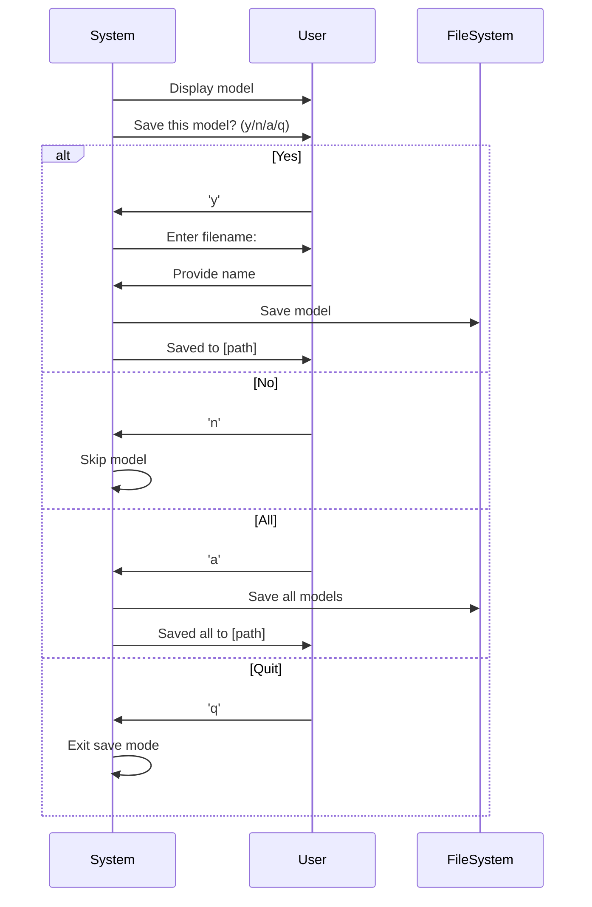
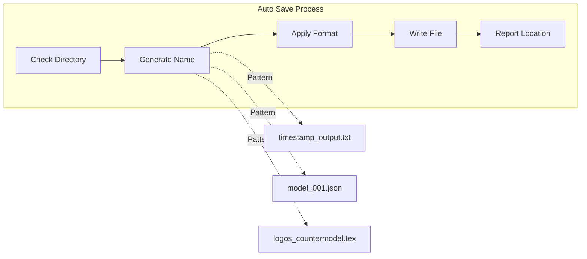
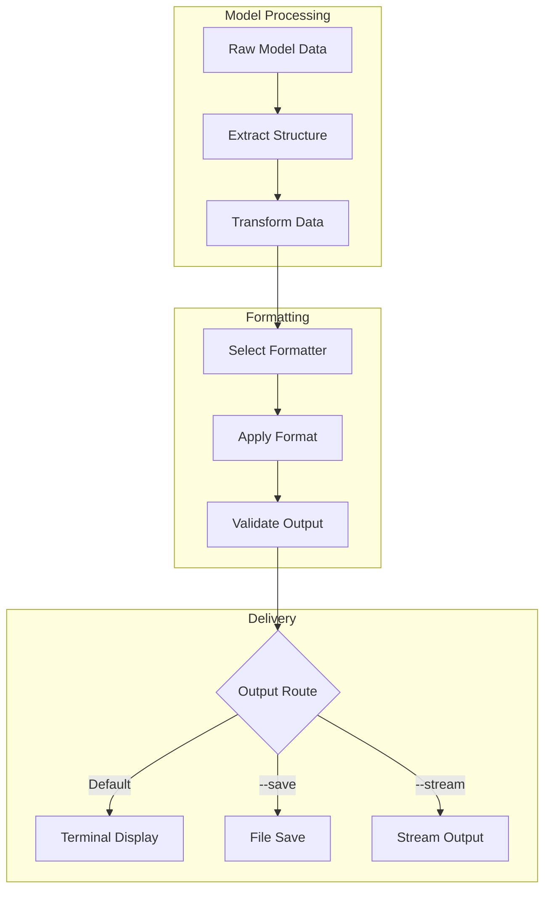
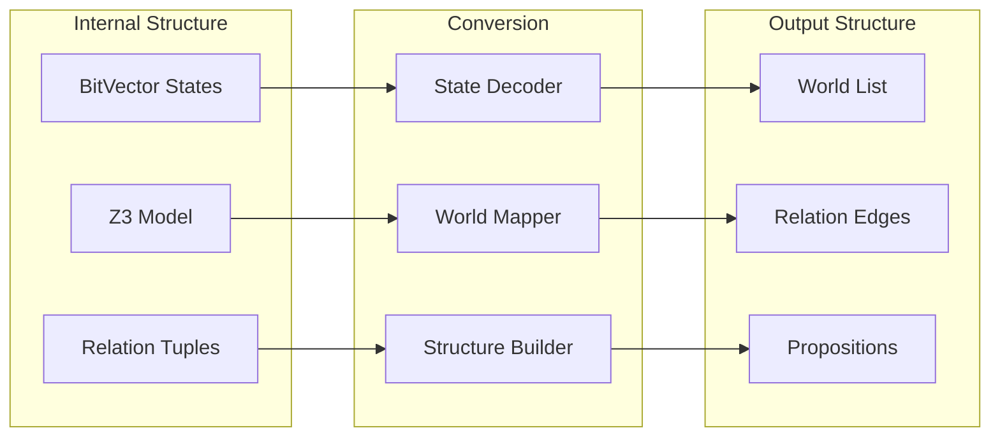
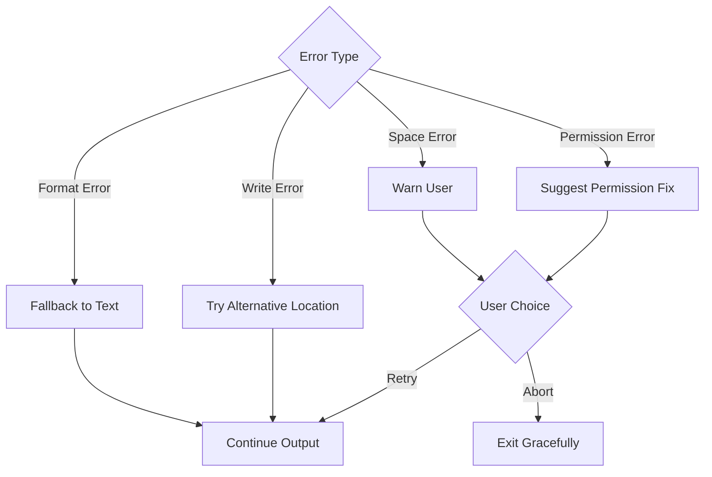

# Output Generation Architecture

[← Back to Architecture](README.md) | [Pipeline →](PIPELINE.md) | [Settings →](SETTINGS.md) | [Technical Implementation →](../../Code/src/model_checker/output/README.md)

## Overview

The output generation system transforms internal model structures into human-readable or machine-processable formats. It implements a flexible strategy pattern that combines format types with save strategies, enabling diverse output options from terminal display to publication-ready documents.

## Output Strategy Architecture



## Format Types

### Text Format (Default)
Human-readable output for terminal display:

```
Model 1 of 3
============
Theory: logos
Settings: N=4, max_time=30

Worlds: w1, w2, w3, w4
Relations:
  w1 → w2
  w2 → w3
  w3 → w4
  w4 → w1 (cycle)

Valuations:
  Proposition A:
    True at: w1, w3
    False at: w2, w4
  
  Proposition B:
    True at: w2, w3, w4
    False at: w1

Verification:
  Premises satisfied: ✓
  Conclusions: 
    B: ✓ (valid)
    C: ✗ (countermodel found)
```

### JSON Format
Structured data for programmatic processing:

```json
{
  "model_id": 1,
  "theory": "logos",
  "settings": {
    "N": 4,
    "max_time": 30
  },
  "structure": {
    "worlds": ["w1", "w2", "w3", "w4"],
    "relations": [
      {"from": "w1", "to": "w2"},
      {"from": "w2", "to": "w3"},
      {"from": "w3", "to": "w4"},
      {"from": "w4", "to": "w1"}
    ],
    "valuations": {
      "A": {
        "true_at": ["w1", "w3"],
        "false_at": ["w2", "w4"]
      },
      "B": {
        "true_at": ["w2", "w3", "w4"],
        "false_at": ["w1"]
      }
    }
  },
  "verification": {
    "premises_satisfied": true,
    "conclusions": {
      "B": {"valid": true},
      "C": {"valid": false, "countermodel": true}
    }
  }
}
```

### LaTeX Format
Publication-ready mathematical notation:

```latex
\begin{model}
\modeltheory{logos}
\modelsettings{N=4, \tau=30}

\begin{worlds}
W = \{w_1, w_2, w_3, w_4\}
\end{worlds}

\begin{relations}
R = \{(w_1, w_2), (w_2, w_3), (w_3, w_4), (w_4, w_1)\}
\end{relations}

\begin{valuations}
V(A) = \{w_1, w_3\} \\
V(B) = \{w_2, w_3, w_4\}
\end{valuations}

\begin{verification}
\models \bigwedge \text{premises} \\
\models B \\
\not\models C
\end{verification}
\end{model}
```

### Markdown Format
Documentation-friendly output:

```markdown
## Model 1

**Theory**: logos  
**Settings**: N=4, max_time=30

### Structure
- **Worlds**: w₁, w₂, w₃, w₄
- **Relations**: w₁→w₂, w₂→w₃, w₃→w₄, w₄→w₁

### Valuations
| Proposition | True at | False at |
|-------------|---------|----------|
| A | w₁, w₃ | w₂, w₄ |
| B | w₂, w₃, w₄ | w₁ |

### Verification
- ✅ All premises satisfied
- ✅ Conclusion B is valid
- ❌ Conclusion C has countermodel
```

## Save Strategies

### Interactive Save Mode



### Automatic Save Mode
With `--save` flag or `save_output: true`:



### Stream Output Mode
For piping to other programs:

```bash
# Pipe to another program
model-checker example.py --format json | jq '.structure.worlds'

# Save specific models
model-checker example.py --format text | grep "INVALID" > countermodels.txt

# Real-time monitoring
model-checker example.py --stream | tee output.log
```

## Output Pipeline Flow



## Formatting Components

### Model Structure Formatter
Converts internal representations to output format:



### Verification Formatter
Formats validation results:

```python
# Internal result
result = {
    'valid': False,
    'countermodel': model_1,
    'failed_conclusion': 'C',
    'satisfiability': 'SAT'
}

# Formatted output
"""
VERIFICATION RESULT
==================
Status: INVALID (Countermodel Found)
Failed Conclusion: C
Model: See Model 1 above

The inference is not valid. The premises do not entail conclusion 'C'.
"""
```

### Statistics Formatter
Presents search statistics:

```
SEARCH STATISTICS
================
Models Found: 5
Models Examined: 127
Isomorphic Models Filtered: 122
Search Time: 3.42 seconds
Z3 Solving Time: 2.81 seconds
Average Model Size: 4.3 worlds
```

## Customization Options

### Custom Formatters
Users can define custom output formats:

```python
class CustomFormatter(BaseFormatter):
    def format_model(self, model):
        """Custom formatting logic"""
        return {
            'custom_field': self.extract_custom_data(model),
            'formatted_output': self.apply_custom_template(model)
        }
    
    def format_header(self):
        return "=== Custom Model Output ==="
    
    def format_footer(self, statistics):
        return f"Generated {statistics['count']} models"
```

### Template System
Define output templates:

```yaml
# output_template.yaml
model:
  header: "Model {{id}} ({{theory}})"
  world_format: "World {{name}}: {{properties}}"
  relation_format: "{{source}} connects to {{target}}"
  proposition_format: "{{name}} is {{value}} at {{world}}"
```

### Filter Options
Control what gets included in output:

```python
output_filters = {
    'show_statistics': True,
    'show_premises': False,
    'show_intermediate': False,
    'compact_mode': True,
    'include_metadata': False
}
```

## Error Handling

### Output Errors



### Recovery Strategies
1. **Format Fallback**: If custom format fails, use text
2. **Location Fallback**: Try temp directory if output directory fails
3. **Partial Save**: Save what's possible if full save fails
4. **Error Reporting**: Clear messages about what went wrong

## Performance Optimization

### Buffering Strategy
```python
# Efficient output for large models
class BufferedOutput:
    def __init__(self, buffer_size=8192):
        self.buffer = []
        self.size = 0
        self.max_size = buffer_size
    
    def write(self, data):
        self.buffer.append(data)
        self.size += len(data)
        if self.size >= self.max_size:
            self.flush()
    
    def flush(self):
        output = ''.join(self.buffer)
        self._write_to_destination(output)
        self.buffer = []
        self.size = 0
```

### Lazy Formatting
Only format what's needed:
```python
# Don't format all models upfront
for model in model_iterator:
    if user_wants_this_model(model):
        formatted = format_model(model)
        output(formatted)
    # Unformatted models are skipped
```

## Integration Points

### CLI Integration
```bash
# Format selection
model-checker example.py --format json

# Save options
model-checker example.py --save --output-dir results/

# Streaming
model-checker example.py --stream --format markdown
```

### API Integration
```python
from model_checker import OutputManager

output = OutputManager(format='json', save_strategy='auto')
output.process_models(models)
results = output.get_formatted_output()
```

### Jupyter Integration
```python
from model_checker.jupyter import display_model

# Interactive display with format selection
display_model(model, format='visual')
```

## See Also

### Related Components
- **[Pipeline Overview](PIPELINE.md)** - Output in the processing pipeline
- **[Settings Management](SETTINGS.md)** - Output-related settings
- **[Iterator System](ITERATE.md)** - Model generation for output

### Technical Documentation
- **[Output Implementation](../../Code/src/model_checker/output/README.md)** - Code details
- **[Formatter Classes](../../Code/src/model_checker/output/formatters.py)** - Format implementations
- **[Save Strategies](../../Code/src/model_checker/output/strategies.py)** - Save logic

### Usage Guides
- **[Output Examples](../usage/OUTPUT_EXAMPLES.md)** - Common output patterns
- **[Custom Formats](../usage/CUSTOM_FORMATS.md)** - Creating formatters
- **[Automation Guide](../usage/AUTOMATION.md)** - Scripting output