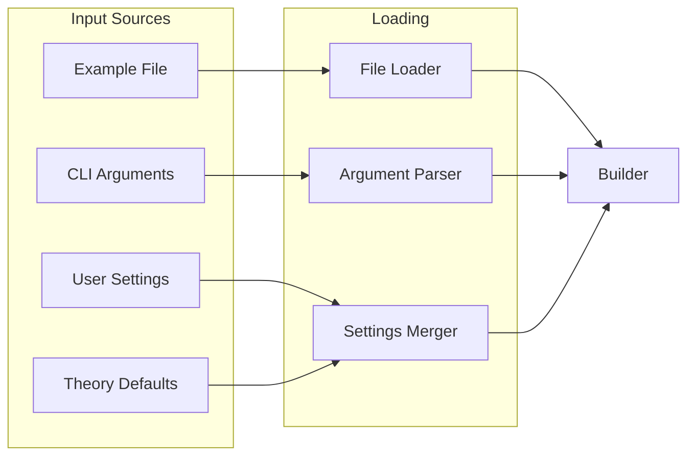
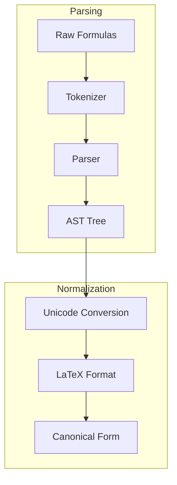
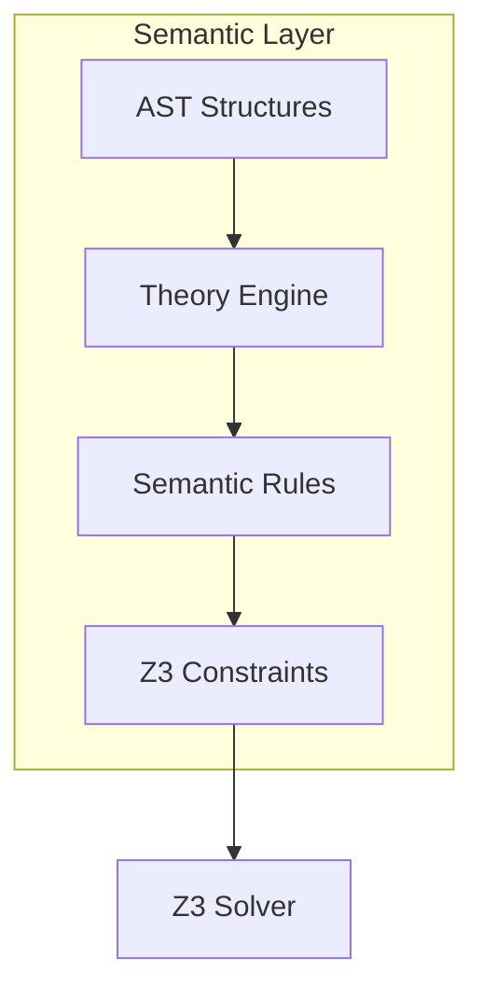
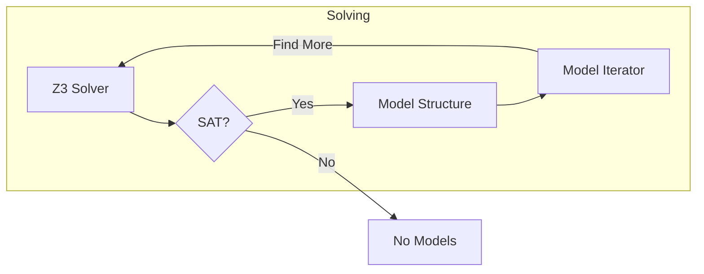
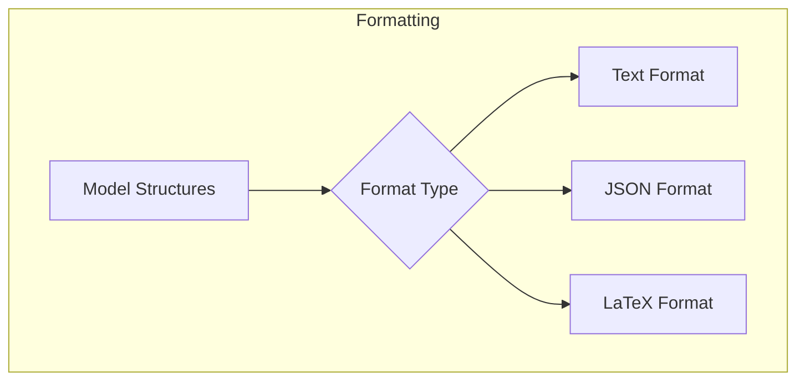
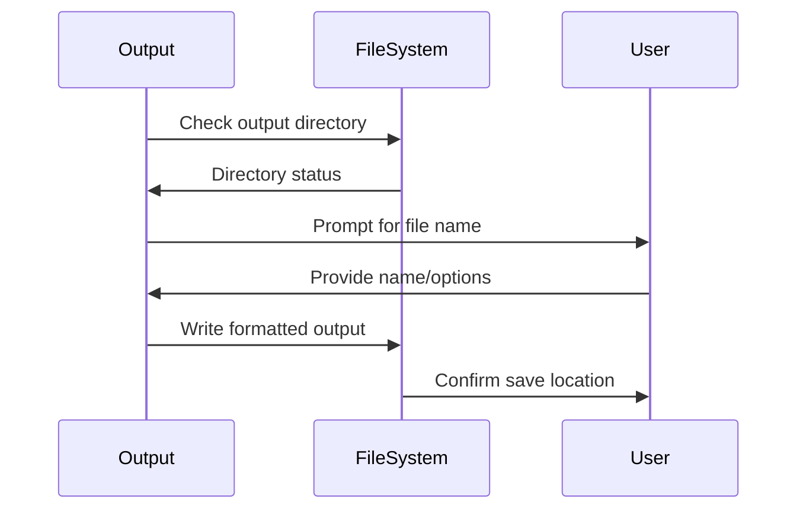
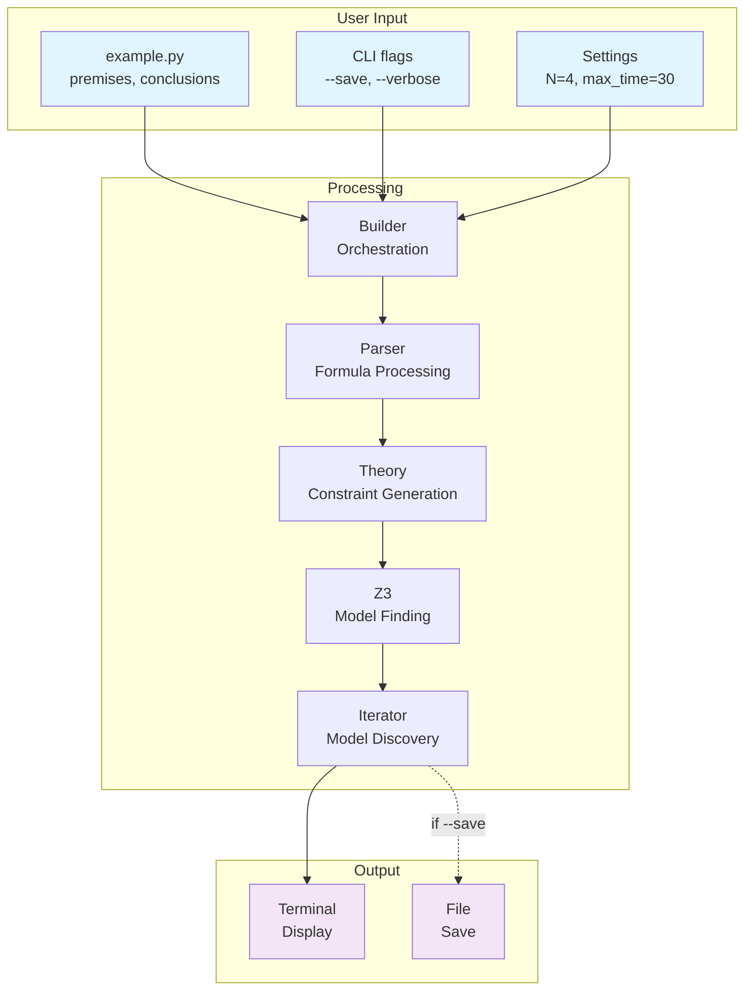

# Data Flow Pipeline: From User Input to Model Output

[← Back to Architecture](README.md) | [Builder →](BUILDER.md) | [Output →](OUTPUT.md) | [Technical Implementation →](../../Code/docs/PIPELINE.md)

## Overview

This document traces the complete journey of data through the ModelChecker system, from initial user inputs (premises, conclusions, settings, and CLI flags) through processing components to final outputs (terminal display or saved files). Understanding this pipeline is essential for both using and extending the framework.

## Table of Contents

1. [User Inputs](#user-inputs)
2. [Processing Pipeline](#processing-pipeline)
3. [Output Generation](#output-generation)
4. [Complete Flow Diagram](#complete-flow-diagram)
5. [Example Walkthrough](#example-walkthrough)
6. [Error Handling](#error-handling)
7. [Performance Considerations](#performance-considerations)

## User Inputs

The ModelChecker accepts four types of user inputs that control the entire processing pipeline:

### 1. Premises
Logical statements assumed to be true in the model:
```python
premises = [
    "A",                    # Atomic proposition
    "A \\rightarrow B",     # Implication
    "\\Box (B \\vee C)"     # Modal necessity
]
```

### 2. Conclusions
Statements to validate against the premises:
```python
conclusions = [
    "B",                    # Should follow from premises
    "\\Diamond C"           # Possible C
]
```

### 3. Settings
Configuration parameters controlling the search:
```python
settings = {
    'N': 4,                 # Bit-width for state representation
    'max_time': 30,         # Z3 timeout in seconds
    'max_models': 10,       # Maximum models to find
    'verbose': True         # Detailed output
}
```

### 4. CLI Flags
Command-line options that modify behavior:
```bash
model-checker example.py --save --verbose --format json
```

## Processing Pipeline

### Stage 1: Input Loading



The loading stage:
1. **File Loading**: Reads example.py containing premises/conclusions
2. **CLI Parsing**: Processes command-line flags and options
3. **Settings Merge**: Combines settings in precedence order:
   - CLI flags (highest priority)
   - Example file settings
   - User configuration
   - Theory defaults (lowest priority)

### Stage 2: Formula Processing



Formula processing involves:
1. **Tokenization**: Breaking formulas into logical components
2. **Parsing**: Building Abstract Syntax Trees (AST)
3. **Normalization**: Converting to canonical representation
4. **Operator Resolution**: Binding operators to semantic implementations

### Stage 3: Constraint Generation



The theory engine:
1. **Interprets AST**: Maps logical structure to semantic meaning
2. **Applies Semantics**: Generates truth conditions based on theory
3. **Creates Constraints**: Builds Z3 constraint expressions
4. **Adds Frame Conditions**: Ensures model consistency

### Stage 4: Model Discovery



Model discovery process:
1. **Initial Solve**: Z3 attempts to find first model
2. **Model Extraction**: Convert Z3 solution to model structure
3. **Iteration**: Find additional distinct models
4. **Isomorphism Check**: Ensure models are structurally different

### Stage 5: Output Formatting



Output formatting options:
1. **Text**: Human-readable terminal output (default)
2. **JSON**: Structured data for programmatic use
3. **LaTeX**: Publication-ready mathematical notation
4. **Custom**: User-defined format templates

## Output Generation

### Terminal Display (Default)

When no `--save` flag is provided, results display in terminal:

```
Model 1:
========
Worlds: w1, w2, w3
Relations: w1 -> w2, w2 -> w3
Valuations:
  A: true at w1
  B: true at w2, w3
  C: false at all worlds

Validity: INVALID
Countermodel found for conclusion "C"
```

### File Output (--save Flag)

When `--save` flag or `save_output: true` setting is used:



File saving process:
1. **Directory Check**: Ensures output directory exists
2. **Name Generation**: Creates timestamp-based or user-specified name
3. **Format Selection**: Applies chosen output format
4. **Write Operation**: Saves to filesystem
5. **Confirmation**: Reports save location to user

## Complete Flow Diagram



## Example Walkthrough

Let's trace a simple modus ponens example through the pipeline:

### Input
```python
# example.py
premises = ["A", "A \\rightarrow B"]
conclusions = ["B"]
settings = {'N': 2, 'max_models': 1}
```

### Command
```bash
model-checker example.py --verbose --save
```

### Processing Steps

1. **Load Inputs**
   - Parse example.py → Extract premises, conclusions, settings
   - Parse CLI → verbose=True, save=True
   - Merge settings → N=2, max_models=1, verbose=True, save=True

2. **Parse Formulas**
   - "A" → Atom('A')
   - "A \\rightarrow B" → Implies(Atom('A'), Atom('B'))
   - "B" → Atom('B')

3. **Generate Constraints**
   - A is true at main world
   - A → B is true at main world
   - Find model where B might be false

4. **Solve with Z3**
   - Result: No countermodel exists
   - Conclusion: Inference is VALID

5. **Format Output**
   ```
   VALIDITY CHECK: VALID
   All conclusions follow from premises
   
   Checking: ['A', 'A → B'] ⊨ ['B']
   Result: ✓ Valid inference
   ```

6. **Save Results**
   - Prompt: "Save as: modus_ponens_valid.txt"
   - Write to: output/modus_ponens_valid.txt

## Error Handling

The pipeline includes error handling at each stage:

### Input Errors
- **Missing File**: Clear error message with usage help
- **Invalid Syntax**: Shows location of syntax error
- **Type Mismatch**: Reports incompatible settings

### Processing Errors
- **Parse Failures**: Highlights problematic formula
- **Semantic Errors**: Explains unsupported operations
- **Solver Timeout**: Reports partial results if available

### Output Errors
- **Write Permission**: Suggests alternative locations
- **Format Issues**: Falls back to text format
- **Disk Space**: Warns before writing large outputs

## Performance Considerations

### Memory Management
- **Streaming**: Large models processed incrementally
- **Caching**: Formula parsing cached for reuse
- **Cleanup**: Intermediate structures garbage collected

### Optimization Points
- **Early Termination**: Stop on first countermodel if not iterating
- **Parallel Solving**: Multiple Z3 instances for model search
- **Incremental Constraints**: Reuse common constraint bases

### Bottlenecks
- **Z3 Solving**: Primary computational cost
- **Isomorphism Checking**: Expensive for large models
- **Output Formatting**: Can be slow for many models

## See Also

### Pipeline Components
- **[Builder Architecture](BUILDER.md)** - Orchestration layer details
- **[Settings Management](SETTINGS.md)** - Configuration system
- **[Output Generation](OUTPUT.md)** - Formatting and save strategies
- **[Iterator Design](ITERATE.md)** - Model discovery process

### Technical Documentation
- **[Implementation Details](../../Code/docs/PIPELINE.md)** - Code-level architecture
- **[Performance Guide](../../Code/docs/PERFORMANCE.md)** - Optimization strategies
- **[Extension Guide](../../Code/docs/EXTENSIONS.md)** - Adding new components

### Usage Guides
- **[Workflow Examples](../usage/WORKFLOW.md)** - Common usage patterns
- **[CLI Reference](../usage/CLI_REFERENCE.md)** - Command-line options
- **[Settings Reference](../usage/SETTINGS_REFERENCE.md)** - All configuration options