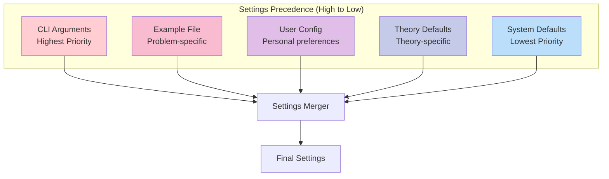
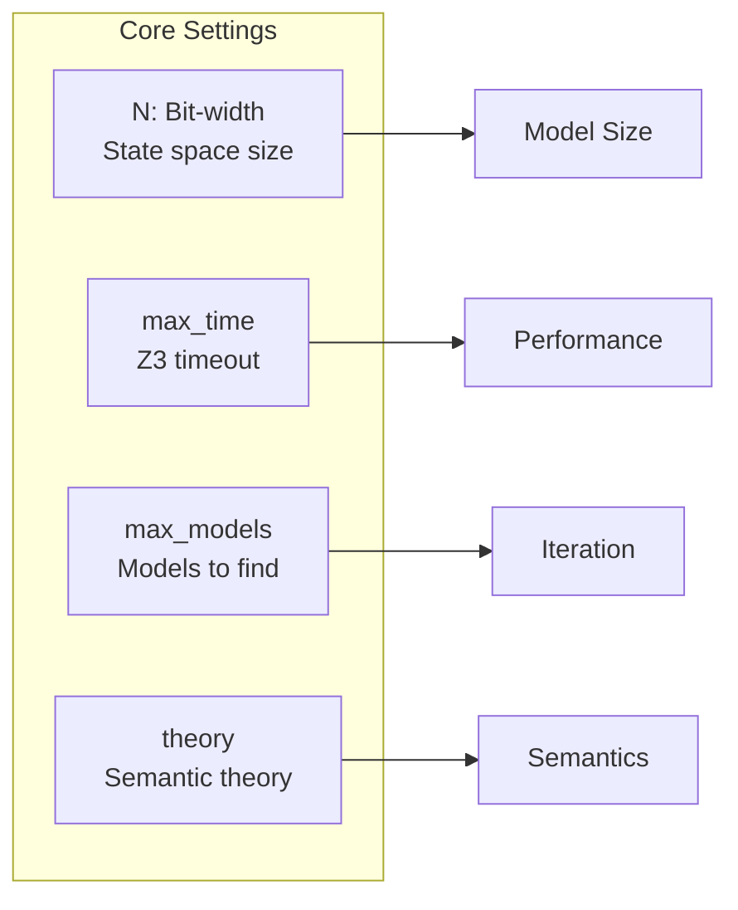
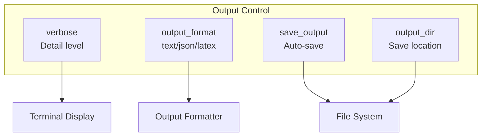
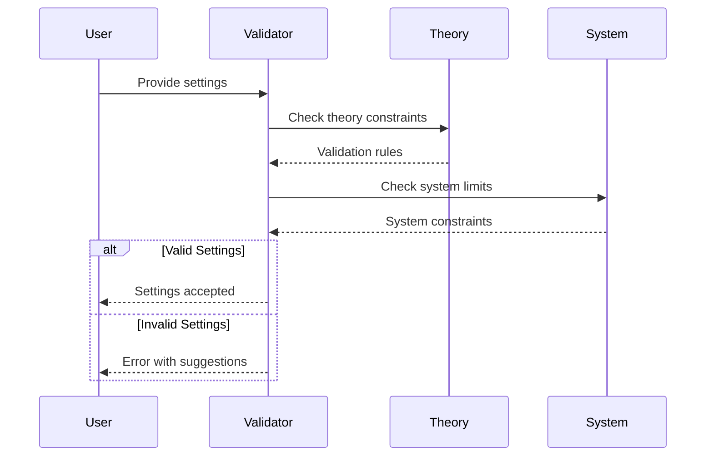
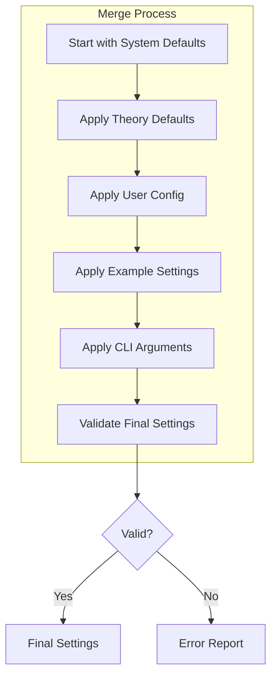
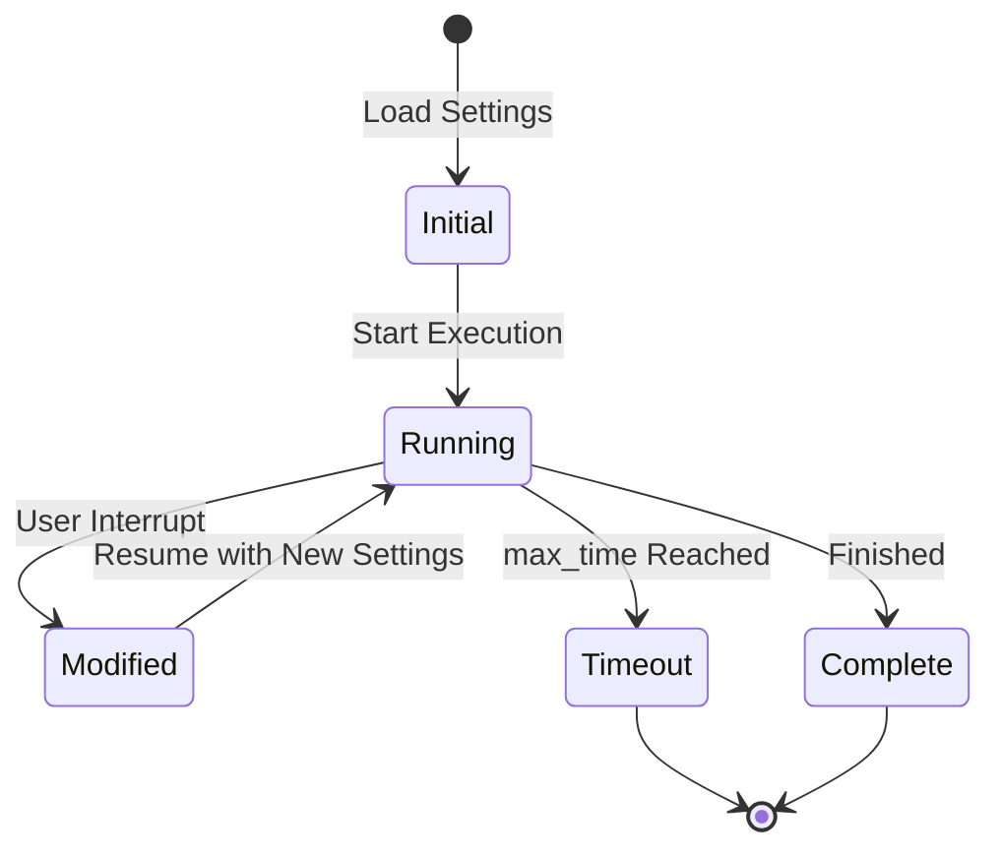

# Settings Management Architecture

[← Back to Architecture](README.md) | [Pipeline →](PIPELINE.md) | [Builder →](BUILDER.md) | [Technical Implementation →](../../Code/src/model_checker/settings/README.md)

## Overview

The settings management system provides a sophisticated configuration hierarchy that allows fine-grained control over ModelChecker behavior while maintaining sensible defaults. Settings can be specified at multiple levels with clear precedence rules, enabling both simple usage and advanced customization.

## Settings Hierarchy

The ModelChecker uses a five-level settings hierarchy with clear precedence:



### 1. CLI Arguments (Highest Priority)
Command-line flags override all other settings:
```bash
model-checker example.py --N 6 --verbose --max-models 5
```

### 2. Example File Settings
Settings defined in the example file:
```python
# example.py
settings = {
    'N': 4,
    'max_time': 60,
    'verbose': False
}
```

### 3. User Configuration
Personal preferences in `~/.model-checker/config.json`:
```json
{
    "default_theory": "logos",
    "verbose": true,
    "save_output": false,
    "output_format": "text"
}
```

### 4. Theory Defaults
Theory-specific default settings:
```python
# theory_lib/logos/settings.py
THEORY_DEFAULTS = {
    'N': 4,
    'max_time': 30,
    'max_models': 10,
    'use_modal': True
}
```

### 5. System Defaults (Lowest Priority)
Framework-wide fallback values:
```python
# settings/defaults.py
SYSTEM_DEFAULTS = {
    'N': 3,
    'max_time': 10,
    'max_models': 1,
    'verbose': False
}
```

## Settings Categories

### Core Settings
Essential parameters that control model checking:



| Setting | Type | Default | Description |
|---------|------|---------|-------------|
| `N` | int | 4 | Bit-width for state representation |
| `max_time` | int | 30 | Z3 solver timeout in seconds |
| `max_models` | int | 10 | Maximum models to discover |
| `theory` | str | "logos" | Semantic theory to use |

### Output Settings
Control how results are displayed and saved:



| Setting | Type | Default | Description |
|---------|------|---------|-------------|
| `verbose` | bool | False | Show detailed output |
| `output_format` | str | "text" | Output format type |
| `save_output` | bool | False | Automatically save results |
| `output_dir` | str | "output/" | Directory for saved files |

### Theory-Specific Settings
Settings that only apply to certain theories:

```python
# Logos-specific settings
{
    'use_modal': True,          # Enable modal operators
    'use_counterfactual': True, # Enable counterfactuals
    'use_constitutive': False,  # Enable constitutive operators
}

# Bimodal-specific settings
{
    'max_time_points': 5,       # Temporal dimension
    'time_branching': 'linear', # Time structure
}
```

## Settings Validation

### Validation Flow



### Validation Rules

1. **Type Checking**
   ```python
   # N must be integer between 1 and 10
   if not isinstance(settings['N'], int) or not 1 <= settings['N'] <= 10:
       raise ValueError("N must be integer between 1 and 10")
   ```

2. **Range Validation**
   ```python
   # max_time must be positive
   if settings['max_time'] <= 0:
       raise ValueError("max_time must be positive")
   ```

3. **Dependency Checking**
   ```python
   # counterfactual requires modal
   if settings['use_counterfactual'] and not settings['use_modal']:
       raise ValueError("Counterfactual operators require modal operators")
   ```

4. **Theory Compatibility**
   ```python
   # Some settings only work with specific theories
   if settings['time_branching'] and theory != 'bimodal':
       raise ValueError("time_branching only applies to bimodal theory")
   ```

## Settings Merge Process

### Merge Algorithm



### Merge Example
```python
# System defaults
settings = {'N': 3, 'verbose': False, 'max_models': 1}

# Theory defaults override
settings.update({'N': 4, 'max_models': 10})
# Result: {'N': 4, 'verbose': False, 'max_models': 10}

# User config overrides
settings.update({'verbose': True})
# Result: {'N': 4, 'verbose': True, 'max_models': 10}

# Example file overrides
settings.update({'N': 5, 'max_models': 5})
# Result: {'N': 5, 'verbose': True, 'max_models': 5}

# CLI arguments override
settings.update({'verbose': False, 'save_output': True})
# Final: {'N': 5, 'verbose': False, 'max_models': 5, 'save_output': True}
```

## Dynamic Settings

Some settings can be modified during execution:



### Runtime Modifications
- **Iteration Control**: Adjust `max_models` during search
- **Timeout Extension**: Increase `max_time` if needed
- **Output Toggle**: Enable/disable `verbose` dynamically
- **Save Decision**: Choose to save after seeing results

## Settings Persistence

### Configuration File Structure
```json
{
    "version": "1.0.0",
    "global": {
        "default_theory": "logos",
        "verbose": true,
        "output_format": "text"
    },
    "theories": {
        "logos": {
            "N": 4,
            "use_modal": true
        },
        "bimodal": {
            "N": 3,
            "max_time_points": 5
        }
    },
    "projects": {
        "research": {
            "output_dir": "~/research/output",
            "save_output": true
        }
    }
}
```

### Loading Order
1. Check for project-specific config
2. Load theory-specific settings
3. Apply global settings
4. Override with command-line arguments

## Best Practices

### For Users
1. **Start Simple**: Use defaults, adjust only as needed
2. **Profile First**: Understand performance before increasing N
3. **Save Configs**: Store frequently-used settings in config file
4. **Use Projects**: Organize settings by project/context

### For Developers
1. **Validate Early**: Check settings before processing
2. **Document Settings**: Clear descriptions and examples
3. **Provide Defaults**: Sensible defaults for all settings
4. **Report Issues**: Clear error messages with suggestions

## Common Patterns

### Research Configuration
```python
# High exploration, save everything
settings = {
    'N': 6,
    'max_models': 100,
    'max_time': 300,
    'save_output': True,
    'verbose': True
}
```

### Teaching Configuration
```python
# Simple, clear output
settings = {
    'N': 3,
    'max_models': 3,
    'output_format': 'text',
    'verbose': False
}
```

### Debugging Configuration
```python
# Maximum information
settings = {
    'verbose': True,
    'debug': True,
    'show_constraints': True,
    'trace_solving': True
}
```

## See Also

### Related Components
- **[Pipeline Overview](PIPELINE.md)** - How settings flow through the system
- **[Builder Architecture](BUILDER.md)** - Settings usage in orchestration
- **[Output System](OUTPUT.md)** - Output-related settings

### Technical Documentation
- **[Settings Implementation](../../Code/src/model_checker/settings/README.md)** - Code details
- **[Configuration API](../../Code/src/model_checker/settings/config.py)** - Settings API
- **[Validation System](../../Code/src/model_checker/settings/validator.py)** - Validation logic

### Usage Guides
- **[Settings Reference](../usage/SETTINGS_REFERENCE.md)** - Complete settings list
- **[Configuration Guide](../usage/CONFIGURATION.md)** - Configuration tutorials
- **[Performance Tuning](../usage/PERFORMANCE.md)** - Optimization settings