# Theory Framework Architecture

[← Back to Architecture](README.md) | [Jupyter →](JUPYTER.md) | [Utils →](UTILS.md)

## Overview

The Theory Library provides a modular framework for implementing different semantic theories as computational programs. Each theory translates logical operators and their truth conditions into Z3 constraints, enabling automated model checking across diverse semantic approaches including modal, counterfactual, and hyperintensional logic.

## Framework Architecture

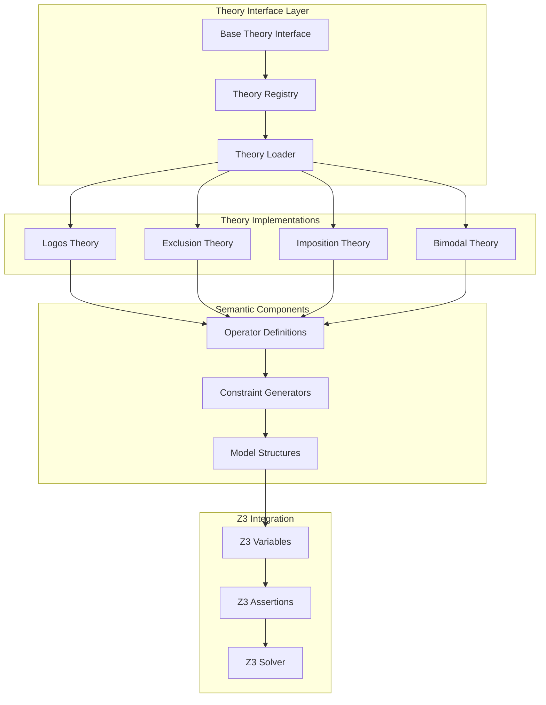

## Theory Design Patterns

### Simple Theory Pattern

Used for focused theories with cohesive operator sets:

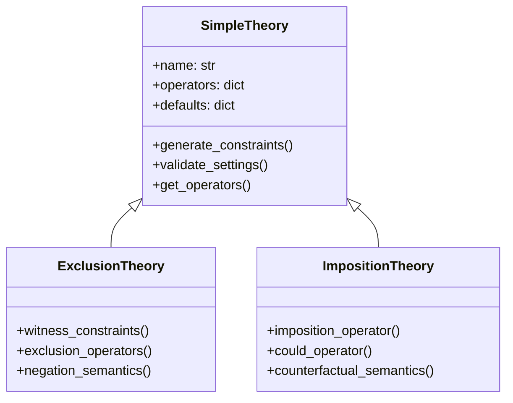

### Modular Theory Pattern

Used for complex theories with multiple subtheories:

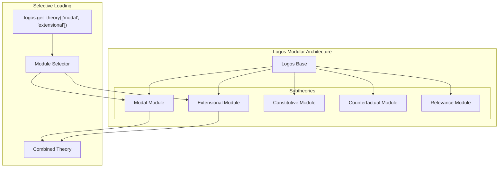

## Operator Architecture

### Operator Definition Flow

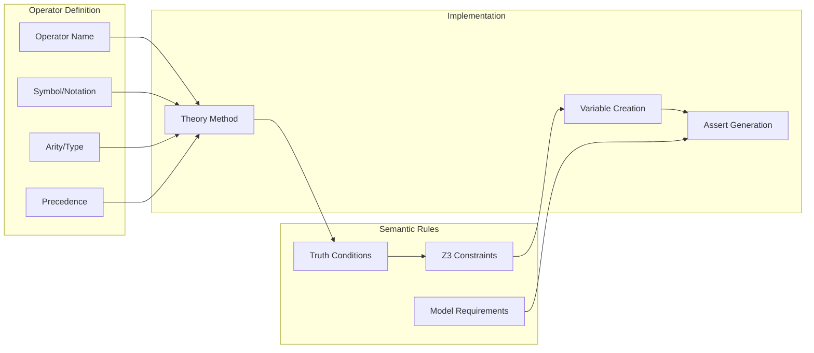

### Operator Types

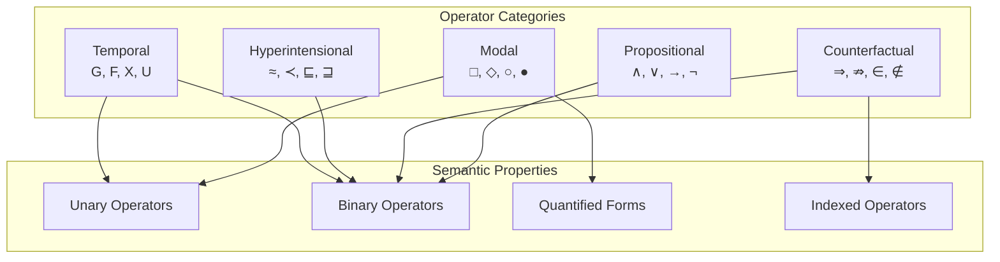

## Constraint Generation

### From Formula to Constraints

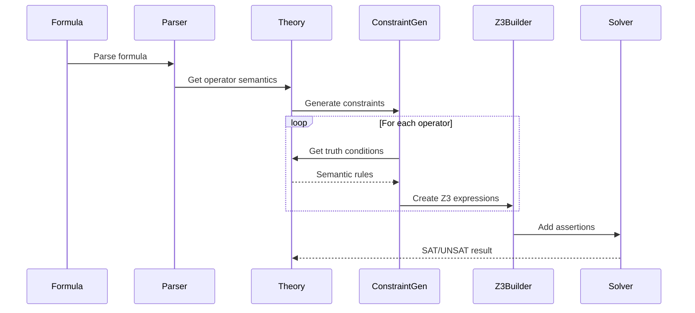

### Constraint Types

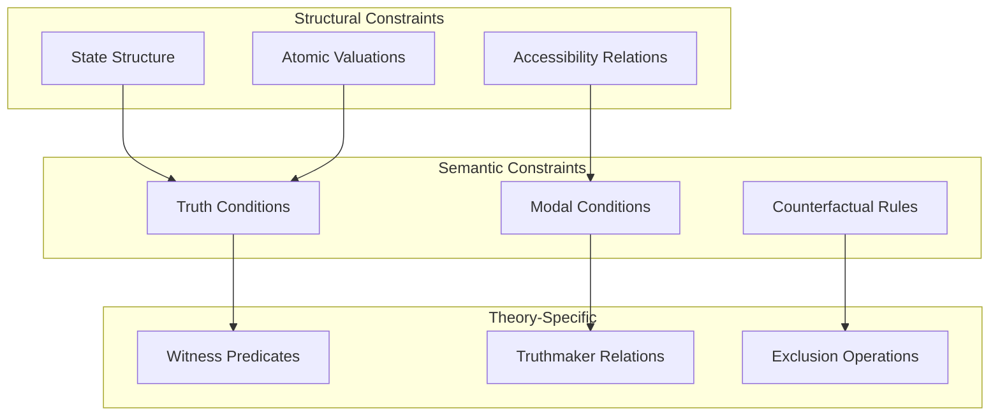

## Model Structure Integration

### Theory-Model Interface

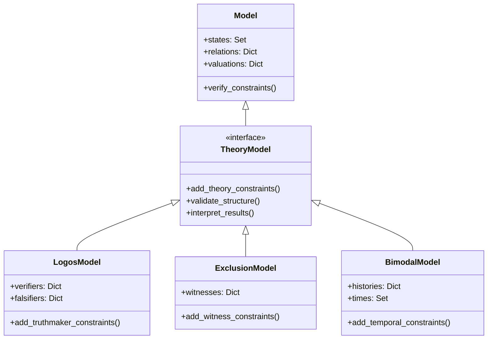

## Theory Registration

### Dynamic Theory Loading

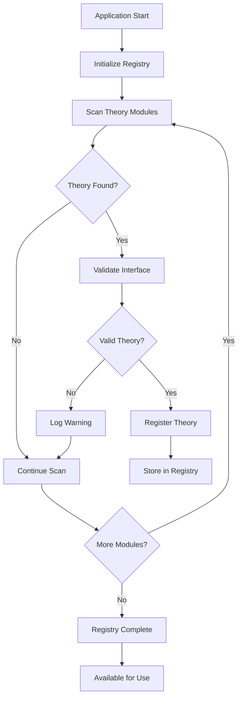

### Theory Discovery

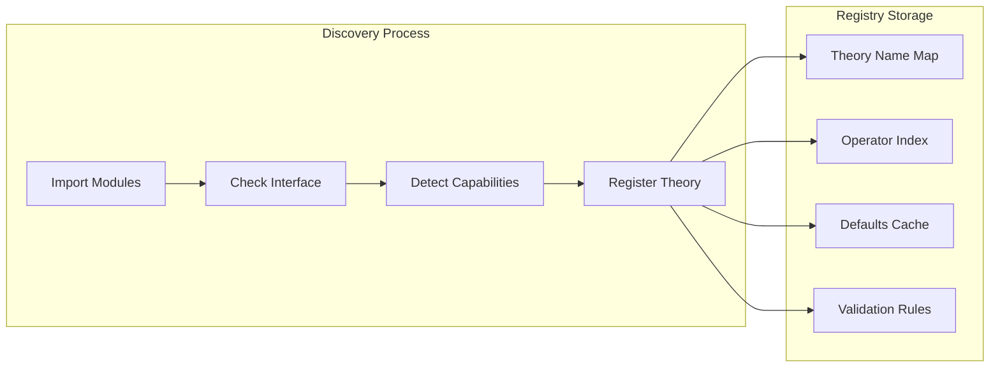

## Extension Architecture

### Adding New Theories

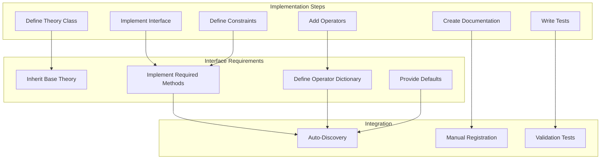

## Theory Comparison

### Cross-Theory Analysis

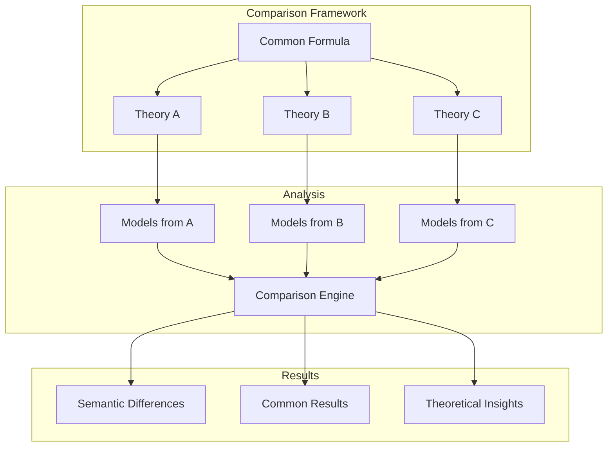

## Performance Optimization

### Theory-Specific Optimizations

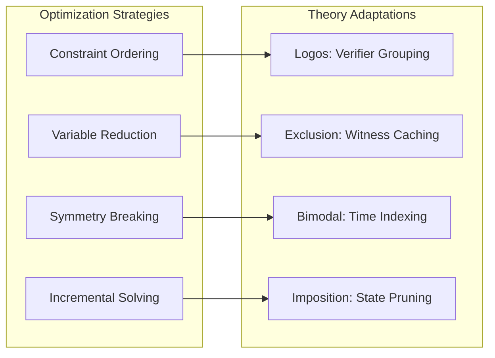

## Testing Architecture

### Theory Test Framework

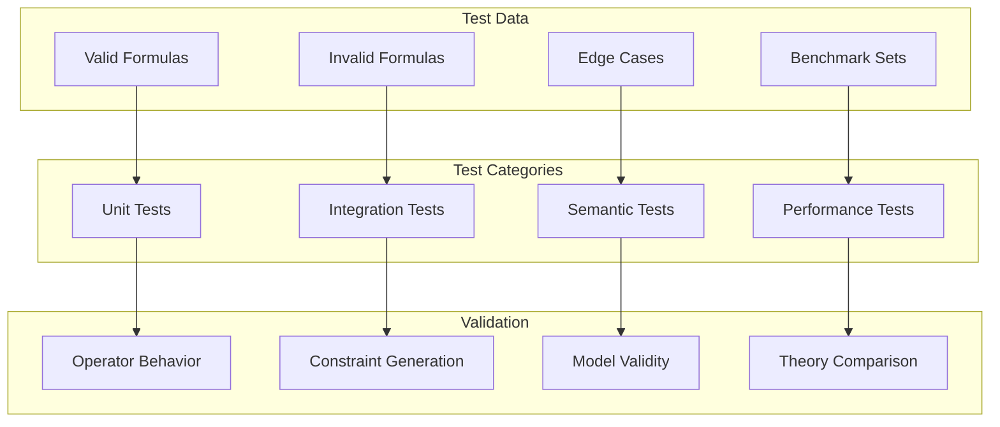

## Best Practices

### Theory Implementation Guidelines

1. **Interface Compliance**: Implement all required base theory methods
2. **Operator Consistency**: Maintain consistent operator naming and behavior
3. **Constraint Efficiency**: Optimize constraint generation for solver performance
4. **Documentation**: Provide clear semantic descriptions and examples
5. **Testing Coverage**: Include comprehensive test cases for all operators

### Design Principles

1. **Modularity**: Keep theories independent and composable
2. **Extensibility**: Design for easy addition of new operators
3. **Performance**: Balance semantic completeness with computational efficiency
4. **Clarity**: Prioritize clear semantic definitions over implementation cleverness
5. **Compatibility**: Ensure theories work with the full ModelChecker pipeline

## Technical Implementation

For detailed implementation information, see:
- [Theory Library Documentation](../../Code/src/model_checker/theory_lib/README.md)
- [Theory Architecture Guide](../../Code/src/model_checker/theory_lib/docs/THEORY_ARCHITECTURE.md)
- [Contributing Guide](../../Code/src/model_checker/theory_lib/docs/CONTRIBUTING.md)

## See Also

- [Semantic Framework](SEMANTICS.md) - Core semantic processing
- [Model Structure](MODELS.md) - Model representation architecture
- [Builder Pipeline](BUILDER.md) - Theory integration in pipeline

---

[← Back to Architecture](README.md) | [Jupyter →](JUPYTER.md) | [Utils →](UTILS.md)