# Shared Utilities & Patterns Architecture

[← Back to Architecture](README.md) | [Theory Framework →](THEORY_LIB.md) | [Pipeline →](PIPELINE.md)

## Overview

The Utils package provides foundational utilities and shared patterns that support the entire ModelChecker framework. These utilities handle critical cross-cutting concerns including expression parsing, bit vector operations, Z3 context management, output formatting, and type safety enforcement throughout the system.

## Utility Architecture

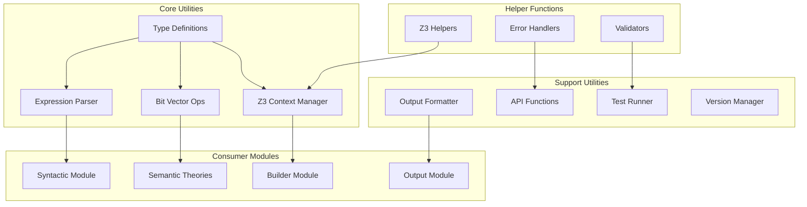

## Type System Architecture

### Type Safety Framework

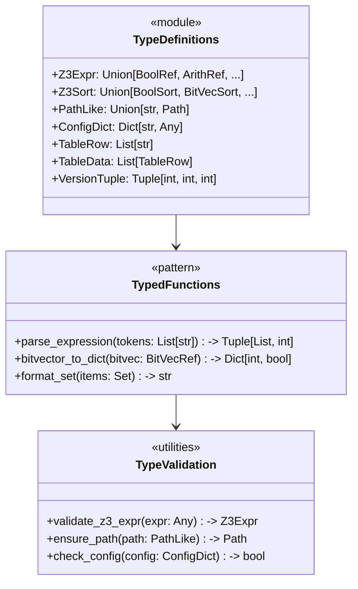

## Expression Parsing Architecture

### Parser Pipeline

```mermaid
flowchart LR
    subgraph "Input Processing"
        InfixExpr[Infix Expression<br/>"A ∧ B → C"]
        Tokenizer[Tokenizer]
        TokenList[Token List<br/>['A', '∧', 'B', '→', 'C']]
    end
    
    subgraph "Parsing Engine"
        ShuntingYard[Shunting Yard Algorithm]
        PrefixConverter[Prefix Converter]
        ComplexityCalc[Complexity Calculator]
    end
    
    subgraph "Output Generation"
        PrefixNotation[Prefix Notation<br/>['→', ['∧', 'A', 'B'], 'C']]
        Complexity[Complexity Score<br/>2]
    end
    
    InfixExpr --> Tokenizer
    Tokenizer --> TokenList
    TokenList --> ShuntingYard
    ShuntingYard --> PrefixConverter
    PrefixConverter --> ComplexityCalc
    ComplexityCalc --> PrefixNotation
    ComplexityCalc --> Complexity
```

### Operator Precedence Handling

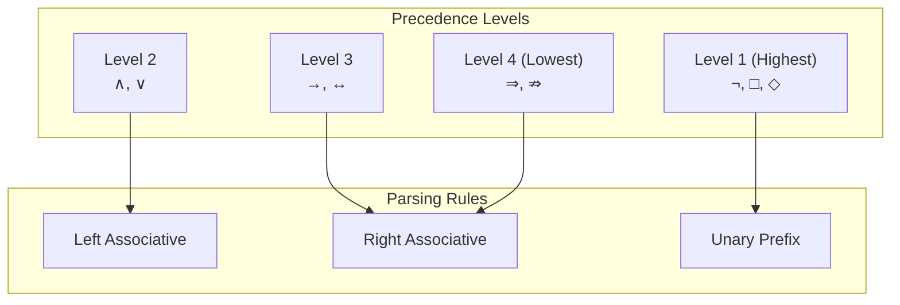

## Bit Vector Operations

### State Representation

```mermaid
graph LR
    subgraph "State Encoding"
        StateIndex[State Index<br/>e.g., 5]
        BitVector[Bit Vector<br/>0b0101]
        BitPositions[Bit Positions<br/>[0,2]]
    end
    
    subgraph "Operations"
        Extract[Extract Bits]
        Combine[Combine States]
        Test[Test Membership]
        Convert[Convert Format]
    end
    
    subgraph "Applications"
        Verifiers[Verifier Sets]
        Falsifiers[Falsifier Sets]
        Relations[Accessibility Relations]
    end
    
    StateIndex --> BitVector
    BitVector --> Extract
    Extract --> BitPositions
    
    BitPositions --> Combine
    Combine --> Verifiers
    Combine --> Falsifiers
    Test --> Relations
    Convert --> BitPositions
```

### Bit Vector Utilities

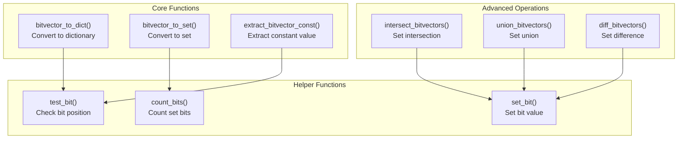

## Z3 Context Management

### Context Isolation Architecture

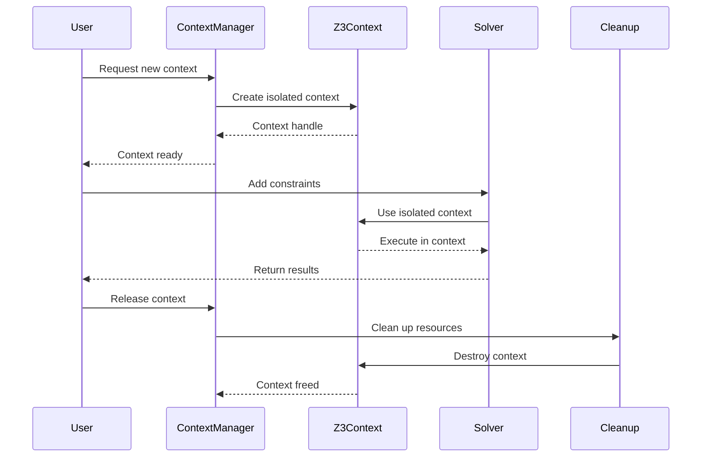

### Resource Management

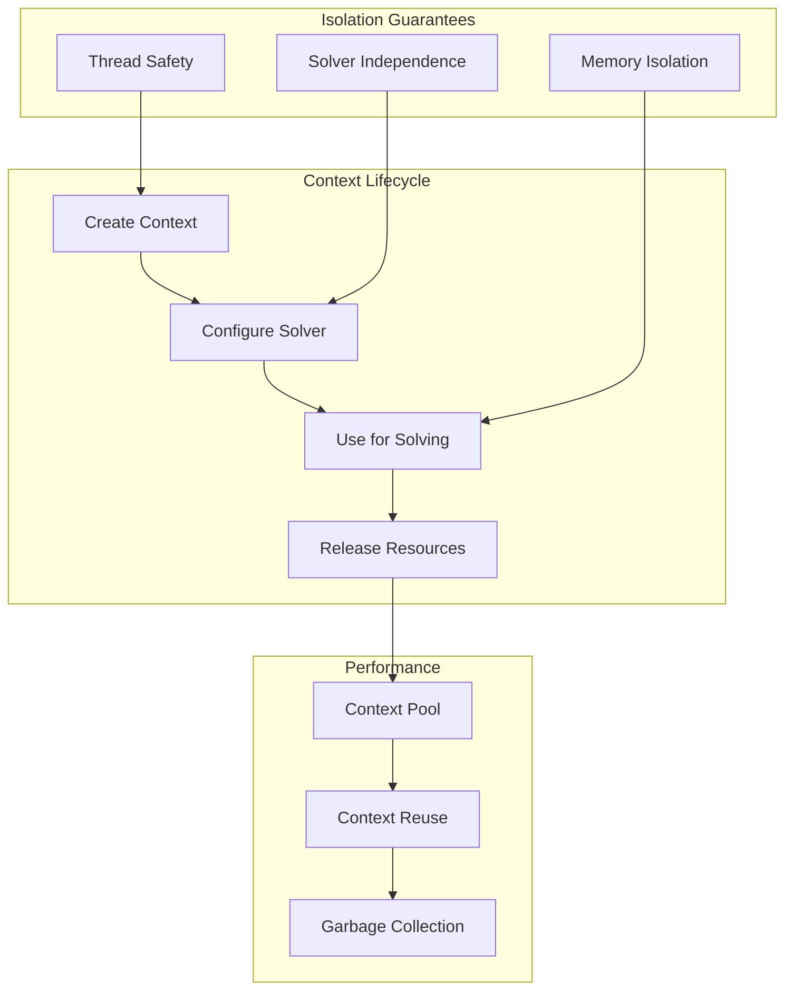

## Output Formatting System

### Formatting Pipeline

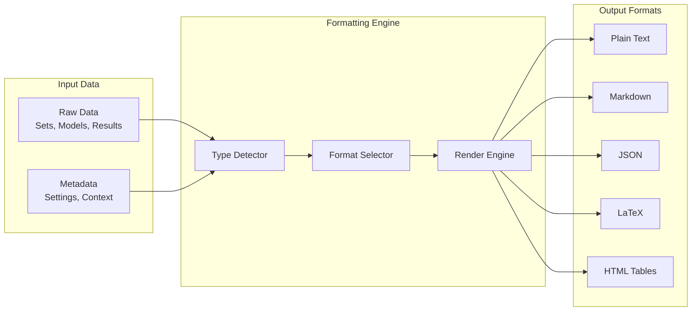

### Pretty Printing Architecture

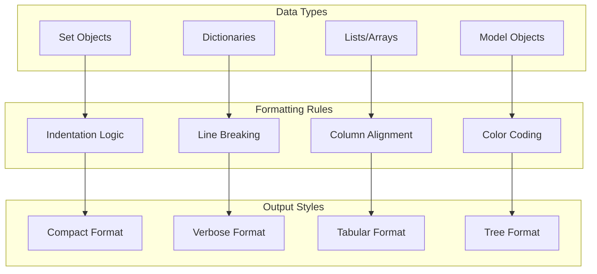

## API Function Architecture

### Theory and Example Access

```mermaid
graph TD
    subgraph "API Layer"
        GetTheory[get_theory()]
        GetExample[get_example()]
        ListTheories[list_theories()]
        ListExamples[list_examples()]
    end
    
    subgraph "Registry Access"
        TheoryRegistry[Theory Registry]
        ExampleRegistry[Example Registry]
        ModuleLoader[Module Loader]
    end
    
    subgraph "Validation"
        ValidateTheory[Validate Theory]
        ValidateExample[Validate Example]
        CheckDependencies[Check Dependencies]
    end
    
    GetTheory --> TheoryRegistry
    GetExample --> ExampleRegistry
    ListTheories --> TheoryRegistry
    ListExamples --> ExampleRegistry
    
    TheoryRegistry --> ValidateTheory
    ExampleRegistry --> ValidateExample
    ModuleLoader --> CheckDependencies
```

## Testing Utilities

### Test Runner Architecture

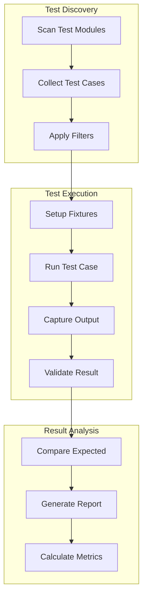

## Error Handling Patterns

### Error Processing Flow

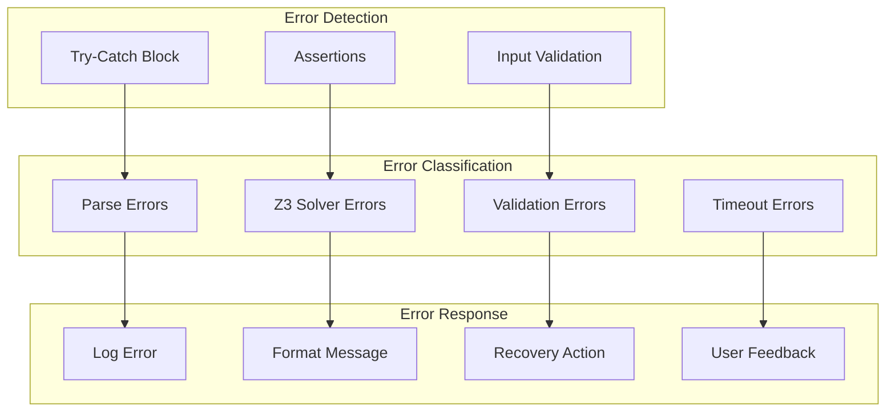

## Version Management

### Version Control System

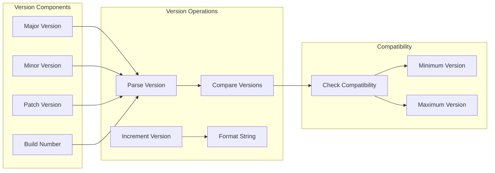

## Integration Patterns

### Cross-Module Dependencies

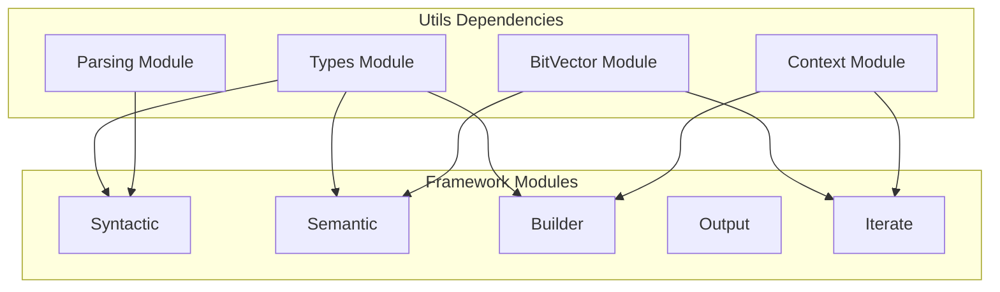

## Performance Considerations

### Optimization Strategies

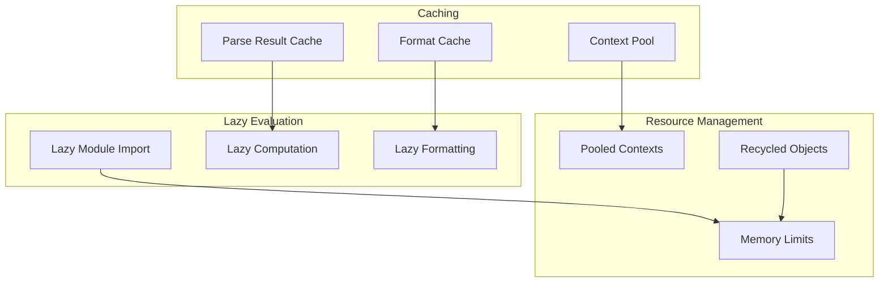

## Best Practices

### Design Principles

1. **Type Safety First**: Use comprehensive type hints for all functions
2. **Fail Fast**: Validate inputs early and provide clear error messages
3. **Resource Efficiency**: Pool and reuse expensive resources like Z3 contexts
4. **Clear Interfaces**: Provide simple, intuitive APIs for common operations
5. **Extensibility**: Design utilities to be easily extended or customized

### Implementation Guidelines

1. **Single Responsibility**: Each utility function should do one thing well
2. **Pure Functions**: Prefer pure functions without side effects where possible
3. **Error Handling**: Provide informative error messages with recovery suggestions
4. **Documentation**: Include usage examples in all function docstrings
5. **Testing**: Maintain comprehensive test coverage for all utilities

## Technical Implementation

For detailed implementation information, see:
- [Utils Package Documentation](../../Code/src/model_checker/utils/README.md)
- [Type Definitions](../../Code/src/model_checker/utils/types.py)
- [API Reference](../../Code/src/model_checker/utils/api.py)

## See Also

- [Pipeline Architecture](PIPELINE.md) - System-wide data flow
- [Builder Architecture](BUILDER.md) - Pipeline orchestration
- [Settings Management](SETTINGS.md) - Configuration utilities

---

[← Back to Architecture](README.md) | [Theory Framework →](THEORY_LIB.md) | [Pipeline →](PIPELINE.md)