# Screenshots

The images below have been generated from the examples provided [here](https://github.com/benbrastmckie/ModelChecker/tree/master/Examples).

## Countermodels

### Counterfactual Strengthening of the Antecedent

### Counterfactual Excluded Middle

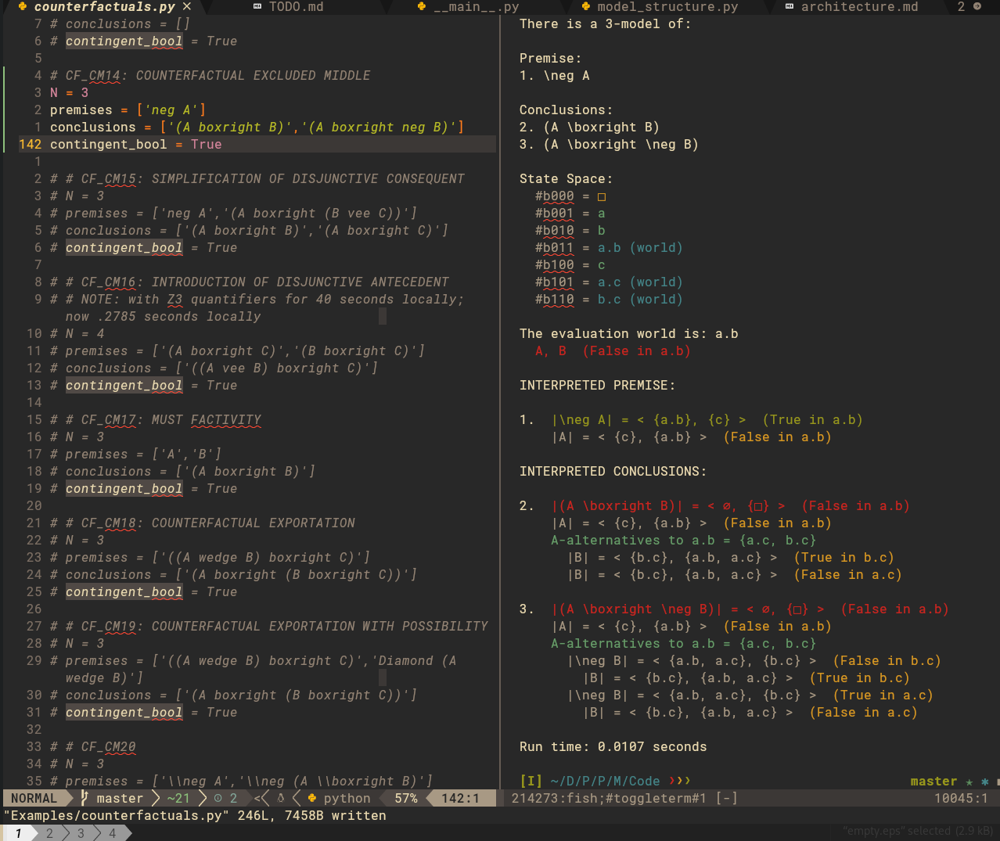

### Counterfactual Transitivity

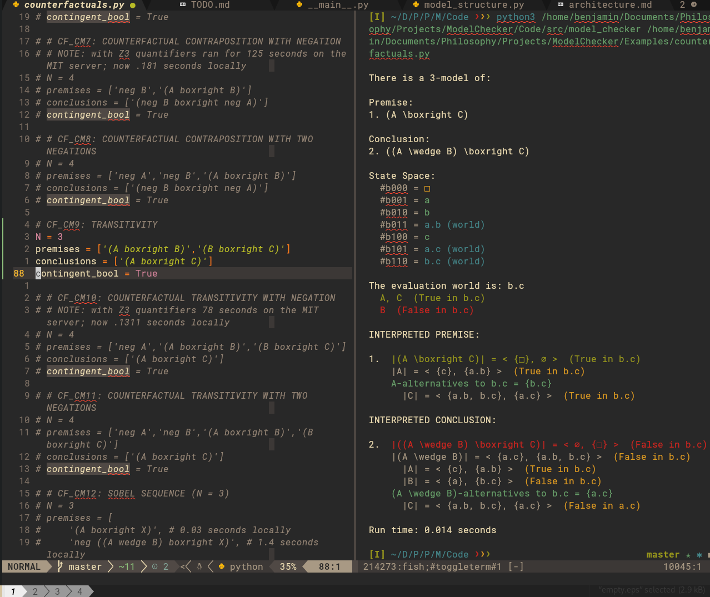

### Strict Conditional to Ground

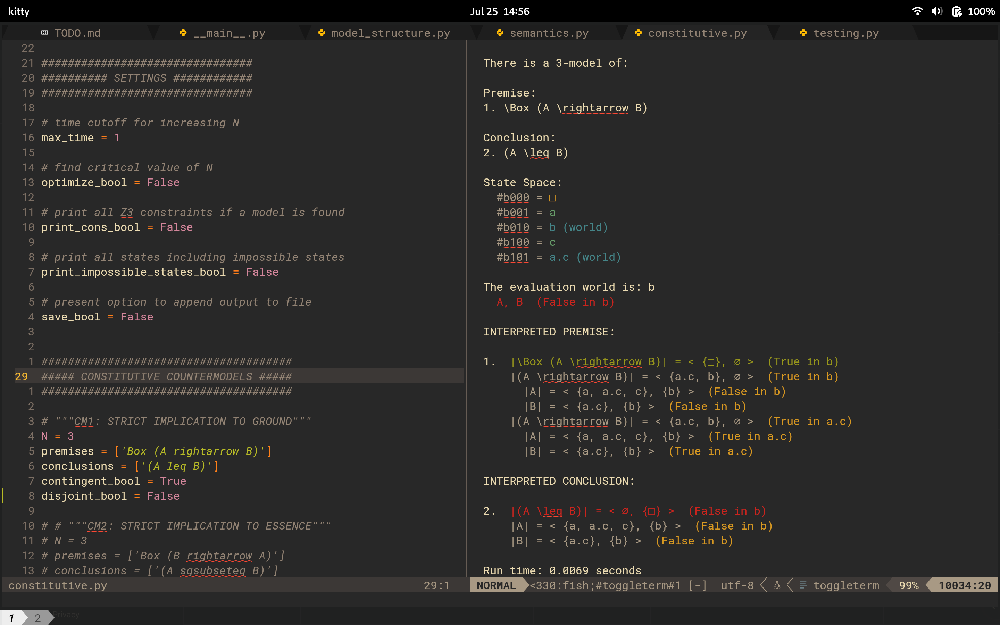

### Conjunction Supplementation for Ground

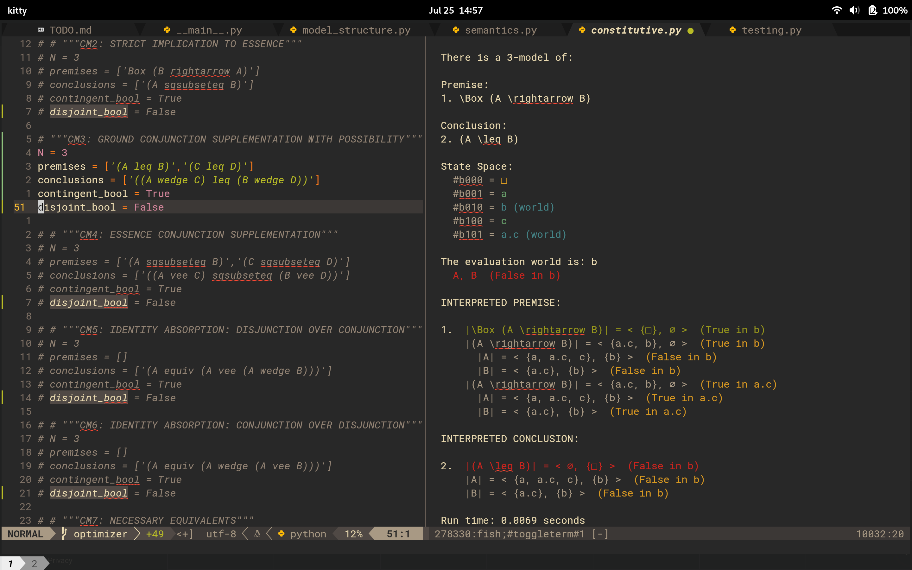

### Counterfactual to Strict Conditional

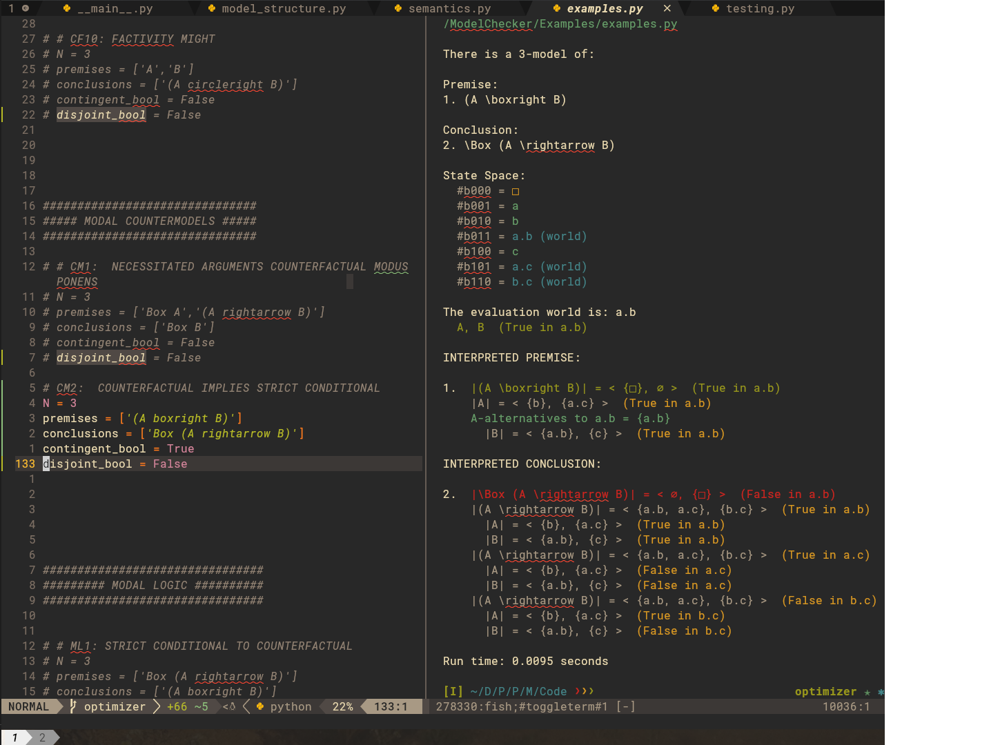

### Relevance Antecedent Strengthening

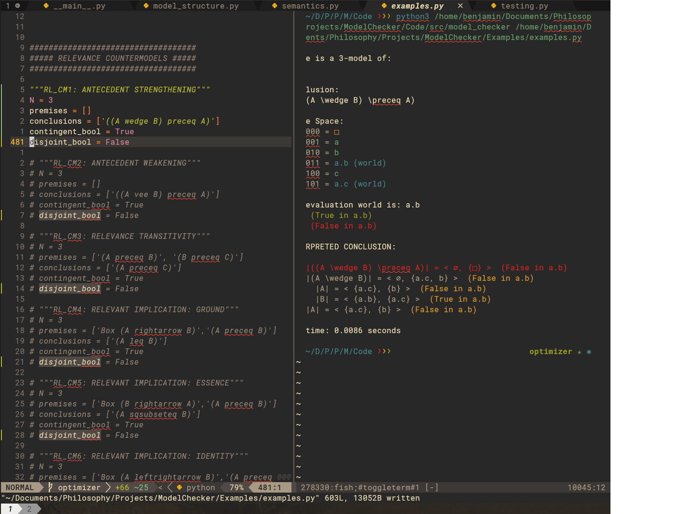

### Relevance Antecedent Weakening

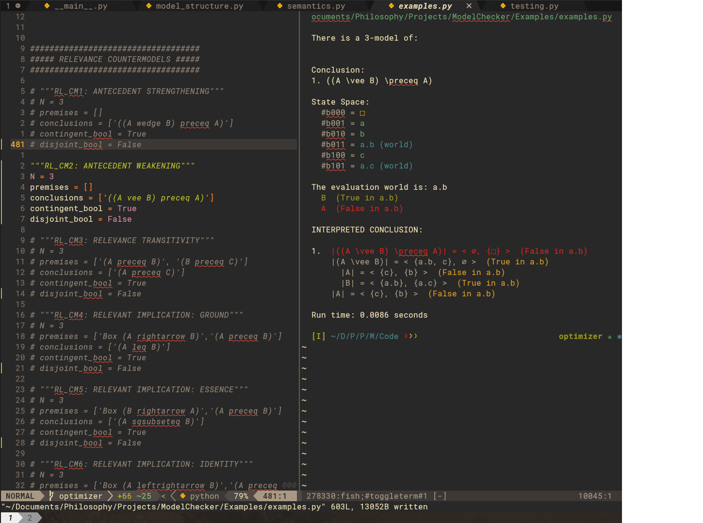

### Relevance Implication to Ground

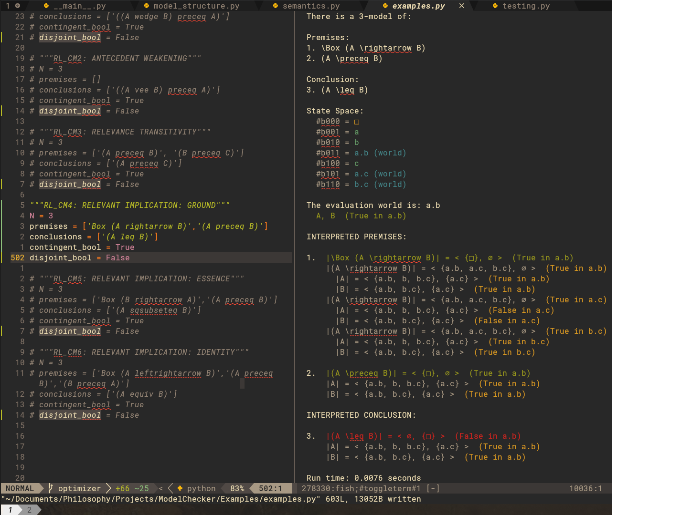

## Validities

### Counterfactual Examples

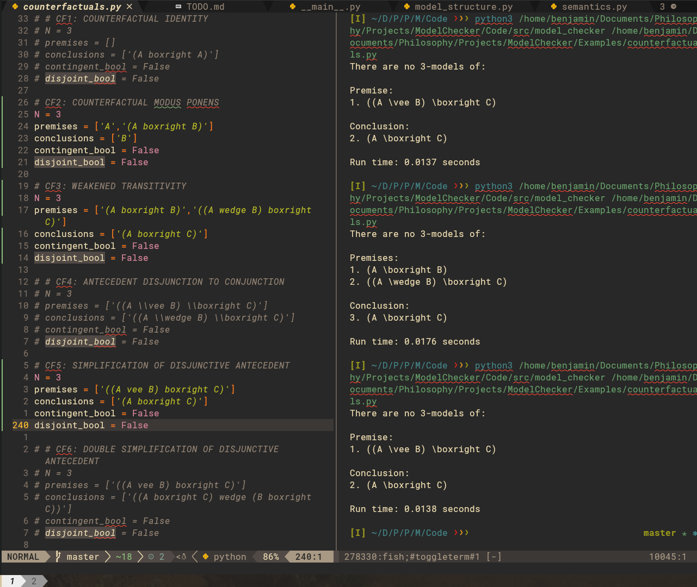

### Constitutive Examples

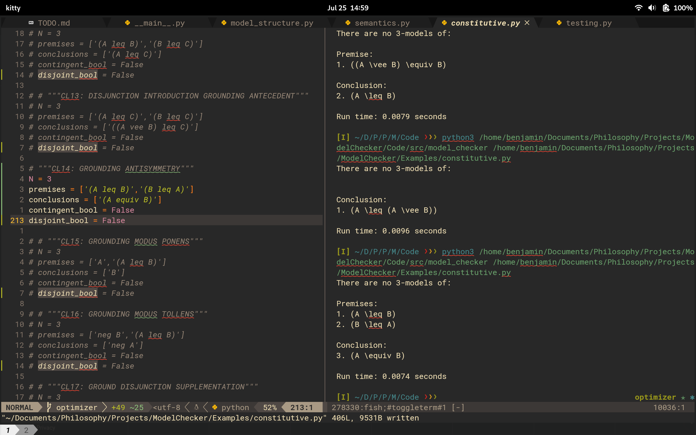

### Modal Examples

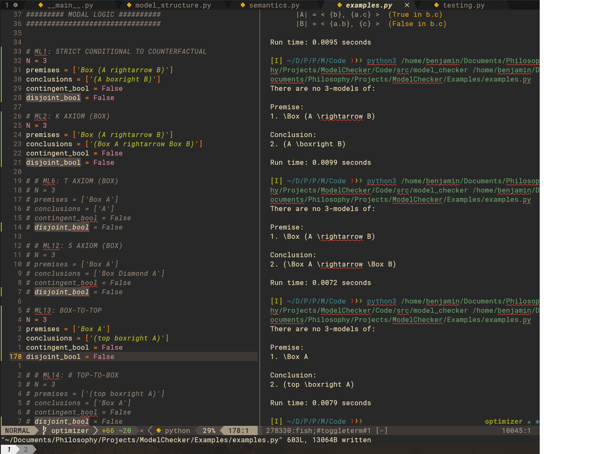

### Relevance Examples

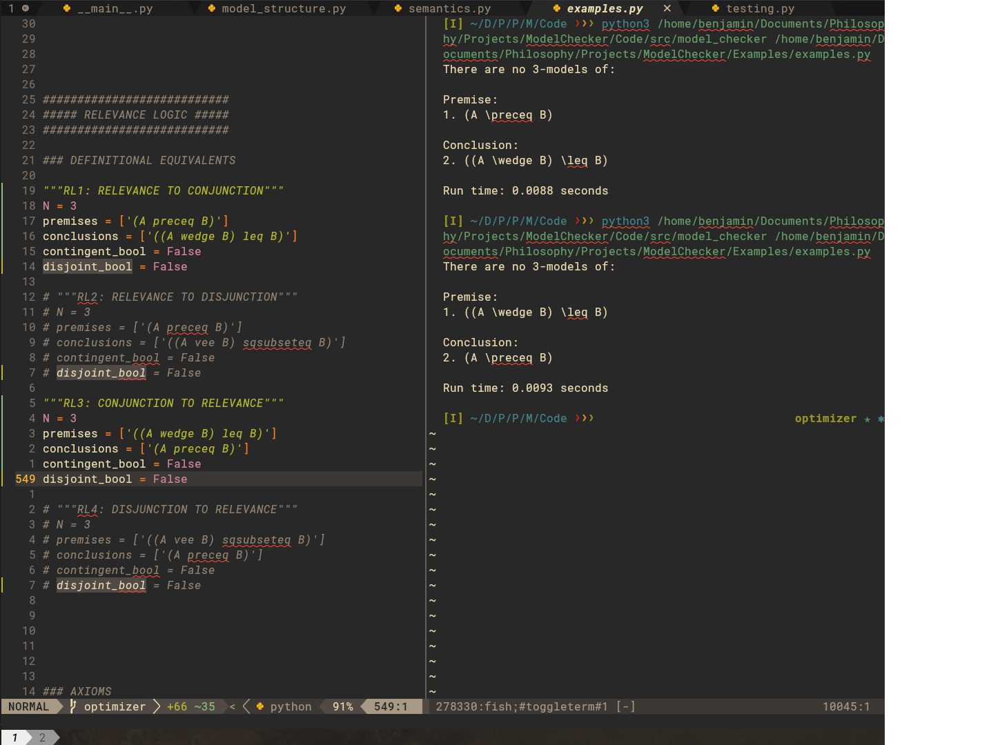
