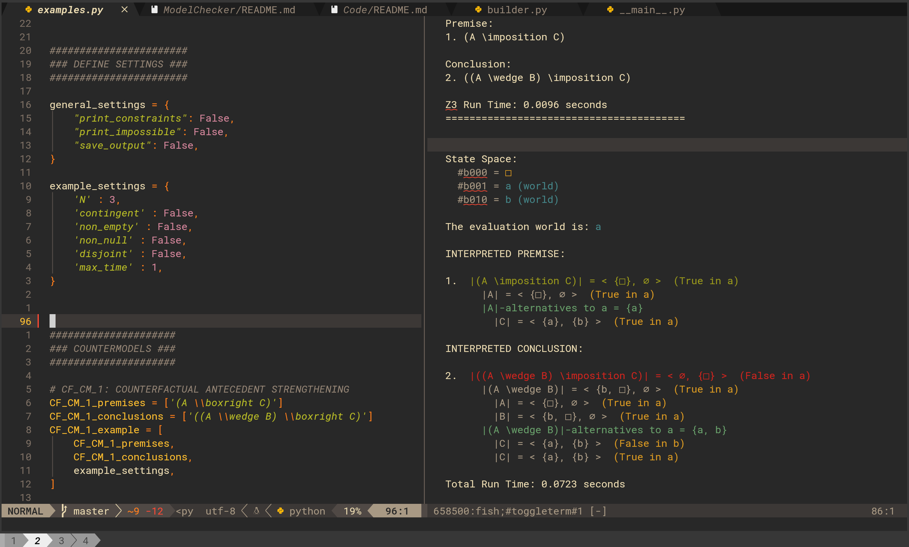

# Model Checker

This project draws on the SMT solver [Z3](https://github.com/Z3Prover/z3) to provide tooling for finding hyperintensional countermodels and establishing validity over models up to a user specified level of complexity for inferences in a propositional language with the following operators:

  - `neg` for _negation_
  - `wedge` for _conjunction_
  - `vee` for _disjunction_
  - `rightarrow` for the _material conditional_
  - `leftrightarrow` for the _material biconditional_
  - `boxright` for the _must counterfactual conditional_
  - `circleright` for the _might counterfactual conditional_
  - `Box` for _necessity_
  - `Diamond` for _possibility_
  - `leq` for _ground_ read 'sufficient for'
  - `sqsubseteq` for _essence_ read 'necessary for'
  - `equiv` for _propositional identity_ read 'just is for'
  - `preceq` for _relevance_
  <!-- - `not` for _exclusion_ -->

The current version provides tooling for the [hyperintensional semantics](#Hyperintensional-Semantics) briefly discussed below with links to further resources.
By abstracting on the details of the particular semantics that the current version includes, the version now under development will provide a general purpose tool kit for developing and studying hyperintensional semantic systems.
This version should be released by the end of 2024.
<!-- See the section on [programmatic semantics](#Programmatic-Semantics) below for more details. -->

### Screenshot



> NOTE: Additional images can be found [here](https://github.com/benbrastmckie/ModelChecker/blob/master/Images/screenshots.md).

## Programmatic Semantics

A programmatic methodology in semantics streamlines the otherwise computationally grueling process of developing and testing novel semantic theories.
By easing the process of investigating increasingly complex semantic theories, this methodology aims to support the growth and maturity of semantics as a discipline.
Instead of only developing a model-theoretic version of a semantics and working out the consequence by hand or not at all, this project provides resources for writing semantic clauses using [Z3](https://github.com/Z3Prover/z3)'s python API without having to start from scratch by providing users with a host of functionality along with a flexible template that can be easily adapted.

Although computational resources are common place (e.g., one' laptop), the ability to make use of these resources to develop and explore the implications of novel semantic theories remains limited.
For instance, [Prover9 and Mace](https://www.cs.unm.edu/~mccune/prover9/) are restricted to first-order and equational statements.
However, for the purposes of semantics, it is desirable to: (1) introduce a range of primitive operators; (2) specify novel semantic clauses for each operator; (3) define the space of models for the resulting language; (4) test which sentences are a logical consequence of which; and (5) print readable countermodels if there are any.
After developing and testing a semantics for a language, one can develop the corresponding model theory and proof theory with a much better sense of the range of its theorems before establishing soundness or attempting to complete the logic.

Whereas the current version of the model-checker provides a programmatic semantics for the hyperintensional operators indicated above, the next release abstracts on the semantic theory included included as a default so that users may introduce semantic clauses for their own operators.
Instead of computing whether a given sentence is a logical consequence of some set of sentences by hand, these resources allow users to search for countermodels or establish logical consequence up to a finite level complexity.
Although computational systems cannot search the space of all models (typically a proper class), proving that there are no models up to some finite level of complexity provides evidence that the logical consequence in question holds in general where the broader the range of models, the stronger the evidence.
Additionally, if finite countermodels exist, users will be able to generate and print those models rather than attempting to do so by hand which is not only limited, but liable to include errors.

## Installation

Install [Python 3](https://www.python.org/downloads/) and run the following command in the terminal:

```
pip install model-checker
```

The project has the `z3-solver` as a dependency which should be installed automatically.
You can confirm that `z3-solver` is installed with:

```
pip show z3-solver
```

In case the dependency did not install automatically, you can run:

```
pip install z3-solver
```

More information can be found [here](https://packaging.python.org/en/latest/tutorials/installing-packages/).

## Updating

Once installed, you can check the current version of the `model-checker` with:

```
model-checker -v
```

For more information, you can run:

```
pip show model-checker
```

To update to the latest version, run:

```
model-checker -u
```

To receive updates about new releases, click the "Watch" button at the top right corner of this page.

## Instructions

The following section is intended to help make this software more accessible.
Users familiar with the terminal can skip to the [Usage](#Usage) instructions below.

### Terminal

Open the terminal (on MacOS, hit `Cmd + Space` and type `terminal`, hitting `Return`) and list the directories by typing `ls` and hitting `Return`. 
Navigate to your desired location with `cd directory/path/...`, replacing `directory/path/...` accordingly.
If you do not know the full path, you can change directory one step at a time by running `cd next_directory` where `next_directory` is to be replaced with the directory you want to change to, running `ls` after each move to see what to enter next.

Alternatively, if you are on MacOS, write `cd` followed by a space in the terminal but do not hit `return`.
Then you can open the desired project directory in Finder, dragging the Finder window onto the terminal.
This should paste the path into the terminal.
You can now hit return to change to the desired directory.
If you are in the directory in which the `test_file.py` exists, you can run `model-checker test_file.py` without specifying the full (or relative) path to that file.
Use the 'up'-arrow key to scroll through past commands, saving time when running the same file multiple times.

Files can be edited with your choice of text editor, e.g., run `vim test_file.py` to edit the named file in the terminal with Vim (for help, run `vimtutor`).
If you do not want to use Vim (exit with `:qa`), you might consider using this configuration of [NeoVim](https://github.com/benbrastmckie/.config) or [VSCodium](https://github.com/benbrastmckie/VSCodium) for working with LaTeX, Markdown, Python, etc., or any other editor you like (e.g., TextEdit on MacOS, or [PyCharm](https://www.jetbrains.com/pycharm/)).

### Usage

To generate a test file run `model-checker` in the terminal.
Alternatively, run `model-checker path/to/test_file.py` if the `test_file.py` already exists.
A number of [examples](https://github.com/benbrastmckie/ModelChecker/blob/master/Examples/examples.py) are provided in the GitHub repository.

Each file may specify the following inputs where the defaults are specified below:

  - A list of zero or more premises that are treated conjunctively: `premises = []`.
  - A list of zero or more conclusions that are treated disjunctively: `conclusions = []`.
  - The number of atomic states to include in each model: `N = 3`.
  - The maximum time in seconds to spend looking for a model: `max_time = 1`.

Optionally, the user can specify a number of additional settings where defaults are provided below:

  - Require all sentence letters to express contingent propositions: `contingent_bool = False`.
  - Require all sentence letters to express propositions with disjoint subject-matters: `contingent_bool = False`.
  - Find a model with the smallest number of atomic elements: `optimize_bool = False`.
  - Print all Z3 constraints or unsatisfiable core constraints: `print_constraints_bool = False`.
  - Show impossible states included in the model: `print_impossibe_states_bool = False`.
  - Prompt the user to append the output to the current file or to a new file: `save_bool = False`.

Users can override these settings from the command line by including the following flags:

  - Include `-c` to set `contingent_bool = True`.
  - Include `-d` to set `disjoint_bool = True`.
  - Include `-o` to set `optimize_bool = True`.
  - Include `-p` to set `print_constraints_bool = True`.
  - Include `-i` to set `print_impossibe_states_bool = True`.
  - Include `-s` to set `save_bool = True`.

Additional flags have been included in order to manage the package version:

  - Include `-h` to print help information about the package and its usage.
  - Include `-v` to print the installed version number.
  - Include `-u` to upgrade to the latest version.

The following section will sketch the underlying semantics.
More information can be found in the GitHub [repository](https://github.com/benbrastmckie/ModelChecker) as well as in this recent [manuscript](https://github.com/benbrastmckie/ModelChecker/blob/master/Counterfactuals.pdf). 

## Hyperintensional Semantics

The semantics is hyperintensional insofar as sentences are evaluated at _states_ which may be partial rather than total as in intensional semantic theories.
States are modeled by bitvectors of a specified length (e.g., `#b00101` has length `5`), where _state fusion_ is modeled by the bitwise OR operator `|`.
For instance, `#b00101 | #b11001 = #b11101`.
The _atomic states_ have exactly one occurrence of `1` and the _null state_ has no occurrences of `1`.
The space of states is finite and closed under fusion.

States are named by lowercase letters in order to print readable countermodels.
Fusions are printed using `.` where `a.b` is the fusion of the states `a` and `b`.
A state `a` is _part_ of a state `b` just in case `a.b = b`.
States may be either _possible_ or _impossible_ where the null state is required to be possible and every part of a possible state is possible.
The states `a` and `b` are _compatible_ just in case `a.b` is possible.
A _world state_ is any state that is both possible and includes every compatible state as a part.

Sentences are assigned _verifier states_ and _falsifier states_ where both the verifiers and falsifiers are required to be closed under fusion.
A sentence is _true at_ a world state `w` just in case `w` includes a verifier for that sentence as a part and _false at_ `w` just in case `w` includes a falsifier for that sentence as a part.
In order to ensure that sentence letters have at most one truth-value at each world state, a fusion `a.b` is required to be impossible whenever `a` is verifier for a sentence letter `A` and `b` is a falsifier for `A`.
Additionally, sentence letters are guaranteed to have at least one truth-value at each world state by requiring every possible state to be compatible with either a verifier or falsifier for any sentence letter.

A _negated sentence_ is verified by the falsifiers for the sentence negated and falsified by the verifiers for the sentence negated.
A _conjunctive sentence_ is verified by the pairwise fusions of verifiers for the conjuncts and falsified by falsifiers for either of the conjuncts or fusions thereof.
A _disjunctive sentence_ is verified by the verifiers for either disjunct or fusions thereof and falsified by pairwise fusions of falsifiers for the disjuncts.
Conjunction and disjunction are dual operators obeying the standard idempotence and De Morgan laws.
The absorption laws do not hold, nor does conjunction distribute over disjunction, nor _vice versa_.
For a defense of the background theory of hyperintensional propositions, see this [paper](https://link.springer.com/article/10.1007/s10992-021-09612-w).

<!-- By contrast with the _bilateral_ extensional operators which treat both verifiers and falsifiers, the semantics for `not` is _unilateral_. -->
<!-- In particular `not A` is verified by a state `s` just in case every non-null part of `s` is incompatible with a verifier for `A` and every verifier for `A` is incompatible with some non-null part of `s`. -->
<!-- This semantics is further motivated and elaborated in [Bernard and Champollion](https://ling.auf.net/lingbuzz/007730/current.html) and included here for comparison. -->

A _necessity sentence_ `Box A` is true at a world just in case every world state includes a part that verifies `A` and a _possibility sentence_ `Diamond A` is true at a world just in case some world state includes a part that verifies `A`.
Given a world state `w` and state `s`, an `s`_-alternative_ to `w` is any world state to include as parts both `s` and a maximal part of `w` that is compatible with `s`.
A _must counterfactual conditional sentences_ `A boxright B` is true at a world state `w` just in case its consequent is true at any `s`-alternative to `w` for any verifier `s` for the antecedent of the counterfactual.
A _might counterfactual conditional sentences_ `A boxright B` is true at a world state `w` just in case its consequent is true at some `s`-alternative to `w` for some verifier `s` for the antecedent of the counterfactual.
The semantic theory for counterfactual conditionals is motivated and further elaborated in this accompanying [paper](https://github.com/benbrastmckie/ModelChecker/blob/master/Counterfactuals.pdf).
This account builds on [Fine 2012](https://www.pdcnet.org/jphil/content/jphil_2012_0109_0003_0221_0246) and [Fine2012a](https://link.springer.com/article/10.1007/s11229-012-0094-y?error=cookies_not_supported&code=5166a4da-1834-438c-9f93-75b61f58b6db).

A _grounding sentence_ `A leq B` may be read '`A` is _sufficient for_ `B`' and an _essence sentence_ `A sqsubseteq B` may be read '`A` is _necessary for_ `B`'.
A _propositional identity sentence_ `A equiv B` may be read '`A` _just is for_ `B`'.
A _relevance sentence_ `A preceq B` may be read '`A` _is wholly relevant to_ `B`'.
The semantics for ground requires every verifier for the antecedent to be a verifier for the consequent, any fusion of a falsifier for the antecedent and consequent to be a falsifier for the consequent, and any falsifier for the consequent to have a part that falsifies the antecedent.
The semantics for essence requires every fusion of a verifier for the antecedent and consequent to be a verifier for the consequent, any verifier for the consequent must have a part that verifies the antecedent, and every falsifier for the antecedent to be a falsifier for the consequent.
The semantics for propositional identity requires the two arguments to have the same verifiers and falsifiers.
The semantics for relevance requires any fusion of verifiers for the antecedent and consequent to be a verifier for the consequent and, similarly, any fusion of falsifiers for the antecedent and consequent to be a falsifier for the consequent.
Whereas the first three constitutive operators are interdefinable, relevance is definable in terms of the other constitutive operators but not _vice versa_:

- `A leq B  :=  neg A sqsubseteq neg B  :=  (A vee B) equiv B`.
- `A sqsubseteq B  :=  neg A leq neg B  :=  (A wedge B) equiv B`.
- `A equiv B  :=  (A leq B) wedge (B leq A)  :=  (A sqsubseteq B) wedge (B sqsubseteq A)`.
- `A preceq B  :=  (A wedge B) leq B :=  (A vee B) sqsubseteq B`.

Instead of a Boolean lattice as in extensional and intensional semantics theories, the space of hyperintensional propositions forms a non-interlaced bilattice as described in this [paper](https://link.springer.com/article/10.1007/s10992-021-09612-w), building on [Fine 2017](https://link.springer.com/article/10.1007/s10992-016-9413-y).
