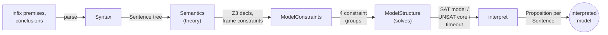
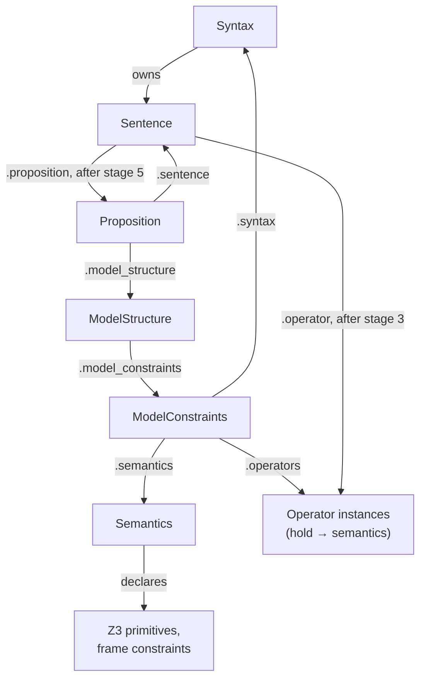

# The Pipeline
[← Spec map](./README.md)

> The five-stage construction pipeline that turns a pair of infix-string premise/conclusion
> lists into a solved, interpreted model, and the object graph it builds along the way.

## The five stages

Every example in the system — whether run from the CLI, a test, or a notebook — is built by the
same sequence, assembled by hand at every call site (there is no single pipeline function; see
[`14-porting-notes.md`](./14-porting-notes.md)):

| # | Stage | Constructor | Produces |
|---|---|---|---|
| 1 | Syntax | `Syntax(premises, conclusions, operator_collection)` | a tree of `Sentence` objects, parsed and operator-linked |
| 2 | Semantics | `{Theory}Semantics(settings)` | Z3 primitive declarations, frame constraints, the evaluation-point shape |
| 3 | ModelConstraints | `ModelConstraints(settings, syntax, semantics, proposition_class)` | four labelled constraint groups, ready to assert |
| 4 | ModelStructure | `{Theory}ModelStructure(model_constraints, settings)` | a solved (or timed-out, or unsat) model — **solving happens inside this constructor** |
| 5 | interpret | `model_structure.interpret(premises + conclusions)` | a `Proposition` attached to every `Sentence`, bottom-up |

Stage 1 is pure syntax and is covered in full by [`02-syntax-and-ast.md`](./02-syntax-and-ast.md)
and [`03-operators.md`](./03-operators.md). Stages 2–3 build the SMT problem
([`04-constraint-generation.md`](./04-constraint-generation.md),
[`05-state-encoding.md`](./05-state-encoding.md)). Stage 4 is the solver boundary
([`06-solver-and-results.md`](./06-solver-and-results.md)). Stage 5 attaches semantic values
([`07-propositions.md`](./07-propositions.md)).

Construction order is strict but enforced only by convention: each constructor takes the previous
stage's product as an argument, and nothing prevents calling stages out of order or twice.

## What each stage consumes and produces

- **Syntax** consumes two lists of infix-formula strings plus an `OperatorCollection` (the set of
  operator classes available to this theory); it produces `all_sentences` (every sentence and
  subsentence, keyed by infix string and interned — see
  [`02-syntax-and-ast.md`](./02-syntax-and-ast.md)), `sentence_letters`, and the `premises` /
  `conclusions` sentence lists.
- **Semantics** consumes only the merged settings dict; it produces the theory's Z3 primitive
  functions (e.g. `verify`, `falsify`, `possible` for the state-mereology family), the frame
  constraints, `main_point` (the designated evaluation point), and the `premise_behavior` /
  `conclusion_behavior` callables.
- **ModelConstraints** consumes the syntax tree and the semantics object; it instantiates every
  operator class in the collection against this semantics, mutates every `Sentence` in the tree
  (operator classes become operator instances — phase 3 of the sentence lifecycle), and produces
  the four constraint groups.
- **ModelStructure** consumes the constraint groups and settings; it produces a fully solved (or
  failed) model together with a large mutable state block described in
  [`06-solver-and-results.md`](./06-solver-and-results.md).
- **interpret** consumes the solved structure and the premise/conclusion sentences; it walks the
  tree bottom-up and attaches a `Proposition` to every node.

## The object graph

Arrows mean "holds a reference to". The graph is **acyclic through stage 4** and becomes
**cyclic at interpretation** (stage 5): `Sentence.proposition` points to a `Proposition` whose
`.sentence` points back, and `ModelStructure` reaches its own premises/conclusions through
`Sentence.proposition.model_structure`.

There is also pervasive **downward aliasing**: each later stage copies references out of earlier
stages into flat attributes on itself (`ModelStructure.N` aliases `semantics.N`,
`Proposition.settings` aliases the structure's settings, and so on). Treat these as derived
accessors, not independent state — a port that keeps one source of truth per value has no
analogue of this pattern to reproduce.

## Lifecycle phases, briefly

The single AST node type, `Sentence`, is mutated through four phases as it moves through this
pipeline — created (stage 1), type-updated (still stage 1, immediately after parsing), object-
updated (stage 3), and proposition-updated (stage 5). The *type* of some fields changes across
phases (`operator` holds `None`, then an operator class, then an operator instance). This is the
single deepest structural property of the syntax layer; the full four-phase table, with triggers
and field-type changes, is in [`02-syntax-and-ast.md`](./02-syntax-and-ast.md).

## Source files

- [`builder/example.py`](../../code/src/model_checker/builder/example.py) — the production
  assembly of all five stages (`BuildExample._build_model_structure`)
- [`utils/testing.py`](../../code/src/model_checker/utils/testing.py) — the same five stages in
  minimal, dependency-free form (`run_test`)
- [`syntactic/syntax.py`](../../code/src/model_checker/syntactic/syntax.py) — stage 1, `Syntax`
- [`models/semantic.py`](../../code/src/model_checker/models/semantic.py) — stage 2 base class,
  `SemanticDefaults`
- [`models/constraints.py`](../../code/src/model_checker/models/constraints.py) — stage 3,
  `ModelConstraints`
- [`models/structure.py`](../../code/src/model_checker/models/structure.py) — stages 4–5,
  `ModelDefaults` (solving and `interpret`)
- [`syntactic/sentence.py`](../../code/src/model_checker/syntactic/sentence.py) — the `Sentence`
  node and its lifecycle
