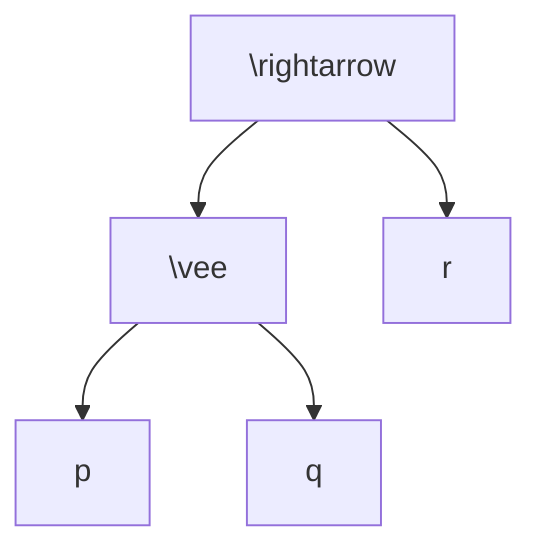
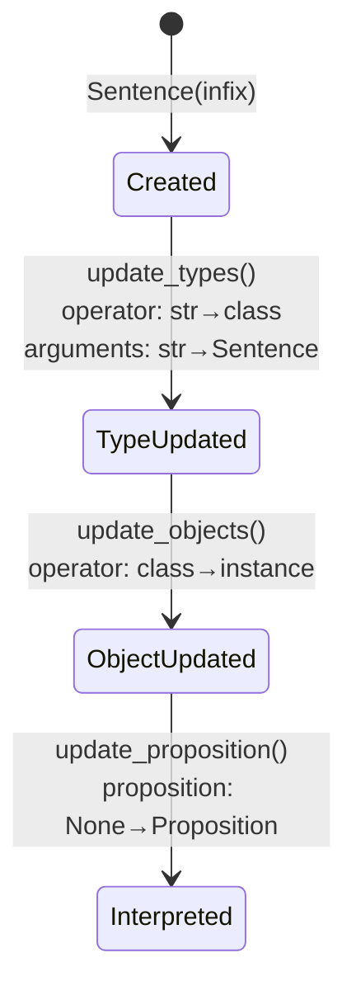

# Syntax and the AST
[← Spec map](./README.md)

> The surface DSL, the recursive-descent parser, the prefix-list output shape, and the
> `Sentence` node's four-phase mutation lifecycle.

## Surface syntax

The DSL is a LaTeX-token propositional language. The parser is deliberately **theory-agnostic**:
it recognizes token *shapes*, not operator *names* — which operators exist is resolved in a later
pass, against whatever `OperatorCollection` the caller supplies.

- **Atoms**: any token for which `token.isalnum()` holds — `p`, `A`, `B1` are atoms. `isalnum()`
  is Unicode-aware, so non-ASCII letters are technically atoms too.
- **Operators**: any token beginning with `\` — `\neg`, `\wedge`, `\boxright`. The parser does not
  know which operator names are valid; that check happens when strings are resolved to classes.
- **Nullary operators**: exactly `\top` and `\bot`, hard-coded as complete formulas in five
  separate locations across the parser and AST layer. A theory cannot add a third nullary operator
  without editing this core code.
- **Unary operators**: prefix, unparenthesized — `\neg p`, `\Box \neg p`.
- **Binary operators**: strictly infix and **mandatorily parenthesized**, with no precedence —
  every binary application carries its own parentheses: `((p \vee q) \rightarrow r)`.
- **Tokenization**: parentheses are padded with spaces, then the string is split on whitespace, so
  every token must be whitespace- or paren-separated.

## The parsing algorithm

Hand-written recursive descent over a mutable token list, with a binary-splitting helper that
scans left-to-right tracking parenthesis depth to locate the main connective. Outline:

1. Pop the first token.
2. If it is `(`: pop the matching `)` from the end, split the interior into
   `(operator, left_tokens, right_tokens)`, recursively parse both sides, and return
   `[operator, left, right]`.
3. If it is an atom: return `[token]`.
4. If it is `\top`/`\bot`: return `[token]`.
5. Otherwise (a unary operator token): parse one argument and return `[token, arg]`.

**Two verified gaps a port should close:**

- **Leftover tokens are silently discarded.** Nothing checks that the token list is empty when
  parsing returns. `"p q"` parses as `p`; `"\wedge p q"` parses as a *unary* application of
  `\wedge`, silently dropping `q`. Returning `(ast, rest)` with an end-of-input assertion
  eliminates the class.
- **Arity is never checked syntactically.** The well-formedness check inspects only the head token
  of a prefix list and never recurses or checks arity against the operator's declared arity.
  `(p \neg q)` (giving the unary `\neg` two arguments) parses without complaint and fails much
  later as a raw Python `TypeError` deep inside constraint generation, not as a parse error.

## Prefix-list shape

The parser's output is a nested list where **every argument is itself a list**, even atoms —
not the flat, Unicode-operator form that some of the repository's own documentation shows.

```
"p"                              -> ["p"]
"\neg p"                         -> ["\neg", ["p"]]
"(p \wedge q)"                   -> ["\wedge", ["p"], ["q"]]
"((p \vee q) \rightarrow r)"     -> ["\rightarrow", ["\vee", ["p"], ["q"]], ["r"]]
```



## The `Sentence` node and its four-phase lifecycle

There is **one** AST node class — no `AtomNode`/`BinaryNode` hierarchy. A single mutable
`Sentence` covers every case, and its fields change *type* as it passes through four phases.

| Phase | Trigger | Effect |
|---|---|---|
| 1. Creation | `Sentence(infix)` | parses infix to a prefix list; sets `name` (original infix string), `prefix_sentence`, `complexity`; for complex sentences, `original_arguments` holds the arguments as **infix strings** and `original_operator` holds the operator as a **string** |
| 2. Type update | `update_types(operator_collection)`, called from `Syntax.initialize_sentences` | operator strings become operator **classes**; atom strings become Z3 `Const(atom, AtomSort)`; **defined operators are expanded** (see [`03-operators.md`](./03-operators.md)); `arguments` is populated, mutating from strings to `Sentence` objects |
| 3. Object update | `update_objects(model_constraints)`, called from `ModelConstraints.instantiate` | operator classes become operator **instances**, looked up by name in the theory's instantiated collection — the instances carry the theory's semantics object |
| 4. Proposition update | `update_proposition(model_structure)`, called from `ModelStructure.interpret` | `proposition` is populated with a theory `Proposition` instance |

So the single field `operator` holds, over its lifetime: `None` → class → instance. Nothing in
the object enforces that consumers respect the current phase. A typed port should model the four
phases as four distinct types — parsed, operator-resolved, semantics-bound, interpreted — rather
than one mutable node with phase-conditional field meanings.



## Interning, sentence letters, and `AtomSort`

`Syntax` interns every node it builds **by infix string**: a subformula appearing in several
premises or conclusions is one shared, mutable object, not a copy. Sentence letters (atoms) become
Z3 `Const(name, AtomSort)`, where `AtomSort` is a Z3 uninterpreted sort created lazily and cached
**per process**, not per example — isolation between examples relies on fresh solvers, not fresh
sorts (see [`06-solver-and-results.md`](./06-solver-and-results.md)). Distinctness of atom
constants is Z3's ordinary name-interning; nothing asserts that two differently-named letters
denote different atoms — the `verify`/`falsify` functions simply take the atom as an argument.

## Source files

- [`syntactic/sentence.py`](../../code/src/model_checker/syntactic/sentence.py) — the `Sentence`
  node, its lifecycle methods, infix rendering
- [`utils/parsing.py`](../../code/src/model_checker/utils/parsing.py) — `parse_expression`, the
  recursive-descent algorithm
- [`syntactic/syntax.py`](../../code/src/model_checker/syntactic/syntax.py) — `Syntax`, interning,
  the circularity check
- [`syntactic/atoms.py`](../../code/src/model_checker/syntactic/atoms.py) — `AtomSort`, the
  process-global sort cache
- [`syntactic/formulas.py`](../../code/src/model_checker/syntactic/formulas.py) —
  `is_syntactically_wff`, the permissive well-formedness check
- [`syntactic/errors.py`](../../code/src/model_checker/syntactic/errors.py) — `ArityError` (defined,
  never raised)

## Related

- [Operators](./03-operators.md) — definitional expansion happens during the phase-2 type update
  described above
- [Constraint generation](./04-constraint-generation.md) — phase 3 (object update) is driven by
  `ModelConstraints.instantiate`
