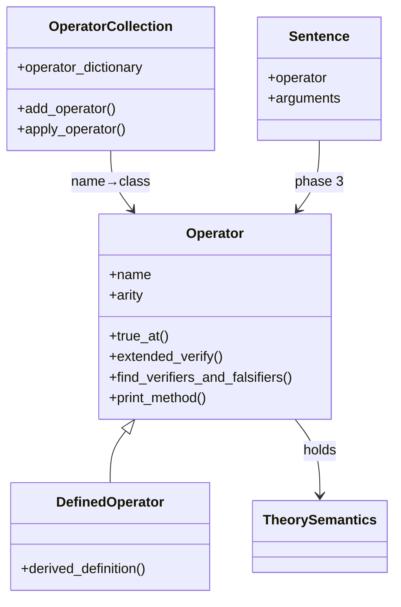

# Operators
[← Spec map](./README.md)

> The `Operator` / `DefinedOperator` / `OperatorCollection` abstraction, the six semantic
> methods every concrete operator implements, and definitional expansion.

This document covers the operator *abstraction* — method shapes, not formulas. The actual truth,
falsity, verification, and falsification conditions each method computes, for every operator in
all four theories, are in [`03a-operator-semantics.md`](./03a-operator-semantics.md).

## The `Operator` base class

Only three class attributes and the constructor are declared on the base class:

```python
class Operator:
    name: str | None = None      # e.g. "\\wedge"
    arity: int | None = None
    primitive: bool = True

    def __init__(self, semantics) -> None: ...
```

Equality and hashing are by `(name, arity)`. Three printing helpers (`general_print`,
`print_over_worlds`, `print_over_times`) are provided on the base class for reuse by concrete
operators' `print_method`.

## The six semantic methods

**None of the semantic methods are declared on the base class — not even as abstract methods.**
The contract exists only as a docstring; it is enforced solely by `AttributeError` at
constraint-generation time if an operator omits one. Every concrete operator implements the same
shape, arguments **splatted** followed by an `eval_point` dict:

| Method | Signature (arity-2 example) | When called | Returns |
|---|---|---|---|
| `true_at` | `(self, leftarg, rightarg, eval_point)` | constraint generation | Z3 `BoolRef` |
| `false_at` | `(self, leftarg, rightarg, eval_point)` | constraint generation | Z3 `BoolRef` |
| `extended_verify` | `(self, state, leftarg, rightarg, eval_point)` | constraint generation | Z3 `BoolRef` |
| `extended_falsify` | `(self, state, leftarg, rightarg, eval_point)` | constraint generation | Z3 `BoolRef` |
| `find_verifiers_and_falsifiers` | `(self, leftarg, rightarg, eval_point)` | post-solve | `(set, set)` of concrete states |
| `print_method` | `(self, sentence_obj, eval_point, indent, use_colors)` | display | — |

`eval_point` is a plain, untyped dict — `{"world": w}` for the state-mereology theories,
`{"world": id, "time": t}` for the temporal theory. Core code never inspects these keys; they are
a stringly-typed convention shared between each theory's dispatchers and its operators. See
[`04-constraint-generation.md`](./04-constraint-generation.md) for how `true_at`/`extended_verify`
are driven by mutual recursion with the theory semantics object, and
[`07-propositions.md`](./07-propositions.md) for how `find_verifiers_and_falsifiers` fits the
post-solve extraction story (which uses different method names in other theories).

Arity mismatches between a call site and an operator's declared `arity` surface only as a Python
`TypeError` at the splat call — an `ArityError` exists but is never raised.

## `DefinedOperator` and definitional expansion

A `DefinedOperator` supplies only `derived_definition(*args)`, returning a prefix structure whose
head is an operator **class** (not name):

```python
class ConditionalOperator(DefinedOperator):
    name = "\\rightarrow"
    arity = 2
    def derived_definition(self, leftarg, rightarg):
        return [OrOperator, [NegationOperator, leftarg], rightarg]
```

Its `arity` is validated against the parameter count of `derived_definition` via signature
inspection. Expansion happens during the sentence lifecycle's phase-2 type update
([`02-syntax-and-ast.md`](./02-syntax-and-ast.md)): the definition is instantiated and recursively
expanded until every node's head operator is primitive. Expansion is **total and eager** — because
derived arguments are themselves re-parsed and recursively type-updated, the whole tree ends up
primitive before constraint generation ever runs. Two consequences:

1. A `DefinedOperator`'s own `true_at`/`extended_verify` implementations are **dead code on the
   solve path** — `sentence.operator` is always the derived primitive head by the time constraints
   are built — yet every defined operator in the shipped theories hand-maintains them anyway,
   duplicated semantics that can drift from the definition.
2. The circularity check that detects cyclic definitions runs **after** expansion has already
   happened, so a circular definition that is actually used blows the recursion limit before the
   intended cycle report fires; the check only reliably catches cycles in operators the current
   example does not use.

## `OperatorCollection`

A name-keyed registry mapping operator name strings to operator classes. **Duplicate names are
silently skipped — first registration wins** — despite a defined-but-unused
`DuplicateOperatorError`; unknown names surface as a bare `KeyError` despite a defined
`UnknownOperatorError`. This matters because a composed theory (see
[`11-theory-catalog.md`](./11-theory-catalog.md)) builds its collection by merging several
subtheories' operator dicts in a fixed load order, so name collisions between subtheories are
resolved silently by that order, with no diagnostics.



## The three-register pattern

The single most important thing for a port to internalize: every primitive operator in the
shipped theories writes the **same truth condition up to three times**, in three separate
registers — the symbolic Z3 clause (`true_at`/`extended_verify`), the concrete post-solve
computation (`find_verifiers_and_falsifiers`), and the display routine (`print_method`), which
often re-derives the same structure a third time. This is the single largest source of drift risk
in the theory library, and deriving the concrete and display registers from the symbolic one is
the highest-leverage structural improvement a port can make. See
[`11-theory-catalog.md`](./11-theory-catalog.md) for a worked example (the counterfactual
operator) where all three registers independently re-derive alternative worlds.

## Source files

- [`syntactic/operators.py`](../../code/src/model_checker/syntactic/operators.py) — `Operator`,
  `DefinedOperator`, the printing helpers
- [`syntactic/collection.py`](../../code/src/model_checker/syntactic/collection.py) —
  `OperatorCollection`
- [`theory_lib/logos/subtheories/extensional/operators.py`](../../code/src/model_checker/theory_lib/logos/subtheories/extensional/operators.py)
  — reference implementations of a primitive and a defined operator

## Related

- [Operator semantics](./03a-operator-semantics.md) — the formulas each method computes
- [Syntax and the AST](./02-syntax-and-ast.md) — the phase-2 type update that drives expansion
- [Constraint generation](./04-constraint-generation.md) — the double dispatch that calls these
  methods
- [Propositions](./07-propositions.md) — how `find_verifiers_and_falsifiers` fits post-solve
  extraction
- [The theory catalog](./11-theory-catalog.md) — the worked three-register example
