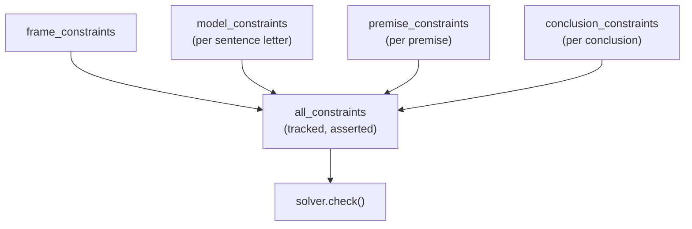
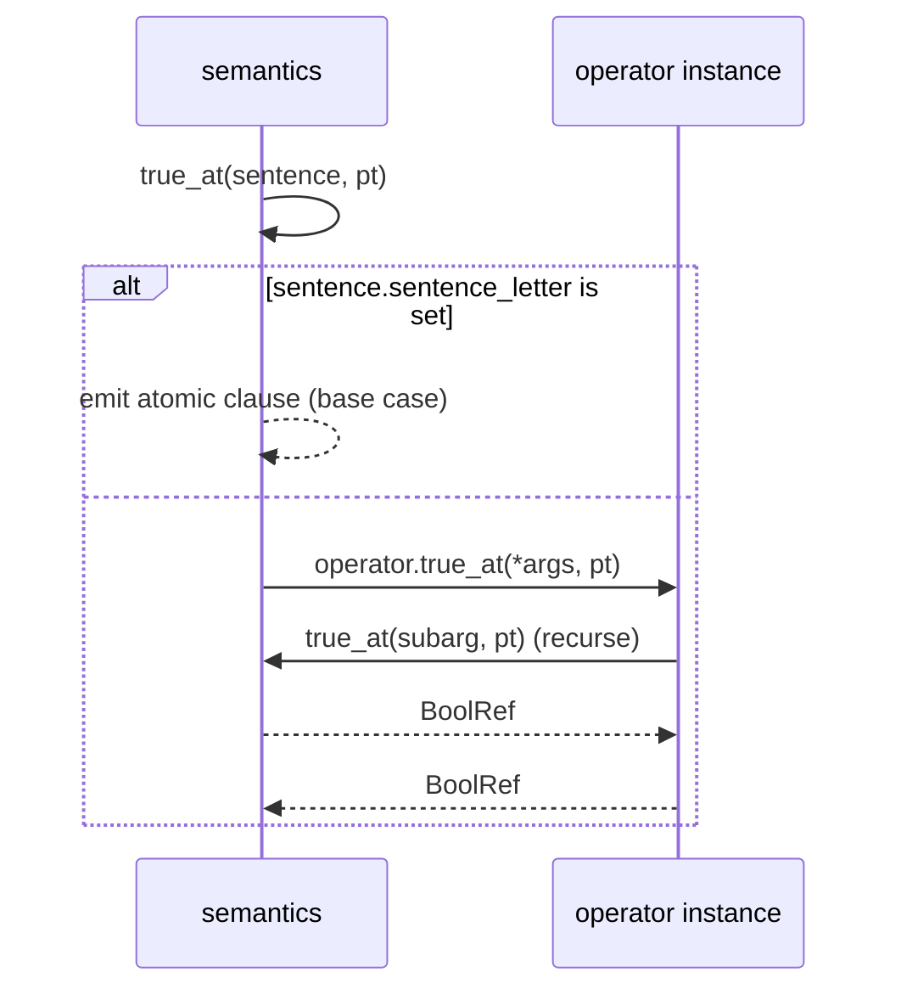

# Constraint Generation
[← Spec map](./README.md)

> How a parsed, operator-linked formula becomes a Z3 constraint set: `ModelConstraints`, the
> four labelled groups, the countermodel framing, and the double-dispatch translation.

## `ModelConstraints`

Constructed as `ModelConstraints(settings, syntax, semantics, proposition_class)`. Its
constructor, in order: loads the sentence letters as raw Z3 constants; instantiates **every**
operator class in the syntax's `OperatorCollection` against this semantics (this is where a
`DefinedOperator`'s arity is validated, whether the operator is used or not); walks the sentence
tree calling `update_objects` on every node — phase 3 of the `Sentence` lifecycle
([`02-syntax-and-ast.md`](./02-syntax-and-ast.md)), replacing operator classes with operator
instances; then builds the four constraint groups.

## The four constraint groups

| Group | Generated by | Content |
|---|---|---|
| `frame_constraints` | the theory semantics' own `__init__` | model-shape axioms — e.g. possibility downward-closed under parthood, `is_world(main_point)` |
| `model_constraints` | `proposition_class.proposition_constraints(mc, letter)`, once per sentence letter | the per-atom "what is a proposition" menu, settings-gated (see [`05-state-encoding.md`](./05-state-encoding.md) and [`07-propositions.md`](./07-propositions.md)) |
| `premise_constraints` | `semantics.premise_behavior(p)`, once per premise | encodes "premise is true at the designated point" |
| `conclusion_constraints` | `semantics.conclusion_behavior(c)`, once per conclusion | encodes "conclusion is false at the designated point" |



## The countermodel framing

`premise_behavior` and `conclusion_behavior` are **lambdas set by the theory**, canonically:

```python
self.premise_behavior    = lambda p: self.true_at(p, self.main_point)
self.conclusion_behavior = lambda c: self.false_at(c, self.main_point)
```

This bakes in **countermodel search**: the query asserts every premise true and every conclusion
false at the designated evaluation point. A `sat` result is therefore a countermodel — the
argument is invalid; `unsat` means the argument is valid. This framing is not incidental — it is
the query `ModelConstraints` is built to express, and a port must decide explicitly whether to
keep it or generalize to other query shapes (entailment by quantification, equivalence checking),
which would have to be expressed through these same two lambdas today.

## Double dispatch: the recursive constraint compiler

The formula → Z3 translation is **mutual recursion** between the theory's semantics object and
the operator instances, with no memoization — Z3's own hash-consing is the only sharing:



`semantics.true_at(sentence, eval_point)` checks whether `sentence.sentence_letter` is set: if so
it emits the atomic clause directly (the base case); otherwise it delegates to
`operator.true_at(*arguments, eval_point)`, and that operator recurses back into
`semantics.true_at`/`extended_verify` for its own subformulas. `false_at`, `extended_verify`, and
`extended_falsify` are structured the same way. The recursion bottoms out at sentence letters.

## The `proposition_constraints` idiom

One cross-class quirk needs explicit re-modelling in a port: `proposition_constraints` is written
as an *instance method of the proposition class*, but `ModelConstraints` invokes it **on the class
object, with a `ModelConstraints` instance bound as `self`**. It works only because both classes
happen to expose `.semantics` and `.settings` attributes with the same names. The clean
restatement is a pure function `(settings, semantics, letter) -> [Constraint]`, not a method on
either class.

## The semantic base contract

`SemanticDefaults` provides, for free, the state space (see
[`05-state-encoding.md`](./05-state-encoding.md)), mereology helpers, base general settings, and a
construction concurrency guard (see [`06-solver-and-results.md`](./06-solver-and-results.md)). It
requires a theory subclass to supply `DEFAULT_EXAMPLE_SETTINGS`, `main_point`,
`frame_constraints`, `premise_behavior`, `conclusion_behavior`, its own Z3 primitive declarations,
and the `true_at`/`false_at`/`extended_verify`/`extended_falsify` dispatchers. **Nothing enforces
this contract** — the base class sets these fields to `None`, and a theory that omits one fails
with `TypeError: 'NoneType' is not callable` deep inside `ModelConstraints`, not at the boundary
where the omission occurred.

## Source files

- [`models/constraints.py`](../../code/src/model_checker/models/constraints.py) —
  `ModelConstraints`, the four constraint groups, `instantiate`
- [`models/semantic.py`](../../code/src/model_checker/models/semantic.py) — `SemanticDefaults`,
  the base contract
- [`theory_lib/logos/semantic/core.py`](../../code/src/model_checker/theory_lib/logos/semantic/core.py)
  — the reference `true_at`/`extended_verify` dispatchers and `premise_behavior`/
  `conclusion_behavior` lambdas
- [`theory_lib/logos/semantic/proposition.py`](../../code/src/model_checker/theory_lib/logos/semantic/proposition.py)
  — `proposition_constraints`

## Related

- [Operators](./03-operators.md) — the operator side of the double dispatch
- [State encoding](./05-state-encoding.md) — the state space `true_at`/`extended_verify` quantify
  over
- [Solving and results](./06-solver-and-results.md) — how the four groups are tracked and asserted
- [The theory contract](./10-theory-contract.md) — what a theory must supply, formalized
