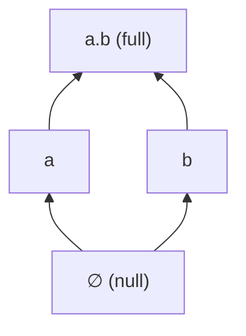

# State Encoding
[← Spec map](./README.md)

> The bit-vector state space, mereology over states, the full encoding table, and finite
> quantifier expansion as a semantic choice with a real cost model.

## The state space

A **state** is a Z3 bit-vector of width `N` (a per-example setting; the state-mereology family
defaults `N` in the range 2–16, capped at `MAX_N = 20`). The state space is *all* `2^N` values,
materialized eagerly as a Python list of `BitVecVal`s at semantics construction. The `MAX_N`
ceiling exists because of that eager materialization: the comment recording the measurement notes
275 MB resident at `N = 16` and 3.5 GB at `N = 20`. This is a hard, measured limit on how large a
model this design can represent, not an arbitrary constant.

## Mereology over bit-vectors

| Concept | Encoding |
|---|---|
| fusion (mereological sum) | bitwise OR, `s \| t` |
| part-of | `s \| t == t` |
| proper part-of | part-of and not equal |
| null state | `BitVecVal(0, N)` |
| full state | `BitVecVal(2^N - 1, N)` |

Fusion and part-of are the two primitives; `product` (pairwise fusion of two state sets) and
`coproduct` (fusion-closure of a union) are built from them and used by operators that combine
verifier/falsifier sets.

## The full encoding table

| Concept | Encoding |
|---|---|
| state | `BitVec(N)` |
| fusion | `s \| t` |
| part-of | `s \| t == t` |
| null / full state | `BitVecVal(0, N)` / `BitVecVal(2^N - 1, N)` |
| possible | uninterpreted `possible : BitVec(N) → Bool` |
| compatible(x, y) | `possible(fusion(x, y))` |
| world | `possible(w) ∧ ∀x. compatible(x, w) → is_part_of(x, w)` (a *maximal* possible state) |
| atomic truthmaking | uninterpreted `verify, falsify : BitVec(N) × AtomSort → Bool` |
| truth at a world | `∃x ⊑ w. verify(x, p)`, expanded to a `2^N`-way disjunction |
| sentence letter | Z3 `Const(name, AtomSort)`, `AtomSort` a process-global uninterpreted sort |

This table (together with the operator-method table described in the operators specification) is
the most directly reusable artifact in this specification — it is the whole semantic core that
the state-mereology theory family (logos, exclusion, imposition; see
[`11-theory-catalog.md`](./11-theory-catalog.md)) is built from.

The N=2 state lattice under parthood: four states — null, two atoms `a` and `b`, and their fusion
`a.b` (displayed with the fusion-notation convention: atomic substates are labelled `a`, `b`, `c`,
…, and a fusion is written `a.b`; the null state displays as `□`).

## Helper predicates

The state-mereology family builds its operator semantics from a small stack of derived
predicates over the encoding above. These are *definitions*, not additional Z3 primitives — each
expands to a quantifier-free formula (via the finite quantifier expansion below) mentioning only
`possible`, parthood, and fusion. A port should implement them as functions from states to
formulas, in this dependency order:

| Predicate | Definition | Reading |
|---|---|---|
| `compatible(x, y)` | `possible(x ⊔ y)` | the fusion of `x` and `y` is possible |
| `maximal(w)` | `∀x. compatible(x, w) → x ⊑ w` | `w` absorbs everything compatible with it |
| `is_world(w)` | `possible(w) ∧ maximal(w)` | a world is a maximal possible state |
| `max_compatible_part(x, w, y)` | `x ⊑ w ∧ compatible(x, y) ∧ ∀z. (z ⊑ w ∧ compatible(z, y) ∧ x ⊑ z) → z = x` | `x` is a ⊑-maximal part of `w` compatible with `y` (not necessarily unique) |
| `is_alternative(u, y, w)` | `is_world(u) ∧ y ⊑ u ∧ ∃z. z ⊑ u ∧ max_compatible_part(z, w, y)` | `u` is a world that results from imposing `y` on `w`: it contains `y` and a maximal `y`-compatible part of `w` |

All five are defined in
[`theory_lib/logos/semantic/core.py`](../../code/src/model_checker/theory_lib/logos/semantic/core.py)
(`compatible`, `maximal`, `is_world`, `max_compatible_part`, `is_alternative`).
`is_alternative` is the load-bearing predicate of the counterfactual semantics (see the operator
semantics document, [`03a-operator-semantics.md`](./03a-operator-semantics.md)); `is_world`
bounds every modal quantifier and appears in the frame constraints of every theory in the
family.

Two theories depart from this stack and a port must not conflate them with it:

- **Exclusion** has no primitive `possible`. It *derives* possibility from its `excludes`
  primitive: `conflicts(x, y) := ∃f₁ ⊑ x, f₂ ⊑ y. excludes(f₁, f₂)`;
  `coheres(x, y) := ¬conflicts(x, y)`; `possible(x) := coheres(x, x)`; and its
  `is_world(w) := possible(w) ∧ ¬∃m. (w ⊏ m ∧ possible(m))` — maximality stated as "no possible
  proper extension" rather than via `compatible`. Defined in
  [`theory_lib/exclusion/semantic/core.py`](../../code/src/model_checker/theory_lib/exclusion/semantic/core.py)
  (`conflicts`, `coheres`, `possible`, `compossible`, `is_world`).
- **Bimodal** is not built on this state mereology at all: its `is_world` is itself an
  uninterpreted function over world *IDs*, not a defined predicate over states (see the
  signature table below and [`11-theory-catalog.md`](./11-theory-catalog.md)).

## Primitive signatures

Every semantic primitive is a genuine Z3 *uninterpreted function* — declared with
`z3.Function(name, domain…, range)`, constrained only by the asserted formulas, and given an
interpretation by the solver. This is the exact signature surface an SMT binding must declare.
`BitVec(N)` abbreviates the bit-vector sort of width `N`; `AtomSort` is the process-global
uninterpreted sort for sentence letters (see [`02-syntax-and-ast.md`](./02-syntax-and-ast.md)).

| Theory | Primitive | Signature |
|---|---|---|
| logos (and imposition, inherited) | `verify` | `BitVec(N) × AtomSort → Bool` |
| logos (and imposition, inherited) | `falsify` | `BitVec(N) × AtomSort → Bool` |
| logos (and imposition, inherited) | `possible` | `BitVec(N) → Bool` |
| exclusion | `verify` | `BitVec(N) × AtomSort → Bool` (no `falsify` — unilateral) |
| exclusion | `excludes` | `BitVec(N) × BitVec(N) → Bool` |
| exclusion | witness pair `h_f, y_f` per formula `f` | `BitVec(N) → BitVec(N)` (see [`11a-exclusion-witnesses.md`](./11a-exclusion-witnesses.md)) |
| imposition | `imposition` | `BitVec(N) × BitVec(N) × BitVec(N) → Bool` — `imposition(x, w, u)`: imposing state `x` on world `w` can yield outcome world `u` |
| bimodal | `task_rel` (declared as `TaskRel`) | `BitVec(N) × Int × BitVec(N) → Bool` — state-to-state transition with an integer duration |
| bimodal | `world_function` | `Int → Array(Int → BitVec(N))` — world ID to world history (time → state) |
| bimodal | `is_world` | `Int → Bool` — world-ID validity (primitive here, *defined* in the state-mereology family) |
| bimodal | `truth_condition` | `BitVec(N) × AtomSort → Bool` — no verifier/falsifier register |
| bimodal | `world_interval_start`, `world_interval_end` | `Int → Int` — per-world time-interval bounds |

Also declared per example, but as constants rather than functions: the designated evaluation
point — logos/exclusion/imposition declare `main_world : BitVec(N)` (a Z3 constant the solver
chooses); bimodal fixes `main_world = 0` (a world ID) and `main_time = 0`.

Declaration sites:
[`theory_lib/logos/semantic/core.py`](../../code/src/model_checker/theory_lib/logos/semantic/core.py),
[`theory_lib/exclusion/semantic/core.py`](../../code/src/model_checker/theory_lib/exclusion/semantic/core.py)
and its witness registry
[`theory_lib/exclusion/semantic/registry.py`](../../code/src/model_checker/theory_lib/exclusion/semantic/registry.py),
[`theory_lib/imposition/semantic/core.py`](../../code/src/model_checker/theory_lib/imposition/semantic/core.py)
(`_define_imposition_operation`),
[`theory_lib/bimodal/semantic/core.py`](../../code/src/model_checker/theory_lib/bimodal/semantic/core.py)
(`define_primitives`, with `TimeSort = WorldIdSort = Int`).

## Finite quantifier expansion: a semantic choice, not an optimization

Quantifiers over the state space are **not** Z3 quantifiers. `ForAll`/`Exists` here substitute
every one of the `2^N` bit-vector values for each bound variable and build an explicit
conjunction/disjunction — cost `(2^N)^k` for `k` bound variables. The state-mereology family uses
this for nearly all of its quantification, so its constraints are quantifier-free bit-vector
formulas whose size is exponential in `N`. **This must be preserved as a semantic decision** in
any port — it is what makes the encoding decidable and friendly to model completion — not treated
as an implementation detail to optimize away. The expansion is recomputed independently at every
call site with no sharing between them.

The choice is applied inconsistently within the codebase itself: some call sites use native Z3
quantifiers instead of the finite expansion, which is why the Z3 solver adapter globally
configures model-based quantifier instantiation and e-matching — a workaround for the two
quantifier strategies coexisting in one solver session, not a general requirement of the encoding.

## Temporal extension

For the one theory with a temporal dimension, an analogous but independent `M` setting (number of
time points) and `all_times` list exist alongside `N`/`all_states`; time is `IntSort()`, not a
bit-vector, so it carries no mereology of its own. See [`11-theory-catalog.md`](./11-theory-catalog.md)
for how that theory's model shape differs from the state-mereology family more broadly.

## Source files

- [`models/semantic.py`](../../code/src/model_checker/models/semantic.py) — `SemanticDefaults`:
  `N`/`M` validation, `all_states`/`all_times`, `fusion`, `is_part_of`, `product`, `coproduct`
- [`utils/z3_helpers.py`](../../code/src/model_checker/utils/z3_helpers.py) — `ForAll`/`Exists`,
  the finite-expansion quantifiers
- [`utils/bitvector.py`](../../code/src/model_checker/utils/bitvector.py) — bit-vector ↔
  fusion-notation display conversion
- [`theory_lib/logos/semantic/core.py`](../../code/src/model_checker/theory_lib/logos/semantic/core.py)
  — `verify`/`falsify`/`possible` declarations, `is_world`

## Related

- [Constraint generation](./04-constraint-generation.md) — where these primitives are asserted
- [The theory catalog](./11-theory-catalog.md) — the theory whose model is not built on this state
  space
