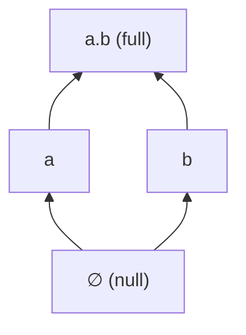

# State Encoding
[← Spec map](./README.md)

> The bit-vector state space, mereology over states, the full encoding table, and finite
> quantifier expansion as a semantic choice with a real cost model.

## The state space

A **state** is a Z3 bit-vector of width `N` (a per-example setting; the state-mereology family
defaults `N` in the range 2–16, capped at `MAX_N = 20`). The state space is *all* `2^N` values,
materialized eagerly as a Python list of `BitVecVal`s at semantics construction. The `MAX_N`
ceiling exists because of that eager materialization: the comment recording the measurement notes
275 MB resident at `N = 16` and 3.5 GB at `N = 20`. This is a hard, measured limit on how large a
model this design can represent, not an arbitrary constant.

## Mereology over bit-vectors

| Concept | Encoding |
|---|---|
| fusion (mereological sum) | bitwise OR, `s \| t` |
| part-of | `s \| t == t` |
| proper part-of | part-of and not equal |
| null state | `BitVecVal(0, N)` |
| full state | `BitVecVal(2^N - 1, N)` |

Fusion and part-of are the two primitives; `product` (pairwise fusion of two state sets) and
`coproduct` (fusion-closure of a union) are built from them and used by operators that combine
verifier/falsifier sets.

## The full encoding table

| Concept | Encoding |
|---|---|
| state | `BitVec(N)` |
| fusion | `s \| t` |
| part-of | `s \| t == t` |
| null / full state | `BitVecVal(0, N)` / `BitVecVal(2^N - 1, N)` |
| possible | uninterpreted `possible : BitVec(N) → Bool` |
| compatible(x, y) | `possible(fusion(x, y))` |
| world | `possible(w) ∧ ∀x. compatible(x, w) → is_part_of(x, w)` (a *maximal* possible state) |
| atomic truthmaking | uninterpreted `verify, falsify : BitVec(N) × AtomSort → Bool` |
| truth at a world | `∃x ⊑ w. verify(x, p)`, expanded to a `2^N`-way disjunction |
| sentence letter | Z3 `Const(name, AtomSort)`, `AtomSort` a process-global uninterpreted sort |

This table (together with the operator-method table described in the operators specification) is
the most directly reusable artifact in this specification — it is the whole semantic core that
the state-mereology theory family (logos, exclusion, imposition; see
[`11-theory-catalog.md`](./11-theory-catalog.md)) is built from.

The N=2 state lattice under parthood: four states — null, two atoms `a` and `b`, and their fusion
`a.b` (displayed with the fusion-notation convention: atomic substates are labelled `a`, `b`, `c`,
…, and a fusion is written `a.b`; the null state displays as `□`).

## Finite quantifier expansion: a semantic choice, not an optimization

Quantifiers over the state space are **not** Z3 quantifiers. `ForAll`/`Exists` here substitute
every one of the `2^N` bit-vector values for each bound variable and build an explicit
conjunction/disjunction — cost `(2^N)^k` for `k` bound variables. The state-mereology family uses
this for nearly all of its quantification, so its constraints are quantifier-free bit-vector
formulas whose size is exponential in `N`. **This must be preserved as a semantic decision** in
any port — it is what makes the encoding decidable and friendly to model completion — not treated
as an implementation detail to optimize away. The expansion is recomputed independently at every
call site with no sharing between them.

The choice is applied inconsistently within the codebase itself: some call sites use native Z3
quantifiers instead of the finite expansion, which is why the Z3 solver adapter globally
configures model-based quantifier instantiation and e-matching — a workaround for the two
quantifier strategies coexisting in one solver session, not a general requirement of the encoding.

## Temporal extension

For the one theory with a temporal dimension, an analogous but independent `M` setting (number of
time points) and `all_times` list exist alongside `N`/`all_states`; time is `IntSort()`, not a
bit-vector, so it carries no mereology of its own. See [`11-theory-catalog.md`](./11-theory-catalog.md)
for how that theory's model shape differs from the state-mereology family more broadly.

## Source files

- [`models/semantic.py`](../../code/src/model_checker/models/semantic.py) — `SemanticDefaults`:
  `N`/`M` validation, `all_states`/`all_times`, `fusion`, `is_part_of`, `product`, `coproduct`
- [`utils/z3_helpers.py`](../../code/src/model_checker/utils/z3_helpers.py) — `ForAll`/`Exists`,
  the finite-expansion quantifiers
- [`utils/bitvector.py`](../../code/src/model_checker/utils/bitvector.py) — bit-vector ↔
  fusion-notation display conversion
- [`theory_lib/logos/semantic/core.py`](../../code/src/model_checker/theory_lib/logos/semantic/core.py)
  — `verify`/`falsify`/`possible` declarations, `is_world`

## Related

- [Constraint generation](./04-constraint-generation.md) — where these primitives are asserted
- [The theory catalog](./11-theory-catalog.md) — the theory whose model is not built on this state
  space
