# Solving and Results
[← Spec map](./README.md)

> The solver backend abstraction, tracked assertions and unsat cores, the unknown-as-timeout
> soundness rule, per-example isolation, the single-threaded construction invariant, and the
> shape of a solved `ModelStructure`.

## The solver backend abstraction

A `SolverProtocol` / `TrackedSolverProtocol` interface (add / check / model / push / pop /
`assert_tracked` / `unsat_core`) is implemented by two adapters — one for Z3, one for cvc5.
Backend selection priority, highest first: an explicit CLI override, then the `MODEL_CHECKER_SOLVER`
environment variable, then the `solver` setting, then the default (`"z3"`).

## Solving is triggered by construction

Solving happens **inside the `ModelStructure` constructor**, not in a separately callable method.
Per example, in order:

1. A fresh solver is created.
2. Each of the four constraint groups (see
   [`04-constraint-generation.md`](./04-constraint-generation.md)) is asserted with a **tracking
   label** — `frame1`, `model1`, `premises1`, `conclusions1`, and so on — via
   `assert_tracked(constraint, label)`.
3. The solver's timeout is set from `max_time`, a setting expressed in **seconds** and converted
   to milliseconds at this boundary (a divergence worth flagging: the constructor's own
   docstring says milliseconds — it is wrong).
4. `check()` runs.

```mermaid
stateDiagram-v2
    [*] --> Solving: assert 4 tracked groups, check()
    Solving --> SAT: sat
    Solving --> UNSAT: unsat
    Solving --> Unknown: unknown
    Unknown --> Timeout: always, regardless of reason
    SAT --> [*]: populates z3_model
    UNSAT --> [*]: populates unsat_core (labelled)
    Timeout --> [*]: populates nothing; timeout=True
```

An `unsat` result yields a **labelled unsat core** — the subset of tracking labels whose
constraints are jointly unsatisfiable, letting a caller identify which of the four groups (and
which premise/conclusion within a group) is implicated.

## Unknown is always a timeout

**This is a soundness rule, not an implementation detail.** Any `unknown` result from the solver
— for any reason — is treated as a timeout, never as `unsat`. The rationale: Z3 reports a
canceled/resource-exhausted search as `unknown` under many conditions besides an actual timeout,
and treating `unknown` as `unsat` would unsoundly report an argument as *valid* on searches that
merely failed to complete. A port must preserve this rule even while restructuring everything
around it: `Result = SAT model | UnsatCore [Label] | Timeout`, with no path from an inconclusive
search to `UnsatCore`.

## No incremental solving; isolation by fresh context

There is no incremental solving or constraint caching on the main path — each example gets a
fresh solver from scratch. Isolation between examples in the same process run is achieved by a
per-example **C-level Z3 context swap**: the process's active Z3 context is temporarily replaced
with a fresh one for the duration of one example, which prevents learned lemmas from one example
leaking into the next (this leakage was measured to cause 2–10× slowdowns without the swap). A
port with per-run solver contexts and immutable terms has no counterpart problem to solve, but
should preserve the *invariant* — one example's solving is isolated from every other's — however
it achieves it.

## The single-threaded construction invariant

Model construction and solving are **single-threaded-only, and this is enforced, not merely
documented.** Every constructor in the pipeline builds Z3 AST nodes against one process-global Z3
context, which is not safe for concurrent use. A process-global, thread-**reentrant** guard wraps
the outermost constructor of every pipeline class: the same thread may re-enter freely (so
iteration, which nests a fresh pipeline run inside an existing one, works), but a second thread
raises an error immediately instead of corrupting process memory. The sanctioned form of
parallelism is one model per **process** (used by `--maximize`,
[`09-output-and-display.md`](./09-output-and-display.md)). A port with per-run solver contexts and
real immutable terms can drop the guard mechanism itself, but must preserve the invariant it
protects: **construction of one model is a single serialized transaction.**

## The shape of a solved structure

`ModelStructure` (in the Python implementation, a single class combining the solver driver and
the result presenter) ends up, after construction, holding roughly ten mutable fields — `solver`,
a second `stored_solver` handle, `timeout`, `z3_model`, `unsat_core`, a status flag, a runtime
figure, `solved`, `satisfiable`, and a raw positional result tuple. An unsat or timed-out
structure is still a fully constructed object, distinguished from a successful one only by these
flags. The spec-level restatement a port should adopt: separate `build : Constraints -> Problem`
from `solve : Problem -> Result`, and make `Result` a genuine sum type —
`SAT model | UnsatCore [Label] | Timeout` — rather than a flag cluster on a mutable object.

## Source files

- [`solver/protocols.py`](../../code/src/model_checker/solver/protocols.py) —
  `SolverProtocol`, `TrackedSolverProtocol`, result-string constants
- [`solver/registry.py`](../../code/src/model_checker/solver/registry.py) — backend selection
  priority, `create_solver`
- [`solver/z3_adapter.py`](../../code/src/model_checker/solver/z3_adapter.py) — the Z3 adapter,
  tracked assertion, quantifier configuration
- [`models/structure.py`](../../code/src/model_checker/models/structure.py) — `ModelDefaults`:
  the solve control flow, the mutable result-state block
- [`models/concurrency.py`](../../code/src/model_checker/models/concurrency.py) — the
  single-threaded construction guard
- [`utils/context.py`](../../code/src/model_checker/utils/context.py) — the per-example C-level
  Z3 context swap

## Related

- [Constraint generation](./04-constraint-generation.md) — what gets asserted
- [Propositions](./07-propositions.md) — what happens after a `SAT model`
- [Iteration](./08-iteration.md) — the sanctioned reuse of a persistent solver across attempts
