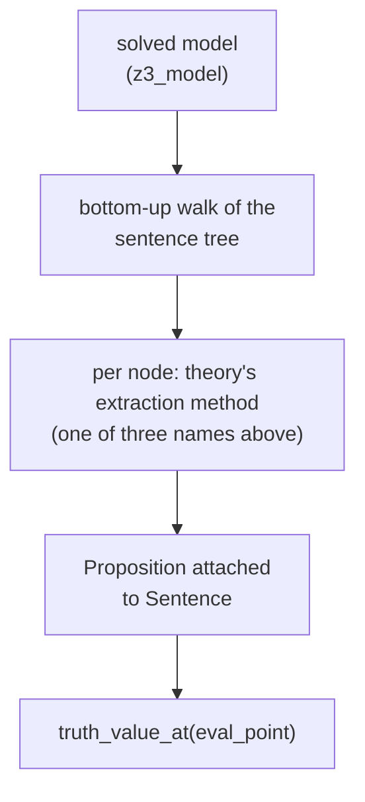

# Propositions
[← Spec map](./README.md)

> The proposition contract, the three evaluation schemes used by the shipped theories, the
> untyped evaluation-point shape, and post-solve extraction.

## What a proposition is

A `Proposition` is **the semantic value of one sentence in one solved model** — the object that
knows how to compute and print a truth value once a model exists. Propositions are constructed
**eagerly, bottom-up, exactly once per solved model**: `interpret` (the pipeline's final stage)
walks the sentence tree, recursing into arguments first so
that every subformula's proposition exists before its parent's is built, and attaches one
`Proposition` per `Sentence` node. Nothing prevents calling `interpret` twice — a second call
silently overwrites the propositions with fresh, equal ones.

## The per-theory contract

| When | What |
|---|---|
| Constraint time (class-level, no instance) | `proposition_constraints(letter)` — the per-atom constraint menu |
| Post-solve | extraction of the concrete extension — see below, three different method names |
| Post-solve | `truth_value_at(eval_point)` |
| Post-solve | `print_proposition(eval_point, indent, use_colors)` |

## Evaluation points

An evaluation point is a plain, untyped dict — `{"world": w}` for the state-mereology family,
`{"world": id, "time": t}` for the temporal theory. Nothing in the base classes types or validates
this shape; each theory's dispatchers and operators agree on its keys purely by convention.

## Three evaluation schemes, one abstraction missing

Post-solve extraction — "given a found model, what is this sentence's semantic value?" — is
implemented under **three different method names**, discovered at runtime by the printer and
proposition layer rather than declared anywhere as a shared interface:

| Scheme | Method | Shape of the result |
|---|---|---|
| Bilateral (verifier/falsifier) | `find_verifiers_and_falsifiers` | a pair of state sets |
| Unilateral (verifier only) | `compute_verifiers` | one state set |
| Bivalent temporal profile | `find_truth_condition` | truth per world-history at each time |

A port should make "evaluation scheme" an explicit, named abstraction with at least these three
inhabitants, rather than three unrelated method names a caller must discover by inspection.

## Ordering and determinism of extracted sets

The verifier/falsifier sets returned by post-solve extraction are Python `set` objects —
**unordered by contract**. Iteration order over them is incidental (hash-based) and nothing in
the extraction path canonicalizes it. Two consequences, both verified against source:

- **The displayed order is canonical, but by an unexpected key.** Every set the output shows
  passes through a formatting helper that sorts elements **lexicographically on their rendered
  fusion-notation names** (`bitvec_to_substates` then a string sort) — so `{a.b.c, b, b.c}`
  prints in that order even though the underlying states are `7, 2, 6`. Displayed output is
  therefore deterministic run-to-run, but it is *string* order, not bit-vector order.
- **In-memory order is not a contract anywhere.** No computation depends on set iteration
  order; only the display path imposes an order, and only at the last moment.

For a port: use ordered sets (`Data.Set` over the state's numeric value is fine) and define a
canonical order — sorted by bit-vector value is the natural choice — for your own golden-test
comparisons. Compare *set contents*, not rendered strings, against captured Python output; if
you do compare rendered display (see the worked trace,
[`07a-worked-trace.md`](./07a-worked-trace.md)), reproduce the lexicographic-on-names sort,
which disagrees with numeric order whenever state-name lengths differ.

## Identity is by formula name only

A proposition's equality and hash are computed **from the sentence's formula name alone** — so
two propositions of the *same formula* constructed from **different solved models** compare
equal. This is a real hazard for any collection-based logic (deduplicating propositions across
models, memoizing by proposition) and is not preserved intentionally; a port should key identity
by (formula, model) or avoid needing proposition identity across models at all.

## Source files

- [`models/proposition.py`](../../code/src/model_checker/models/proposition.py) —
  `PropositionDefaults`: construction, aliasing, identity, the abstract-by-guard contract
- [`theory_lib/logos/semantic/proposition.py`](../../code/src/model_checker/theory_lib/logos/semantic/proposition.py)
  — `find_verifiers_and_falsifiers`, the bilateral scheme
- [`theory_lib/exclusion/operators.py`](../../code/src/model_checker/theory_lib/exclusion/operators.py)
  — `compute_verifiers`, the unilateral scheme
- [`theory_lib/bimodal/operators.py`](../../code/src/model_checker/theory_lib/bimodal/operators.py)
  — `find_truth_condition`, the temporal-profile scheme
- [`models/structure.py`](../../code/src/model_checker/models/structure.py) — `interpret`, the
  bottom-up attachment walk
- [`utils/formatting.py`](../../code/src/model_checker/utils/formatting.py) — the sorted set
  rendering behind the display-order guarantee

## Related

- [Operators](./03-operators.md) — `find_verifiers_and_falsifiers` as one of the six semantic
  methods
- [Solving and results](./06-solver-and-results.md) — the solved model propositions are computed
  against
- [Output and display](./09-output-and-display.md) — `print_proposition` in the display contract
