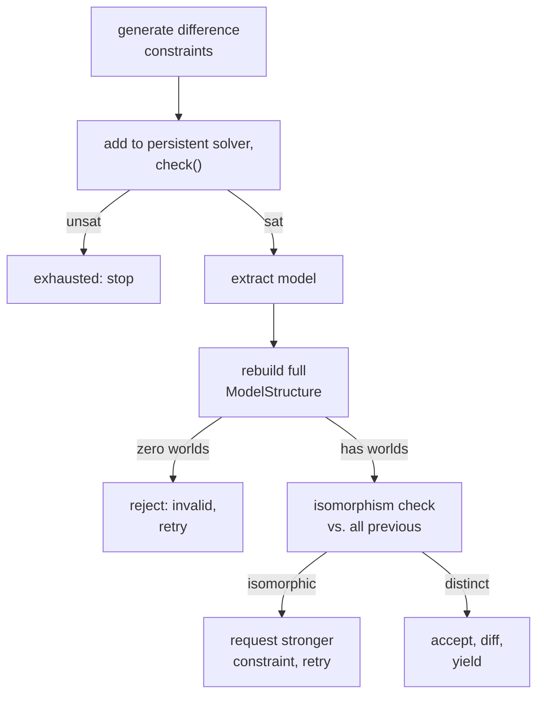

# Iteration
[← Spec map](./README.md)

> The algorithm for finding successive distinct countermodels, the two-tier notion of
> distinctness, how MODEL 2+ is rebuilt, what the isomorphism check does and does not see, and
> the termination budgets.

## The live loop

Given a solved model, one iteration attempt does, in order:

1. **Generate difference constraints** against every previously found model.
2. **Add them permanently** to a persistent solver (no push/pop — they accumulate for the whole
   iteration session) and check satisfiability.
3. **Extract** the new Z3 model.
4. **Rebuild** a full `ModelStructure` from it (see below — this is not just "wrap the model").
5. **Reject** the candidate if it has zero worlds.
6. **Check isomorphism** against every previous model.
7. If isomorphic: request a stronger constraint and retry. If not: **accept**, compute
   differences against the previous model, and yield.

## Two-tier distinctness

"Distinct" is deliberately checked at two independent levels:

1. **Syntactic difference**, enforced by solver constraints — a disjunction over designated
   semantic predicates (e.g. "at least one state flips its is-world status relative to the
   previous model").
2. **Semantic distinctness up to isomorphism**, enforced *post hoc* by a graph-isomorphism check
   over the candidate's model structure. A model that satisfies (1) but fails (2) is counted as
   "isomorphic, skipped" and never yielded.

This is the central concept a port must preserve: the constraint layer only forces a *designated*
kind of difference; genuine novelty is a separate, more expensive check run after a candidate
model already exists.

One verified defect lives exactly here (known-defect #1 in
[`14-porting-notes.md`](./14-porting-notes.md)): the generic difference-constraint generator in
[`iterate/constraints.py`](../../code/src/model_checker/iterate/constraints.py) enumerates
candidate states via `_generate_input_combinations`, whose unary case iterates
`range(domain_size)` with the **bit-width `N`** passed as `domain_size` — the first `N` states,
not the `2^N` states of the space. The syntactic-difference tier is therefore weaker than
designed, and the isomorphism tier absorbs the duplicates it lets through.

## Rebuilding MODEL 2+

The next model is not simply "the next thing the solver returns" — it must be *re-solved* under
the concrete values the iterator found, because the iteration constraints only pin the
designated-predicate differences, not a full valuation. The rebuild: construct a **fresh** syntax
tree, semantics instance, and `ModelConstraints` (explicitly no state transfer from the previous
model); build a temporary solver, assert the base constraints, then **pin every one of the new
model's concrete values as constraints** (for every state, whether it is a world / possible, and
for every state-atom pair, its verify/falsify value) to match what the solver found; replace the
constraint set with this pinned set and construct a new `ModelStructure` — trivially satisfiable,
forced to exactly the intended model — then interpret it.

## Isomorphism checking

Each candidate and every previous model is turned into a graph — one node per world, edges for
the theory's accessibility relation — and compared with a general graph-isomorphism algorithm.
**What the check does not see matters as much as what it does** — and the blindness is more
specific than "no attributes": the graph builder in
[`iterate/graph.py`](../../code/src/model_checker/iterate/graph.py) **computes and stores
per-node sentence-letter truth-value properties on every world node**, but the comparison then
calls the isomorphism check with **no node-match or edge-match arguments**, so that computed
data is built and silently ignored. The check is attribute-blind *by omitted argument*, not by
design. Two models with identical shape but different truth-value assignments are declared
isomorphic and skipped; and only the declared accessibility relation is encoded as edges, so
hyperintensional structure living elsewhere (verifier/falsifier content, parthood) is invisible
to the check entirely. The consequence for a port: attribute-matching the comparison is a
**one-argument change** to the isomorphism call — the node data is already there — not a rebuild
of the graph encoding.

## Termination budgets

| Condition | Effect |
|---|---|
| target model count reached | success |
| per-search wall-clock timeout | stop this search; **all previously yielded models are kept** — yielding is incremental |
| solver returns non-`sat` | search space exhausted |
| consecutive-invalid cap reached | stop (repeated zero-world / unbuildable candidates) |
| lack-of-progress heuristic | stop (too many checks relative to models found) |
| interrupt | clean finish, keep what was found |

A mid-iteration timeout only abandons the *current* search — every model already yielded before
the timeout remains valid output. The theory-declarative half of this algorithm — "which relations
count as designated differences for this theory" — is, in principle, just a per-theory list of
model dimensions; a port can drive the whole difference-constraint and diff-reporting machinery
from that one declarative list rather than hand-writing it per theory.

## Source files

- [`iterate/core.py`](../../code/src/model_checker/iterate/core.py) — the live loop,
  `iterate_generator`
- [`iterate/constraints.py`](../../code/src/model_checker/iterate/constraints.py) — difference
  constraint generation, persistent-solver satisfiability checking
- [`iterate/models.py`](../../code/src/model_checker/iterate/models.py) — `ModelBuilder`, the
  MODEL 2+ rebuild-and-pin procedure
- [`iterate/graph.py`](../../code/src/model_checker/iterate/graph.py) — graph encoding and the
  isomorphism check

## Related

- [Constraint generation](./04-constraint-generation.md) — the constraint groups a rebuild
  replaces
- [Solving and results](./06-solver-and-results.md) — the persistent-solver reuse this loop relies
  on
- [The theory contract](./10-theory-contract.md) — where a theory declares its iterator
