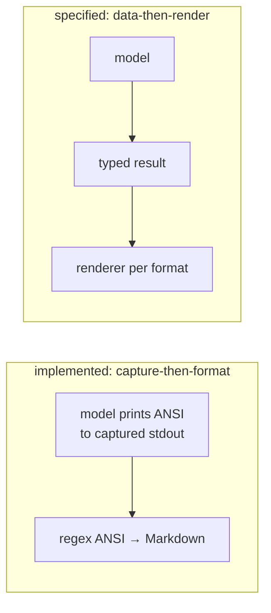

# Output and Display
[← Spec map](./README.md)

> The three output modes that actually exist, capture-then-format versus data-then-render, the
> display contract a theory must satisfy, recursive truth-tree printing, `--maximize`, and
> progress feedback.

## The three output modes

Exactly three output modes are implemented — no more, regardless of what other constants or
formatter names exist elsewhere in the codebase:

1. **ANSI-colored terminal** (the default) — models print themselves directly to standard output.
2. **A combined Markdown file** — one file collecting every example run in the session.
3. **A combined JSON file** — structured model data plus the raw captured text, one file per
   session.

**Nothing reads the JSON back.** There is no persisted, re-loadable model anywhere in the system —
the JSON output is a one-way export for external analysis, not a serialization format the tool
itself consumes.

## Capture-then-format, not data-then-render

The saved-output architecture is **capture-then-format**: when saving is enabled, standard output
is redirected into an in-memory buffer, the model prints itself exactly as it would to a terminal,
output is restored, the captured text is re-printed to the real console, and the Markdown artifact
is produced by regex-converting the captured ANSI escape codes into Markdown emphasis markup. The
JSON artifact's structured half comes from a *separate* collector that duck-types four extraction
hooks on the model structure — it is not derived from the same captured text.

The specified alternative — `model → typed result → renderer`, with one canonical result
datatype and independent renderers per output format — is the improvement this document
recommends; the existing structured-data collector is a workable starting shape for the typed
result half.

## The display contract

A theory must supply, on its model-structure class: `print_to`, `print_all`, `print_states`,
`print_evaluation`. Its proposition class must supply `print_proposition`. Every operator must
supply `print_method`, normally delegating to one of three base helpers provided by the operator
base class (a generic recursive printer, and two variants for printing over worlds or over
times — see [`03-operators.md`](./03-operators.md)).

## Recursive truth-tree printing

Printing the evaluation of a formula is **mutual recursion** between the model structure and
operator `print_method`s: an atomic sentence delegates to its proposition's
`print_proposition`; a complex sentence delegates to its operator's `print_method`, which
typically prints its own line and then recurses back into the model structure's printer for each
argument, one indent level deeper — producing the indented evaluation tree seen in terminal
output. Because propositions and operators print to bare standard output rather than an injected
sink, the whole recursion has to run inside a stdout-redirect wrapper whenever output is being
captured for saving, and color choice is decided by testing object identity against the real
terminal stdout — which silently disables colors under capture and breaks if the output stream is
wrapped a second time.

## `--maximize`: narrower than it sounds

`--maximize` compares theories, but its metric is **the maximum model size `N` each theory can
still solve within the time limit** — not validity agreement between theories. Each theory runs
in its own process (one worker per theory, consistent with the single-threaded construction
invariant in [`06-solver-and-results.md`](./06-solver-and-results.md)), incrementing `N` until a
run fails or times out; results are sorted and printed as plain text, bypassing the saving
subsystem entirely. Genuine cross-theory *semantic* comparison — the same example evaluated under
several theories, with operator-name translation dictionaries — is just the ordinary run path,
not a special mode.

## Progress feedback

A background-animated progress bar tracks elapsed time against the per-search timeout, with a
spinner for waits that cannot be measured as a fraction. A deliberate **deferred-completion
protocol** freezes the bar's fill and elapsed-time display at the instant a model is actually
found, before printing anything else, so that the bar, the model differences, and the model body
print in a fixed, non-interleaved order even though the search that produced them ran
concurrently with the bar's own animation.

## Source files

- [`builder/module.py`](../../code/src/model_checker/builder/module.py) — the capture/save
  dispatch
- [`output/manager.py`](../../code/src/model_checker/output/manager.py) — `OutputManager`, batch
  finalization into the combined Markdown/JSON files
- [`output/collectors.py`](../../code/src/model_checker/output/collectors.py) —
  `ModelDataCollector`, the structured-data extraction hooks
- [`models/structure.py`](../../code/src/model_checker/models/structure.py) — `recursive_print`,
  the mutual-recursion truth-tree printer
- [`builder/comparison.py`](../../code/src/model_checker/builder/comparison.py) —
  `ModelComparison`, the `--maximize` worker pool
- [`output/progress/`](../../code/src/model_checker/output/progress/) — the animated progress bar
  and the deferred-completion protocol

## Related

- [Propositions](./07-propositions.md) — `print_proposition`, the leaf of the truth-tree recursion
- [Iteration](./08-iteration.md) — the per-model output this document's printers render
- [Examples and the CLI](./13-examples-and-cli.md) — how `--save`/`--maximize` are invoked
