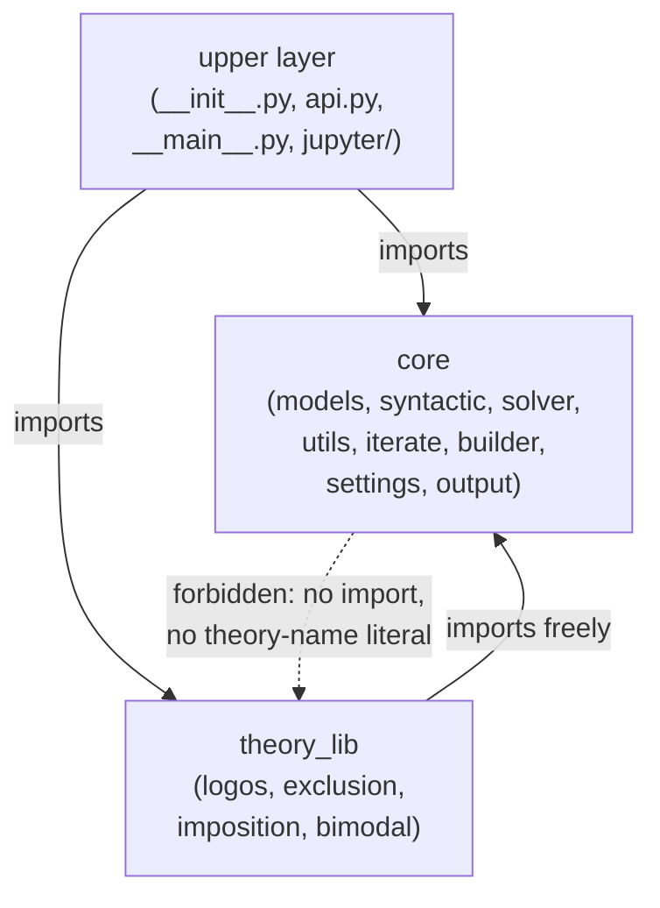
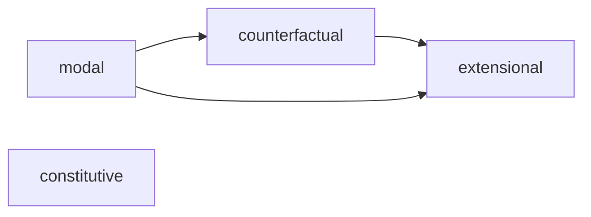

# The Theory Contract
[← Spec map](./README.md)

> What a semantic theory must supply to plug into the pipeline, the layering rule that keeps
> the core theory-agnostic, the executable contracts that enforce both, and the subtheory
> system.

## The single entry point

Every theory exposes `get_theory(config=None)`, returning exactly:

```python
{"semantics": <SemanticDefaults subclass>,
 "proposition": <PropositionDefaults subclass>,
 "model": <ModelDefaults subclass>,
 "operators": <OperatorCollection instance>}
```

This dict is the entire interface the builder and every other core consumer needs; nothing else
about a theory is required to be importable by name.

## The required module set

Every theory is one canonical package layout:

| Item | Contract |
|---|---|
| `__init__.py` | exposes `get_theory` |
| `semantic/` (a **package**, not a bare `semantic.py`) | `__init__.py` (re-export only), `core.py` (the `SemanticDefaults` subclass), `model.py` (the `ModelDefaults` subclass) |
| `operators.py` | yields an `OperatorCollection` |
| `iterate.py` | a `BaseModelIterator` subclass plus `iterate_example`/`iterate_example_generator` entry points |
| `examples.py` | `example_range`, `test_example_range`, `semantic_theories`, `unit_tests`, each assigned exactly once |
| `tests/`, `docs/` | a six-file docs set; enforced but not runtime-critical |

## Semantics-class requirements

A theory's semantics subclass must set `DEFAULT_EXAMPLE_SETTINGS` (which must include an
`iterate` key — this is why `iterate.py` is mandatory rather than optional), `frame_constraints`,
`premise_behavior`, `conclusion_behavior`, `main_point`, and the `true_at`/`false_at`/
`extended_verify`/`extended_falsify` dispatchers (see
[`04-constraint-generation.md`](./04-constraint-generation.md)). None of this is enforced by an
abstract base class or a protocol check — the base class sets these to `None` and a missing
override fails only when something later dereferences it.

## `examples.py` and `iterate.py` entry points

`examples.py` defines the four names above exactly once each — enforced by an AST-walking
conformance check, because a plain attribute-presence check cannot detect one assignment silently
overwriting an earlier one at the same name (this has actually happened in the shipped theories).
`iterate.py` exposes an iterator class plus eager (`iterate_example`) and generator
(`iterate_example_generator`) entry points; the generator entry point carries a marker attribute
that the builder detects by `hasattr` to choose the incremental display path — **absence of the
marker silently degrades to the eager, non-incremental path** rather than failing.

## The layering rule

Three layers, one-way dependencies:



**Core may never import `theory_lib`** — not via a static import, a function-local import, or an
`importlib` string literal — **and may never hardcode a theory name.** `theory_lib` may import
core freely. Only the upper layer is permitted to know both. This is enforced by an AST-walking
test, not merely documented, and it holds in practice: the theory library imports core
pervasively (dozens of files, a few hundred import statements); core imports the theory library
in exactly zero.

## The executable contracts (authoritative over any prose)

Four test suites enforce the contracts named in this document and are authoritative over any
prose description of them, including this one, should the two ever diverge:

- Layering (the rule above): [`code/tests/test_layering.py`](../../code/tests/test_layering.py)
- Theory conformance (the required module set, the `examples.py` attribute set, the
  `get_theory()` key set, the `iterate.py` entry points):
  [`code/src/model_checker/theory_lib/tests/test_theory_conformance.py`](../../code/src/model_checker/theory_lib/tests/test_theory_conformance.py)
- The CLI flag/documentation matrix (every flag mentioned in shipped documentation is registered
  on the real parser):
  [`code/tests/cli/test_docs_flag_matrix.py`](../../code/tests/cli/test_docs_flag_matrix.py)
- Packaging (wheel/sdist inclusions, exclusions, entry points):
  [`code/tests/packaging/`](../../code/tests/packaging/)

## The subtheory system

One theory (the flagship of the state-mereology family — see
[`11-theory-catalog.md`](./11-theory-catalog.md)) further decomposes its operators into
subtheories, each contributing a disjoint slice of the operator set through a registry with a
hardcoded dependency graph:



Semantics is **never defined in a subtheory** — it stays centralized in the theory's own
`semantic/` package; a subtheory supplies only operators, examples, and tests. Subset loading is
a first-class user feature: a caller can request a theory instance built from only some
subtheories (plus their transitive dependencies), and each such request builds an independent
registry, so differently-configured instances of the same theory can coexist in one process. A
subtheory contributing zero operators is defined to be a defect by the theory's own rule — the
mechanism that retired a subtheory once by folding its sole operator into another.

## Source files

- [`registry.py`](../../code/src/model_checker/registry.py) — the core, theory-name-free registry
  (see [`12-settings-and-registry.md`](./12-settings-and-registry.md))
- [`theory_lib/__init__.py`](../../code/src/model_checker/theory_lib/__init__.py) — the one place
  theory names are enumerated as literals
- [`theory_lib/docs/THEORY_ARCHITECTURE.md`](../../code/src/model_checker/theory_lib/docs/THEORY_ARCHITECTURE.md)
  — the normative prose source for this contract
- [`theory_lib/logos/operators.py`](../../code/src/model_checker/theory_lib/logos/operators.py) —
  the subtheory loader and its dependency graph

## Related

- [Operators](./03-operators.md) — the `OperatorCollection` every theory's `operators.py` yields
- [Constraint generation](./04-constraint-generation.md) — the semantics-class obligations in
  detail
- [The theory catalog](./11-theory-catalog.md) — the four theories as instances of this contract
- [Settings and the registry](./12-settings-and-registry.md) — how a theory is discovered at
  runtime
