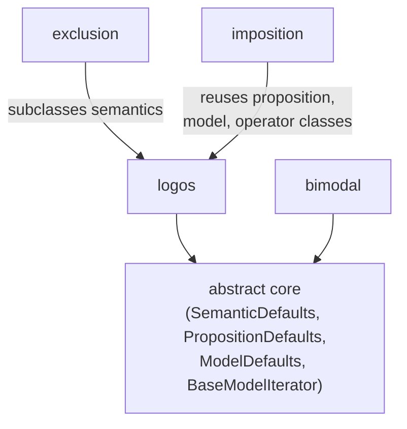

# The Theory Catalog
[← Spec map](./README.md)

> The four shipped theories, the two families they fall into, how they vary, and one worked
> operator walkthrough showing why the three-register pattern matters in practice.

## The four theories

| Theory | Model theory | Atomic primitives | Distinctive machinery | Operator count (v1.3.3) |
|---|---|---|---|---|
| **logos** (flagship) | bilateral truthmaker semantics; state lattice under fusion/parthood; worlds are maximal possible states | `verify`, `falsify`, `possible` | the subtheory system; counterfactuals via maximal compatible parts | 18, all subtheories loaded |
| **exclusion** | unilateral truthmaker semantics; verifiers only | `verify`, primitive `excludes`; `possible` is *derived* | per-formula Skolem witness functions making minimality-quantified negation first-order | 4 |
| **imposition** | Kit Fine's counterfactual semantics over the same state lattice as logos | logos's primitives plus a primitive ternary `imposition` relation | Fine's four frame conditions; a mode that turns a run into a meta-proof relating `imposition` to logos's alternative-worlds definition | 13, including both counterfactual styles side by side |
| **bimodal** | temporal + modal logic over world histories — a genuinely different model theory | a binary `truth_condition` (no verifiers at all); a ternary task relation; world histories indexed by integer time | evaluation points are (world-id, time) pairs; frame axioms aligned with an independent formal (Lean) specification | 17 |

## Two families



There are really **two families**. The state-mereology family has logos as its trunk: exclusion
subclasses logos's semantics directly (inheriting fusion, parthood, and the constraint pipeline
while overriding `possible`, `is_world`, and the verification story); imposition reuses logos's
proposition class, model structure, and extensional/modal operator classes essentially verbatim,
adding only its own primitive relation and counterfactual operator. Bimodal is different in kind
— it shares only the abstract core classes and the operator/collection machinery, and
re-implements everything else, because its model theory (world histories, no verifiers, integer
time) has no state-lattice counterpart to reuse.

## Worked example: the counterfactual operator's three registers

Recall from [`03-operators.md`](./03-operators.md) that every primitive operator writes its truth
condition in up to three registers — symbolic, concrete, and display — and that the highest
port-relevant risk is these three drifting apart. The logos counterfactual operator is the
clearest instance: **all three registers independently re-derive "the alternative worlds to a
given world under a given antecedent-verifier."**

```python
def true_at(self, leftarg, rightarg, eval_point):
    # symbolic: ForAll (verifier, alt-world) pairs via is_alternative,
    # substituting the consequent's truth at each alternative.
    ...

def find_verifiers_and_falsifiers(self, leftarg, rightarg, eval_point):
    # concrete: loops the *found model's* worlds/verifiers, evaluating
    # is_alternative and truth_value_at directly against the Z3 model.
    ...

def print_method(self, sentence_obj, eval_point, indent_num, use_colors):
    # display: re-computes the same alternative-worlds set a third time,
    # purely to decide what to print, via print_over_worlds.
    ...
```

Each register is a faithful re-derivation of the same underlying relation — alternative worlds —
but written independently, in a different idiom (a quantified Z3 formula; a Python loop over a
concrete model; a display-oriented recomputation). Nothing keeps them synchronized if the
semantics changes. The improvement a port should make explicit: derive the concrete register from
the symbolic one where the solver already computed the relevant relation, and make the display
register consume *data* (the concrete register's output) rather than recomputing semantics a
third time.

## Source files

- [`theory_lib/logos/`](../../code/src/model_checker/theory_lib/logos/) — the flagship theory and
  its subtheories
- [`theory_lib/exclusion/`](../../code/src/model_checker/theory_lib/exclusion/) — unilateral
  witness-predicate semantics
- [`theory_lib/imposition/`](../../code/src/model_checker/theory_lib/imposition/) — Fine's
  imposition counterfactuals
- [`theory_lib/bimodal/`](../../code/src/model_checker/theory_lib/bimodal/) — temporal + modal
  logic over world histories
- [`theory_lib/logos/subtheories/counterfactual/operators.py`](../../code/src/model_checker/theory_lib/logos/subtheories/counterfactual/operators.py)
  — the worked counterfactual operator above

## Related

- [Operators](./03-operators.md) — the three-register pattern in general
- [State encoding](./05-state-encoding.md) — the state lattice the mereology family shares
- [Propositions](./07-propositions.md) — the three evaluation schemes these theories use
- [The theory contract](./10-theory-contract.md) — the contract these four theories satisfy
