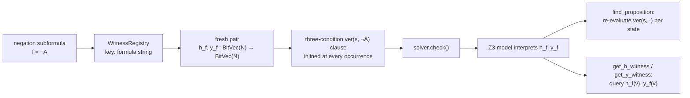

# Exclusion Witness Predicates
[← Spec map](./README.md)

> The Skolem witness-function mechanism at the core of the exclusion theory: the higher-order
> negation condition being replaced, the Skolemization that makes it first-order, the exact
> function signatures and registry lifecycle, the constraints generated, and the failure modes
> a port must avoid.

## The condition being replaced

Unilateral (exclusion) semantics — Bernard and Champollion's revision of Fine's unilateral
truthmaker semantics (see the theory's `CITATION.md`) — has no falsifiers. Negation is instead
defined through the `excludes` relation, and its verification condition is **inherently
second-order**: a state `s` verifies `¬A` iff *there exist functions* `h, y` from states to
states such that

```
∃h, y : State → State.
  (1)  ∀x. ver(x, A) → (y(x) ⊑ x ∧ excludes(h(x), y(x)))     — exclusion
  (2)  ∀x. ver(x, A) → h(x) ⊑ s                               — upper bound
  (3)  ∀z. [∀x. ver(x, A) → h(x) ⊑ z] → s ⊑ z                 — least upper bound
```

Reading: for every verifier `x` of `A`, `y` picks out a part of `x` and `h` picks out something
that excludes that part (so `s` rules out every way `A` could be made true); all the excluders
fit inside `s`; and `s` is the *smallest* state with that property. The existential
quantification over *functions* is what a first-order SMT query cannot express directly.

## The Skolemization

The mechanism replaces the quantified functions with **fresh uninterpreted Z3 functions** — a
Skolem pair per negation formula:

```
h_f, y_f : BitVec(N) → BitVec(N)        for each negation formula f = ¬A
```

With the pair fixed, conditions (1)–(3) are ordinary first-order formulas over `h_f`/`y_f`, the
`excludes` primitive, and parthood — exactly the three-conjunct `ver(s, ¬A)` clause stated in
[`03a-operator-semantics.md`](./03a-operator-semantics.md). The solver chooses an
interpretation for each pair when it builds a model, which is sound for the countermodel query:
`sat` delivers concrete witness functions, and `unsat` means no model exists under any choice.

Skolemization solves a second problem that motivated this architecture (the theory's own docs
call it the *False Premise Problem*): witnesses expressed as existentially bound variables
inside a constraint are **gone after solving** — but post-solve verifier computation for `¬A`
needs the witness *values*. Declaring `h_f`/`y_f` as global uninterpreted functions makes them
first-class citizens of the Z3 model, queryable after `solver.check()` returns.

## Signatures, keying, and the registry lifecycle

`WitnessRegistry` (one instance per semantics object, constructed with `N`) owns all pairs:

- **Creation**: `register_witness_predicates(formula_str)` declares
  `z3.Function(f"{formula_str}_h", BitVecSort(N), BitVecSort(N))` and the `_y` twin, records
  both in a name-keyed dict, and caches the pair. Re-registering an existing key raises — the
  operator guards with a membership test first.
- **Keying is by formula string identity.** The key is a canonical rendering of the subformula
  (atoms print as their letter name; complex formulas as `op(arg,…)` recursively). Two
  occurrences of the *same* negation subformula therefore share one pair — correct, since a
  given subformula has a single verifier set per model — while distinct negations, including
  nested ones (`¬¬A` yields pairs for both `¬A` and `¬(¬A)`), get their own.
- **When pairs are created (the live path)**: lazily, at constraint-generation time. The
  negation operator's `extended_verify` registers the pair for its formula on first use, then
  emits the three-condition clause mentioning `h_f`/`y_f`. Every negation the traversal reaches
  gets its pair as a side effect of building the query — no separate pre-pass runs.
- **A dormant pre-registration pass exists and a port should not copy it**: the semantics class
  also carries a two-phase `build_model` path (recursive pre-registration, then a
  `WitnessConstraintGenerator` emitting per-state biconditional defining constraints). Its
  recursive walk matches negations by the operator name `\exclude`, but the shipped operator
  registers under `\neg`, so the pre-pass matches nothing on the standard pipeline; it is
  exercised only by unit tests. The lazy path above is the one that runs.
- **Reset**: `clear()` empties predicates, mapping, and cache (used when a fresh model build
  starts).

## The constraints generated

On the live path there are **no separate "witness axioms"**: the three-condition formula *is*
the constraint contribution of each negation occurrence, inlined wherever the recursive
translation needs `ver(s, ¬A)` — in premise constraints (via
`true(¬A, w) = ∃x. ver(x, ¬A) ∧ x ⊑ w`), in negated-conclusion constraints, and inside any
larger formula containing the negation. The functions `h_f`/`y_f` occur free in those
constraints; the `excludes` relation ties them to the frame constraints (exclusion symmetry,
harmony, rashomon — see [`03a-operator-semantics.md`](./03a-operator-semantics.md)).

The dormant generator path states the same three conditions as explicit per-state biconditionals
(`ver(s, ¬A) ↔ (1) ∧ (2) ∧ (3)` for each of the `2^N` states), with minimality phrased as "no
proper part of `s` satisfies the upper-bound condition" rather than the least-upper-bound form.
The two phrasings agree in the shipped usage; the inlined least-upper-bound form is the one the
solver actually sees, and is what a port should implement.

## Post-solve access

Two query paths exist after a model is found:

1. `find_proposition` (the standard pipeline's proposition class) recomputes each sentence's
   verifier set by evaluating the symbolic `ver(s, ·)` clause against the found model for every
   state — for negations this works precisely because the model interprets `h_f`/`y_f`.
2. `WitnessAwareModel.get_h_witness(formula_str, v)` / `get_y_witness(…)` evaluate `h_f(v)` /
   `y_f(v)` directly, exposing the concrete witness mappings (used by the operator's
   `compute_verifiers` and available for inspection/debugging).



## Failure modes a port must avoid

This mechanism is the historically hardest part of unilateral semantics to implement correctly
(the minimality clause of the negation condition has been a source of published errata in the
surrounding literature). The specific ways to get it wrong:

- **Existential variables instead of Skolem functions.** Encoding `∃h, y` with quantified
  first-order machinery (or per-state existential variables) loses the witnesses after solving
  — verifier sets for negations become uncomputable, and nested negations (`¬¬A`) have no
  inner-witness values to build the outer condition from. This is the exact failure the
  architecture was built to escape.
- **Sharing one pair across distinct negations.** If `¬A` and `¬B` use the same `h`/`y`, their
  conditions couple: the solver must find a single function pair serving both, which wrongly
  excludes models where the two negations need different witnesses. One fresh pair per distinct
  negation subformula, always.
- **Unstable keying.** The pair lookup at constraint time and at query time must agree. Keying
  by object identity (rather than formula syntactic identity) breaks the sharing between
  repeated occurrences of the same subformula and orphans the post-solve queries, which look up
  by formula string.
- **Weakening least-upper-bound to minimality.** Condition (3) as implemented says `s` is below
  *every* upper bound of the `h_f`-image — a least element, not merely a minimal one. A port
  that checks only "no proper part of `s` works" admits ties the shipped condition rejects;
  match the least-upper-bound form.

## Source files

- [`theory_lib/exclusion/semantic/registry.py`](../../code/src/model_checker/theory_lib/exclusion/semantic/registry.py)
  — `WitnessRegistry`: declaration, keying, caching, duplicate protection, `clear`
- [`theory_lib/exclusion/operators.py`](../../code/src/model_checker/theory_lib/exclusion/operators.py)
  — `UniNegationOperator.extended_verify`: lazy registration + the inlined three conditions;
  `compute_verifiers`: the witness-querying concrete register
- [`theory_lib/exclusion/semantic/core.py`](../../code/src/model_checker/theory_lib/exclusion/semantic/core.py)
  — `WitnessSemantics`: registry ownership, formula-string keying, the dormant `build_model` path
- [`theory_lib/exclusion/semantic/constraints.py`](../../code/src/model_checker/theory_lib/exclusion/semantic/constraints.py)
  — `WitnessConstraintGenerator`: the dormant per-state biconditional variant
- [`theory_lib/exclusion/semantic/model.py`](../../code/src/model_checker/theory_lib/exclusion/semantic/model.py)
  — `WitnessAwareModel`: `get_h_witness`/`get_y_witness`; `WitnessStructure`: the standard-pipeline structure
- [`theory_lib/exclusion/docs/`](../../code/src/model_checker/theory_lib/exclusion/docs/)
  — the theory's own architecture and user documentation (cross-checked against the code above)

## Related

- [Operator semantics](./03a-operator-semantics.md) — the exclusion operator conditions using these witnesses
- [State encoding](./05-state-encoding.md) — the primitive signatures, including the witness pairs
- [The theory catalog](./11-theory-catalog.md) — where exclusion sits among the four theories
