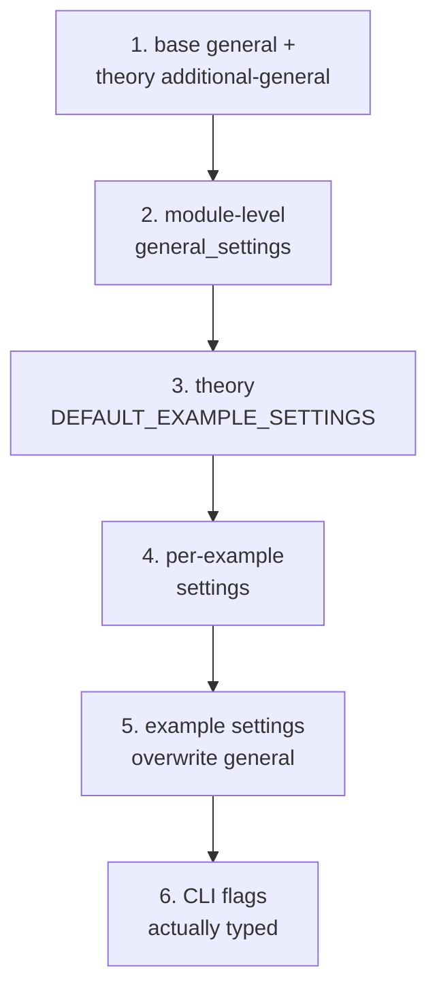

# Settings and the Registry
[← Spec map](./README.md)

> Where settings are declared, the six-step precedence chain, the unknown-setting policy, the
> full setting inventory, the theory registry as a generic discovery mechanism, and the
> error-handling policy stated explicitly.

## Three declaration sites

1. Base general settings, shared by every theory.
2. Each theory's own example defaults, plus an optional additional-general-settings dict for
   theory-specific general flags.
3. A module-level fallback default set that has drifted from (1) and is currently dead — accepted
   as a constructor parameter but never read.

## The precedence chain

Six steps, lowest to highest:

1. Base general settings, overlaid with the theory's additional general settings.
2. The user's module-level `general_settings` (only keys already present in step 1 are merged).
3. The theory's example defaults (`DEFAULT_EXAMPLE_SETTINGS`).
4. The user's per-example settings (only keys already present in step 3 are merged).
5. The per-example settings dict **wholesale overwrites** the general settings on any key
   collision.
6. CLI flags the user **actually typed** — highest precedence.

**Step 6 is the fragile one.** A boolean CLI flag's "not given" state and its "given as false"
state are indistinguishable in the parsed representation, so the settings layer re-scans the raw
command line to determine which flags the user actually typed, aided by a hand-maintained
short-flag-to-long-flag map. **Clustered short flags are parsed correctly by the argument parser
but not detected as user-provided by this re-scan, so their overrides silently fail to apply** —
a documented, known gap, not an oversight worth reproducing.

## Unknown settings: a warning, not an error

An unrecognized setting key produces a **printed warning and is discarded** — not an error — 
unless an opt-in strict mode is enabled, and nothing in the production path enables it. This is a
direct contradiction of the project's own stated fail-fast principle, worth naming explicitly in
[`14-porting-notes.md`](./14-porting-notes.md) as an intended change rather than a behavior to
preserve.

## The setting inventory

| Setting | Meaning | Type |
|---|---|---|
| `N` | bit-width; state space is `2^N` | positive int, ≤ `MAX_N` |
| `M` | number of time points (temporal theory only) | positive int |
| `contingent` | force atomic propositions to be neither necessary nor impossible | bool |
| `non_empty` | verifier/falsifier sets must be non-empty | bool |
| `non_null` | the null state verifies/falsifies nothing | bool |
| `disjoint` | distinct atoms get disjoint verifier/falsifier content | bool |
| `possible`, `fusion_closure` | closure toggles (unilateral theory only) | bool |
| `max_time` | solver timeout, in **seconds** | positive number |
| `iterate` | number of distinct models to search for | should be a natural number ≥ 1 |
| `expectation` | expected verdict, for the examples-as-tests convention (see [`13-examples-and-cli.md`](./13-examples-and-cli.md)) | bool or unset |
| `solver` | backend override | `"z3"` \| `"cvc5"` |

The `iterate` type deserves a specific note: one theory defaults it to the boolean `False` while
the iterator itself validates it as a positive integer and other call sites compare it against
`1` — it happens to work only because every shipped example sets an explicit integer. Specify it
as a natural number `>= 1` from the start.

## The registry: a generic, theory-name-free mechanism

The theory registry contains **zero theory-name literals** — it is a generic lookup table; the
actual catalog of theory names lives entirely in the theory library, one layer up (see
[`10-theory-contract.md`](./10-theory-contract.md) for the layering rule this preserves). Each
registered theory entry holds its four components (semantics, proposition, model, operators),
each of which may be supplied directly or as a zero-argument thunk; the four thunks of one theory
share a cache, so a theory's `get_theory()` runs **at most once** no matter how many times its
components are accessed. Registration is idempotent and fails fast on a genuine duplicate name. A
theory that is registered but broken (e.g. an import error inside its package) raises nothing at
registration time — the error is deferred and re-raised at the first access to any of that
theory's four components, i.e. **discovery errors surface at first use, not at startup.**

## The error-handling policy, stated as policy

The practiced (if not always documented) rule across the whole system: errors that could produce
a **wrong logical verdict** are handled strictly (the unknown-as-timeout rule in
[`06-solver-and-results.md`](./06-solver-and-results.md), `N` validation, model-state extraction,
the single-threaded construction guard); errors in **presentation and metadata** are absorbed with
placeholder fallbacks; **configuration** errors are warnings by default, as described above. This
is a coherent, worth-preserving policy — a port should state it explicitly as a design rule rather
than let it emerge from scattered individual choices, which is how it currently exists.

## Source files

- [`settings/settings.py`](../../code/src/model_checker/settings/settings.py) —
  `SettingsManager`, the precedence chain, flag-provenance detection
- [`settings/errors.py`](../../code/src/model_checker/settings/errors.py) — the settings error
  hierarchy
- [`registry.py`](../../code/src/model_checker/registry.py) — `TheoryEntry`, thunk memoization,
  registration
- [`theory_lib/__init__.py`](../../code/src/model_checker/theory_lib/__init__.py) — where the
  registry is populated from the one list of theory-name literals

## Related

- [Constraint generation](./04-constraint-generation.md) — `N` and `max_time` consumed here
- [The theory contract](./10-theory-contract.md) — the layering rule the registry preserves
- [Examples and the CLI](./13-examples-and-cli.md) — where CLI flags become settings overrides
