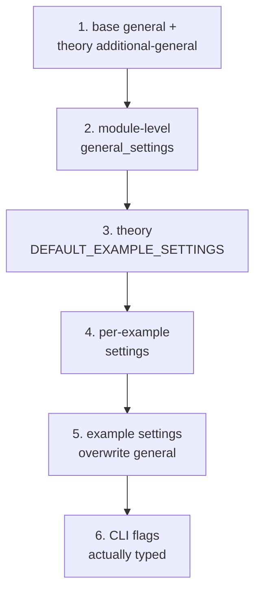

# Settings and the Registry
[← Spec map](./README.md)

> Where settings are declared, the six-step precedence chain, the unknown-setting policy, the
> full setting inventory, the theory registry as a generic discovery mechanism, and the
> error-handling policy stated explicitly.

## Three declaration sites

1. Base general settings, shared by every theory.
2. Each theory's own example defaults, plus an optional additional-general-settings dict for
   theory-specific general flags.
3. A module-level fallback default set that has drifted from (1) and is currently dead — accepted
   as a constructor parameter but never read.

## The precedence chain

Six steps, lowest to highest:

1. Base general settings, overlaid with the theory's additional general settings.
2. The user's module-level `general_settings` (only keys already present in step 1 are merged).
3. The theory's example defaults (`DEFAULT_EXAMPLE_SETTINGS`).
4. The user's per-example settings (only keys already present in step 3 are merged).
5. The per-example settings dict **wholesale overwrites** the general settings on any key
   collision.
6. CLI flags the user **actually typed** — highest precedence.

**Step 6 is the fragile one.** A boolean CLI flag's "not given" state and its "given as false"
state are indistinguishable in the parsed representation, so the settings layer re-scans the raw
command line to determine which flags the user actually typed, aided by a hand-maintained
short-flag-to-long-flag map. **Clustered short flags are parsed correctly by the argument parser
but not detected as user-provided by this re-scan, so their overrides silently fail to apply** —
a documented, known gap, not an oversight worth reproducing.

## Unknown settings: a warning, not an error

An unrecognized setting key produces a **printed warning and is discarded** — not an error — 
unless an opt-in strict mode is enabled, and nothing in the production path enables it. This is a
direct contradiction of the project's own stated fail-fast principle, worth naming explicitly as
an intended change rather than a behavior to preserve.

## The setting inventory

| Setting | Meaning | Type |
|---|---|---|
| `N` | bit-width; state space is `2^N` | positive int, ≤ `MAX_N` |
| `M` | number of time points (temporal theory only) | positive int |
| `contingent` | force atomic propositions to be neither necessary nor impossible | bool |
| `non_empty` | verifier/falsifier sets must be non-empty | bool |
| `non_null` | the null state verifies/falsifies nothing | bool |
| `disjoint` | distinct atoms get disjoint verifier/falsifier content | bool |
| `possible`, `fusion_closure` | closure toggles (unilateral theory only) | bool |
| `max_time` | solver timeout, in **seconds** | positive number |
| `iterate` | number of distinct models to search for | should be a natural number ≥ 1 |
| `expectation` | expected verdict, for the examples-as-tests convention (see [`13-examples-and-cli.md`](./13-examples-and-cli.md)) | bool or unset |
| `solver` | backend override | `"z3"` \| `"cvc5"` |

The `iterate` type deserves a specific note: one theory defaults it to the boolean `False` while
the iterator itself validates it as a positive integer and other call sites compare it against
`1` — it happens to work only because every shipped example sets an explicit integer. Specify it
as a natural number `>= 1` from the start.

**The type column above is documentation, not enforcement.** The settings layer validates
exactly one setting: `N` gets a dedicated check (an integer — `bool` explicitly excluded, since
Python's `bool` subclasses `int` — in `[1, MAX_N]`, raising the settings `ValidationError` or
`RangeError`). A general type-conversion validator and its `TypeConversionError` exist in the
source but are **never called** on any path; every other setting's type is trusted. The `N`
bound is additionally re-checked at semantics construction (see the edge-case table below), so
the range is enforced twice and everything else zero times.

## The registry: a generic, theory-name-free mechanism

The theory registry contains **zero theory-name literals** — it is a generic lookup table; the
actual catalog of theory names lives entirely in the theory library, one layer up (see
[`10-theory-contract.md`](./10-theory-contract.md) for the layering rule this preserves). Each
registered theory entry holds its four components (semantics, proposition, model, operators),
each of which may be supplied directly or as a zero-argument thunk; the four thunks of one theory
share a cache, so a theory's `get_theory()` runs **at most once** no matter how many times its
components are accessed. Registration is idempotent and fails fast on a genuine duplicate name. A
theory that is registered but broken (e.g. an import error inside its package) raises nothing at
registration time — the error is deferred and re-raised at the first access to any of that
theory's four components, i.e. **discovery errors surface at first use, not at startup.**

The registry's complete public surface — a port designing the equivalent interface needs all of
it, not just register/lookup: `register_theory` (idempotent registration, fail-fast on genuine
duplicates), `get_theory_entry` (lookup; unknown names raise a `ValueError` listing the
available theories), `get_registered` (registration-ordered name list), `iter_theories`
(iteration over entries), `set_adapter` (attach or replace a registered theory's adapter
object), and `set_default_theory` / `get_default_theory` (a mutable default-theory name,
`None` until set).

## The error-handling policy, stated as policy

The practiced (if not always documented) rule across the whole system: errors that could produce
a **wrong logical verdict** are handled strictly (the unknown-as-timeout rule described in the
solving specification, `N` validation, model-state extraction, the single-threaded construction
guard); errors in **presentation and metadata** are absorbed with
placeholder fallbacks; **configuration** errors are warnings by default, as described above. This
is a coherent, worth-preserving policy — a port should state it explicitly as a design rule rather
than let it emerge from scattered individual choices, which is how it currently exists.

## The exception taxonomy, mapped onto the policy

Eight dedicated error modules define the hierarchy. Mapping each family onto the
strict/absorb/warn policy (tier assignments verified against the raising/handling call sites,
not the class docstrings):

| Module | Root and notable members | Policy tier |
|---|---|---|
| `models/errors.py` | `ModelError`: `ModelConstraintError`, `ModelSolverError`, `ModelInterpretationError`, `ModelStateError`, `SemanticError`, `PropositionError` | **strict** — verdict-bearing; `SemanticError` guards the `N` range at construction |
| `syntactic/errors.py` | `SyntacticError`: `ParseError` (`SyntaxError`, `UnbalancedParenthesesError`), `ValidationError` (`UnknownOperatorError`, `InvalidFormulaError`, `CircularDefinitionError`, `ArityError`, `DuplicateOperatorError`), `TransformationError` | **strict when raised** — but several members are defined and never raised (`ArityError`, `UnknownOperatorError`, `DuplicateOperatorError`; see [`03-operators.md`](./03-operators.md)); the live failures are raw `TypeError`/`KeyError` |
| `theory_lib/errors.py` | `TheoryError`: theory-load, semantic, formula, operator, subtheory families; the witness family (`WitnessError`, registry/constraint/predicate variants); `Z3IntegrationError` family | **strict** — theory discovery, witness bookkeeping, and Z3 integration all fail loudly |
| `settings/errors.py` | `SettingsError`: `ValidationError`, `TypeConversionError`, `RangeError`, `MissingRequiredError`, `UnknownSettingError`, `TheoryCompatibilityError` | **warn by default** — unknown keys print-and-discard; only the `N` checks raise; `TypeConversionError` is dead (its validator is never called) |
| `iterate/errors.py` | `IterateError`: limit, state, extraction, constraint-generation, isomorphism-check, timeout, validation | **absorb into partial success** — iteration failures stop the search and keep already-yielded models ([`08-iteration.md`](./08-iteration.md)); a failed isomorphism check logs a warning and reports "not isomorphic" |
| `output/errors.py` | `OutputError`: directory, format, IO, strategy, notebook-generation | **absorb** — presentation; fallbacks and placeholders |
| `builder/error_types.py` | `BuilderError` plus 8 subclasses (module-load, validation, model-check, configuration, theory/example-not-found, iteration, output) | **strict** at load/configuration time |
| `builder/errors.py` | a second, parallel `BuilderError` hierarchy (package-oriented: `PackageError` variants) plus re-declarations of several `error_types.py` names | **strict**; see hazard below |

Two porting hazards in the hierarchy itself: **duplicate class names across modules** —
`SemanticError` exists in both `models/errors.py` and `theory_lib/errors.py`,
`ValidationError` in three modules, and the two builder modules re-declare five names against
each other, so catching by unqualified name is ambiguous — and the **defined-but-never-raised
members**, which make the hierarchy look stronger than the behavior it describes. A port should
collapse to one hierarchy with one name per failure kind and raise everything it defines.

## Edge-case behavior, stated as cases

Each row verified by reading the validating (or non-validating) code path:

| Input | Behavior |
|---|---|
| `N` not an int (incl. `bool`) | settings-layer `ValidationError`; independently `SemanticError` at semantics construction |
| `N = 0` or negative | settings-layer `RangeError` (bounds `[1, MAX_N]`); `SemanticError` at construction |
| `N > MAX_N` (20) | same pair — raised *before* the `2^N` state list is materialized, deliberately: an unchecked large `N` would exhaust memory inside an uninterruptible Z3 call |
| empty premise list | accepted, no validation — contributes zero premise constraints; the query degenerates to "is there a model making the conclusions false" |
| empty conclusion list | accepted — the query degenerates to "are the premises jointly satisfiable"; `sat` still prints as a countermodel |
| leftover tokens after parse (`"p q"`) | silently discarded — parses as `p` (parser gap #1, [`02-syntax-and-ast.md`](./02-syntax-and-ast.md)) |
| arity mismatch (`(p \neg q)`) | parses without complaint; fails later as a raw `TypeError` inside constraint generation (parser gap #2) |
| unknown operator name in a formula | bare `KeyError` from the operator collection — `UnknownOperatorError` exists but is not raised |
| unknown theory name at the registry | `ValueError` naming the unknown theory and listing available ones |
| unknown setting key | printed warning, key discarded (the warn tier above) |

## Source files

- [`settings/settings.py`](../../code/src/model_checker/settings/settings.py) —
  `SettingsManager`, the precedence chain, flag-provenance detection
- [`settings/errors.py`](../../code/src/model_checker/settings/errors.py) — the settings error
  hierarchy
- [`models/errors.py`](../../code/src/model_checker/models/errors.py),
  [`syntactic/errors.py`](../../code/src/model_checker/syntactic/errors.py),
  [`theory_lib/errors.py`](../../code/src/model_checker/theory_lib/errors.py),
  [`iterate/errors.py`](../../code/src/model_checker/iterate/errors.py),
  [`output/errors.py`](../../code/src/model_checker/output/errors.py),
  [`builder/error_types.py`](../../code/src/model_checker/builder/error_types.py),
  [`builder/errors.py`](../../code/src/model_checker/builder/errors.py) — the exception
  hierarchy surveyed above
- [`models/semantic.py`](../../code/src/model_checker/models/semantic.py) — the
  construction-time `N` validation backstop
- [`registry.py`](../../code/src/model_checker/registry.py) — `TheoryEntry`, thunk memoization,
  registration
- [`theory_lib/__init__.py`](../../code/src/model_checker/theory_lib/__init__.py) — where the
  registry is populated from the one list of theory-name literals

## Related

- [Constraint generation](./04-constraint-generation.md) — `N` and `max_time` consumed here
- [The theory contract](./10-theory-contract.md) — the layering rule the registry preserves
- [Examples and the CLI](./13-examples-and-cli.md) — where CLI flags become settings overrides
