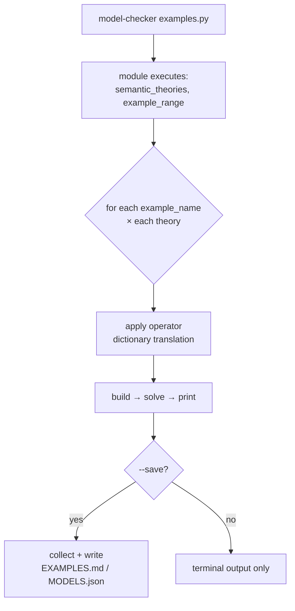

# Examples and the CLI
[← Spec map](./README.md)

> The example-file format — the user's real input language — examples as the executable
> behavioral specification, and the CLI surface.

## The example file: an ordinary module, executed on load

An examples file is **an ordinary Python module, executed on load** — not a data format read by a
parser. The loader requires exactly two module-level names and accepts a third:

| Name | Required | Shape |
|---|---|---|
| `semantic_theories` | yes | `{display_name: TheoryDict}` — one or more theories to run each example under |
| `example_range` | yes | `{example_name: ExampleCase}` — what actually runs |
| `general_settings` | no | a settings override dict |

`TheoryDict` carries the theory's four `get_theory()` components (see
[`10-theory-contract.md`](./10-theory-contract.md)) plus an optional fifth key, `dictionary`: an
operator-rename map applied by **plain string substitution** to every premise and conclusion
before parsing — a mechanism for running the same example text under a theory that uses different
operator tokens. `ExampleCase` is a three-element list: `[premises, conclusions, settings]`.

## Conventions that *are* the behavioral specification

Nothing in the loader enforces these, but every shipped example file follows them, and the
`expectation` setting is the actual oracle:

- `{PREFIX}_CM_{n}` names a countermodel-expected example (`expectation: True` — the argument is
  invalid); `{PREFIX}_TH_{n}` names a theorem (`expectation: False` — the argument is valid).
- A `unit_tests` dict holds the *complete* set of examples in a module, consumed by the test
  suite; `example_range` is a smaller, curated subset selected for interactive/default runs,
  conventionally maintained as a dict literal with most entries commented out.
- Each theory's test suite parametrizes directly over `unit_tests` and rebuilds the five-stage
  pipeline without going through the CLI/builder layer at all — **the examples corpus is the
  executable specification**, not illustrative sample input.

## The CLI surface

One positional argument (the examples file path) plus 17 options.

| Flag | Effect |
|---|---|
| `file_path` | path to the examples file (optional; omitted ⇒ interactive project generation) |
| `--load_theory` | generate a new project from a theory instead of running a file |
| `--contingent` | settings override |
| `--non_null` | settings override |
| `--non_empty` | settings override |
| `--disjoint` | settings override |
| `--maximize` | theory-comparison mode (see [`09-output-and-display.md`](./09-output-and-display.md)) |
| `--save [FMT...]` | enable output saving; no format given = both markdown and json |
| `--sequential` | **registered but nonfunctional** — parses successfully, then raises a not-implemented error before doing anything |
| `--align_vertically` | vertical temporal display (the temporal theory only) |
| `--z3` | select the Z3 backend (mutually exclusive with `--cvc5`) |
| `--cvc5` | select the cvc5 backend |
| `--print_constraints` | show solver constraints |
| `--print_z3` | show raw solver output |
| `--print_impossible` | include impossible states in display |
| `--version` | print version and exit |
| `--upgrade` | upgrade the installed package |

Every option except the backend pair (`--z3`/`--cvc5`) also has a one-letter short form. The
short forms matter to a port only through the flag-provenance re-scan gap described in
[`12-settings-and-registry.md`](./12-settings-and-registry.md) (clustered short flags parse but
their overrides silently fail to apply).

The `--sequential` entry is marked nonfunctional deliberately: the flag exists, is documented
elsewhere in the repository as working, and is registered on the parser — but its implementation
was removed and the code path now raises unconditionally. A guard test that scans documentation
for invocation examples and checks flag registration cannot catch this class of gap (the flag
*is* registered); it is worth naming explicitly so a port does not treat "the flag exists" as
evidence the feature does.

## Project generation, Jupyter, and packaging

These subsystems are Python packaging/UX machinery of the kind
[`14-porting-notes.md`](./14-porting-notes.md)'s mechanism-not-to-reproduce table classifies —
a port designs its own scaffolding, notebook story, and packaging. Three invariants survive the
cut: project generation copies a theory by explicit manifest, never a verbatim tree copy;
Jupyter integration is a dependency-gated layer that degrades to typed stubs; packaging ships
by explicit allowlist, enforced by the executable packaging contract named in
[`10-theory-contract.md`](./10-theory-contract.md).

## Source files

- [`builder/validation.py`](../../code/src/model_checker/builder/validation.py) — `TheoryDict`
  and `ExampleCase` validation
- [`builder/translation.py`](../../code/src/model_checker/builder/translation.py) — the
  `dictionary` operator-rename substitution
- [`__main__.py`](../../code/src/model_checker/__main__.py) — the argument parser, the 17-option
  surface
- [`builder/module.py`](../../code/src/model_checker/builder/module.py) — `BuildModule`, module
  loading and execution flow
- [`builder/project.py`](../../code/src/model_checker/builder/project.py) — `BuildProject`,
  project generation
- [`jupyter/`](../../code/src/model_checker/jupyter/) — the notebook integration layer

## Related

- [Output and display](./09-output-and-display.md) — where `--save`/`--maximize` route to
- [The theory contract](./10-theory-contract.md) — the `TheoryDict` shape this file's loader
  validates
- [Settings and the registry](./12-settings-and-registry.md) — the full precedence chain these
  flags feed into
