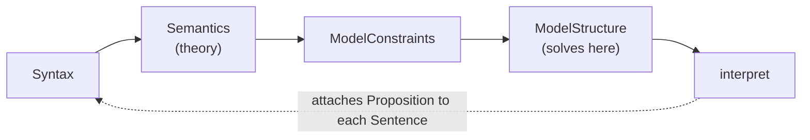

# Python ModelChecker Architecture Specification

> A concise description of the core architecture for the python implementation of the
> ModelChecker, including the modular compiler design for generating SMT-LIB constraints from
> sentences expressed in an extensible DSL and the host of features and tools for adjusting and
> evaluating the countermodels that the ModelChecker finds.

## Audience and purpose

This tree describes the Python ModelChecker at a level of generality suitable for designing a
reimplementation in another language. It states what the system does — its data shapes,
algorithms, and contracts — and, where the Python implementation itself is a weak model for a
port, says so explicitly and names the alternative. It makes **no design decisions for any
target language**: no type signatures, no module layout, no library choices. Read it as a
specification of observable behavior, not as a description of Python source code to transliterate.

## Scope

- Version 1.3.3 of the `model_checker` package.
- ~46k lines of production Python across 11 packages, plus ~40.7k lines of tests in 174 test
  files.
- Exactly two runtime dependencies: `z3-solver` (the SMT backend) and `networkx` (isomorphism
  checking during model iteration).
- The `oracle/` tree at the repository root — a standalone differential-testing harness for one
  theory — is out of scope. It is quality infrastructure (N-version programming), not part of the
  framework.

## How to read this

Start at [`01-pipeline.md`](./01-pipeline.md): it lays out the five-stage construction pipeline
that every other document is a satellite of. End at
[`14-porting-notes.md`](./14-porting-notes.md): it collects what to preserve, what not to
reproduce, and what is verified broken, plus a warning about the reliability of the repository's
own prose documentation.
Keep [`00-glossary.md`](./00-glossary.md) at hand as the reference companion — one canonical
definition per load-bearing term, each linking to its treating document. The lettered documents
(`03a`, `07a`, `11a`) are reference satellites of their numbered parents — consult them when the
parent points there; they do not change the 01 → 14 reading order.

## Pipeline at a glance

Everything else in this tree — the theory library, iteration, output, settings, the CLI — orbits
this five-stage spine. Details in [`01-pipeline.md`](./01-pipeline.md).

## Map

### The compiler pipeline

| Document | Covers |
|---|---|
| [`01-pipeline.md`](./01-pipeline.md) | The five-stage spine, the object graph, construction order, aliasing and cycles |
| [`02-syntax-and-ast.md`](./02-syntax-and-ast.md) | The surface DSL, the parser, the `Sentence` node and its four-phase lifecycle, interning |
| [`03-operators.md`](./03-operators.md) | `Operator` / `DefinedOperator` / `OperatorCollection`, the six semantic methods, definitional expansion |
| [`03a-operator-semantics.md`](./03a-operator-semantics.md) | The actual truth/falsity/verification/falsification conditions of every operator, all four theories |
| [`04-constraint-generation.md`](./04-constraint-generation.md) | `ModelConstraints`, the four constraint groups, the countermodel framing, double dispatch |
| [`05-state-encoding.md`](./05-state-encoding.md) | The bit-vector state space, mereology, the encoding table, finite quantifier expansion |

### Solving and semantic values

| Document | Covers |
|---|---|
| [`06-solver-and-results.md`](./06-solver-and-results.md) | Solver backends, tracked assertions, unknown-as-timeout, per-example isolation |
| [`07-propositions.md`](./07-propositions.md) | The proposition contract, the three evaluation schemes, post-solve extraction |
| [`07a-worked-trace.md`](./07a-worked-trace.md) | One valid example and one countermodel traced through all five stages, with captured constraints and model — the golden test |

### Tools built on a solved model

| Document | Covers |
|---|---|
| [`08-iteration.md`](./08-iteration.md) | The iteration algorithm, two-tier distinctness, model rebuild, isomorphism, termination |
| [`09-output-and-display.md`](./09-output-and-display.md) | Output modes, capture-then-format, the display contract, `--maximize` |

### The extensible theory library

| Document | Covers |
|---|---|
| [`10-theory-contract.md`](./10-theory-contract.md) | What a theory must supply, the layering rule, the executable conformance contracts |
| [`11-theory-catalog.md`](./11-theory-catalog.md) | The four shipped theories, the two families, a worked operator walkthrough |
| [`11a-exclusion-witnesses.md`](./11a-exclusion-witnesses.md) | The exclusion theory's Skolem witness-function mechanism, specified completely |

### Configuration and the user surface

| Document | Covers |
|---|---|
| [`12-settings-and-registry.md`](./12-settings-and-registry.md) | Settings declaration and precedence, the theory registry, error-handling policy |
| [`13-examples-and-cli.md`](./13-examples-and-cli.md) | The example-file format, examples as the executable specification, the CLI surface |

### Reading this as a port

| Document | Covers |
|---|---|
| [`14-porting-notes.md`](./14-porting-notes.md) | Semantics to preserve, mechanism not to reproduce, known defects, dead code, documentation reliability |
| [`00-glossary.md`](./00-glossary.md) | Canonical definitions of the load-bearing terms, alphabetical |

## Conventions

- **Codebase links** are relative and file-level, from this flat directory into
  `../../code/src/model_checker/{package}/{file}.py`. They never carry line anchors, which rot on
  the next edit — the relevant symbol is named in prose instead. Directory links are used only
  where a package as a whole, not one file, is the subject.
- **Diagrams** are [Mermaid](https://mermaid.js.org/) fenced blocks, rendered natively by GitHub.
  Every diagram shows a mechanism — flow, layering, lifecycle, or relationship — never a decorated
  list.
- **Executable contracts over prose.** Four test suites are authoritative over any prose
  documentation anywhere in the repository, including this tree, should they ever diverge:
  layering (`test_layering.py`), theory conformance (`test_theory_conformance.py`), the CLI
  flag/docs matrix (`test_docs_flag_matrix.py`), and packaging (`code/tests/packaging/`). See
  [`10-theory-contract.md`](./10-theory-contract.md) for where these are cited in full.
- Every document's second line is a back-link to this map, and every document carries a
  `## Source files` section listing the codebase paths it describes.
