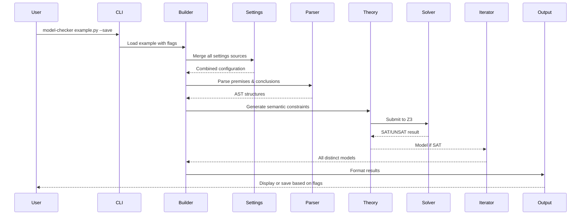
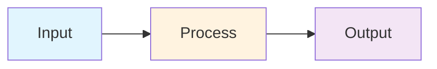

# Plan 095: Architecture Documentation Refactor

**Status**: Completed
**Created**: 2025-01-12
**Updated**: 2025-01-17
**Dependencies**: Plan 094 (Documentation Cross-Linking)

## Executive Summary

This plan details the comprehensive refactoring of the Docs/methodology/ directory (to be renamed to Docs/architecture/) to create a structured, accessible architectural documentation that mirrors the model_checker package structure. Each major package will have a corresponding conceptual document with flowcharts and clear explanations, targeting a less technical audience while maintaining links to technical implementation details.

## Current State Analysis

### Existing Docs/methodology/ Structure
```
methodology/
├── README.md           # General overview
├── ARCHITECTURE.md     # System architecture (needs visual enhancement)
├── BUILDER.md         # Builder pipeline concepts
├── ITERATOR.md        # Model iteration concepts
├── JUPYTER.md         # Interactive development
├── OUTPUT.md          # Output generation concepts
├── SEMANTICS.md       # Semantic framework concepts
└── SYNTACTIC.md       # Parsing and syntax concepts
```

### Issues with Current Structure
1. Not all packages have corresponding conceptual docs
2. Missing visual diagrams and flowcharts
3. Inconsistent coverage depth
4. Some documents too technical for target audience
5. Poor alignment with actual package structure

## Proposed New Structure

### Docs/architecture/ (renamed from methodology/)
```
architecture/
├── README.md              # Architecture overview & navigation hub
├── PIPELINE.md            # Complete data flow from inputs to outputs
├── BUILDER.md             # Builder pipeline concepts & flows
├── MODELS.md              # Model structure & constraint concepts
├── ITERATE.md             # Iteration strategy & discovery flows
├── SETTINGS.md            # Configuration hierarchy & flow
├── OUTPUT.md              # Output generation pipeline
├── JUPYTER.md             # Interactive exploration concepts
├── SYNTACTIC.md           # Parsing & AST construction flows
├── THEORY_LIB.md          # Theory framework & extensibility
└── UTILS.md               # Shared utilities & patterns
```

## Implementation Phases

### Phase 1: Directory Restructure
**Timeline**: Day 1

1. Rename methodology/ to architecture/
2. Rename ARCHITECTURE.md to PIPELINE.md with focus on complete data flow:
   - User inputs (premises, conclusions, settings, flags)
   - Processing through each component
   - Output generation (terminal display or file with --save)
3. Keep all documents directly in architecture/ (no subdirectories)
4. Rename documents to match package names (BUILDER.md, MODELS.md, etc.)
5. Update all cross-references to new paths

### Phase 2: Architecture Overview (README.md)
**Timeline**: Day 2

Create comprehensive navigation hub with:

```markdown
# ModelChecker Architecture Documentation

## Overview
[High-level description of the architecture documentation purpose]

## System Pipeline
- **[Data Flow Pipeline](PIPELINE.md)** - Complete flow from inputs to outputs
- **[Technical Implementation](../../Code/docs/ARCHITECTURE.md)** - Code-level details

## Core Components

### Pipeline Orchestration
- **[Builder Pipeline](BUILDER.md)** - Model checking workflow orchestration
  - Links to: [Technical Docs](../../Code/src/model_checker/builder/README.md)
- **[Settings Management](SETTINGS.md)** - Configuration hierarchy & precedence
  - Links to: [Technical Docs](../../Code/src/model_checker/settings/README.md)

### Model Framework
- **[Model Structure](MODELS.md)** - Semantic models & constraints
  - Links to: [Technical Docs](../../Code/src/model_checker/models/README.md)
- **[Model Iteration](ITERATE.md)** - Discovery of distinct models
  - Links to: [Technical Docs](../../Code/src/model_checker/iterate/README.md)

### Input/Output
- **[Syntax Processing](SYNTACTIC.md)** - Formula parsing & AST
  - Links to: [Technical Docs](../../Code/src/model_checker/syntactic/README.md)
- **[Output Generation](OUTPUT.md)** - Multi-format result production
  - Links to: [Technical Docs](../../Code/src/model_checker/output/README.md)

### Extensions
- **[Theory Framework](THEORY_LIB.md)** - Semantic theory architecture
  - Links to: [Theory Library](../../Code/src/model_checker/theory_lib/README.md)
- **[Interactive Tools](JUPYTER.md)** - Notebook & exploration tools
  - Links to: [Jupyter Docs](../../Code/src/model_checker/jupyter/README.md)

### Utilities
- **[Shared Utilities](UTILS.md)** - Common patterns & helpers
  - Links to: [Utils Docs](../../Code/src/model_checker/utils/README.md)
```

### Phase 3: Pipeline Document (PIPELINE.md)
**Timeline**: Days 3-4

Create PIPELINE.md focusing on complete data flow from user inputs to outputs:

#### Core Focus: Input → Processing → Output
The PIPELINE.md document will trace the complete journey of:
- **Inputs**: Premises, conclusions, settings, CLI flags
- **Processing**: Through builder, parser, theory, solver, iterator
- **Outputs**: Terminal display or file output (when --save flag or save setting is true)

#### 3.1 User Input to Output Flow
```mermaid
graph TB
    subgraph "User Inputs"
        Premises[Premises<br/>e.g., 'A', 'A → B']
        Conclusions[Conclusions<br/>e.g., 'B']
        Settings[Settings<br/>N=4, max_time=30]
        Flags[CLI Flags<br/>--verbose, --save]
    end

    subgraph "Processing Pipeline"
        Builder[Builder Orchestration]
        Parser[Formula Parsing]
        Theory[Constraint Generation]
        Solver[Z3 Solving]
        Iterator[Model Discovery]
    end

    subgraph "Output Options"
        Terminal[Terminal Display]
        FileOut[File Output<br/>(if --save)]
    end

    Premises --> Builder
    Conclusions --> Builder
    Settings --> Builder
    Flags --> Builder
    Builder --> Parser
    Parser --> Theory
    Theory --> Solver
    Solver --> Iterator
    Iterator --> Terminal
    Iterator --> FileOut
```

#### 3.2 Detailed Processing Pipeline


### Phase 4: Package-Specific Documents
**Timeline**: Days 5-8 (2-3 packages per day)

#### 4.1 Builder Package (BUILDER.md)
```markdown
# Builder Pipeline Architecture

## Overview
The Builder orchestrates the entire model checking pipeline...

## Pipeline Flow
[Mermaid diagram showing BuildModule → BuildExample → Model generation]

## Component Coordination
[Diagram showing how Builder coordinates Parser, Theory, Solver, Output]

## Configuration Management
[Flow showing settings precedence and validation]

## Technical Implementation
See [Builder Package Documentation](../../../Code/src/model_checker/builder/README.md)
```

#### 4.2 Models Package (MODELS.md)
```markdown
# Model Structure & Constraints

## Conceptual Overview
Models represent semantic structures...

## Model Components
[Diagram showing States, Worlds, Relations, Valuations]

## Constraint Generation Flow
[Flowchart from semantic requirements to Z3 constraints]

## Technical Details
See [Models Implementation](../../../Code/src/model_checker/models/README.md)
```

#### 4.3 Iterate Package (ITERATE.md)
```markdown
# Model Iteration Strategy

## Discovery Process
[Flowchart showing iteration loop with difference detection]

## Isomorphism Prevention
[Diagram explaining structural equivalence detection]

## Progress Tracking
[Visual representation of iteration progress]

## Implementation
See [Iterator Package](../../../Code/src/model_checker/iterate/README.md)
```

#### 4.4 Settings Package (SETTINGS.md)
```markdown
# Configuration Architecture

## Settings Hierarchy
[Diagram showing precedence: CLI → Example → User → Theory → System]

## Validation Flow
[Flowchart of settings validation and warning system]

## Theory-Specific Settings
[Table/diagram of settings per theory]

## Technical Reference
See [Settings Package](../../../Code/src/model_checker/settings/README.md)
```

#### 4.5 Output Package (OUTPUT.md)
```markdown
# Output Generation Pipeline

## Strategy Pattern Architecture
[Diagram showing Formatters × SaveStrategies matrix]

## Format Generation Flow
[Flowchart from model data to final output]

## Interactive Save Mode
[Sequence diagram of user interaction]

## Implementation Details
See [Output Package](../../../Code/src/model_checker/output/README.md)
```

#### 4.6 Syntactic Package (SYNTACTIC.md)
```markdown
# Parsing & Syntax Processing

## Parsing Pipeline
[Flowchart: Input → Tokenize → Parse → AST → Sentences]

## Operator Resolution
[Diagram showing operator lookup and binding]

## Formula Normalization
[Flow showing Unicode → LaTeX conversion]

## Technical Documentation
See [Syntactic Package](../../../Code/src/model_checker/syntactic/README.md)
```

#### 4.7 Theory Library (THEORY_LIB.md)
```markdown
# Theory Framework Architecture

## Theory Structure
[Diagram showing theory interface and implementations]

## Extension Points
[Flowchart for adding new theories]

## Theory Comparison
[Visual comparison of different semantic approaches]

## Implementation Guide
See [Theory Library](../../../Code/src/model_checker/theory_lib/README.md)
```

#### 4.8 Jupyter Package (JUPYTER.md)
```markdown
# Interactive Development Architecture

## Component Structure
[Diagram showing UI components and backend integration]

## Interaction Flow
[Sequence diagram of user interactions]

## Notebook Generation
[Pipeline from exploration to saved notebook]

## Technical Details
See [Jupyter Package](../../../Code/src/model_checker/jupyter/README.md)
```

#### 4.9 Utils Package (UTILS.md)
```markdown
# Shared Utilities & Patterns

## Common Patterns
[Diagram of shared functionality]

## Utility Categories
[Organization of helper functions]

## Cross-Package Usage
[Dependency graph of utility usage]

## Implementation
See [Utils Documentation](../../../Code/src/model_checker/utils/README.md)
```

### Phase 5: Visual Enhancement Guidelines
**Timeline**: Ongoing during Phases 3-4

#### Diagram Standards
1. **Tool**: Mermaid for all diagrams (GitHub native rendering)
2. **Style**: Consistent colors and shapes
3. **Complexity**: Each diagram focuses on one concept
4. **Accessibility**: Include text descriptions

#### Diagram Types per Document
- **Flowcharts**: Process flows and pipelines
- **Sequence Diagrams**: Interaction sequences
- **Component Diagrams**: Structural relationships
- **State Diagrams**: State transitions where relevant

#### Example Mermaid Template


### Phase 6: Cross-Reference Updates
**Timeline**: Day 9

1. Update all references from methodology/ to architecture/
2. Add bidirectional links between conceptual and technical docs
3. Ensure navigation headers in all documents
4. Verify all relative paths

### Phase 7: Review and Polish
**Timeline**: Day 10

1. Non-technical review for accessibility
2. Technical review for accuracy
3. Visual review of all diagrams
4. Navigation testing
5. Final formatting pass

## Implementation Progress

### Completed (Phase 1-3)
- [x] Renamed methodology/ to architecture/
- [x] Renamed ARCHITECTURE.md to PIPELINE.md
- [x] Rewrote PIPELINE.md to focus on data flow from inputs to outputs
- [x] Created SETTINGS.md with configuration hierarchy and flowcharts
- [x] Created OUTPUT.md with output generation architecture
- [x] Created BUILDER.md with builder orchestration flows
- [x] Created MODELS.md with model structure and constraints
- [x] Created ITERATE.md with iteration strategy flows
- [x] Created SYNTACTIC.md with parsing and AST construction
- [x] Created SEMANTICS.md with semantic framework concepts
- [x] Added Mermaid flowcharts to all new documents

### Completed (2025-01-17)
- [x] Create JUPYTER.md - Interactive exploration architecture
- [x] Create THEORY_LIB.md - Theory framework architecture  
- [x] Create UTILS.md - Shared utilities and patterns
- [x] Update architecture/README.md as comprehensive navigation hub

### Completed (2025-01-17) - Final Tasks
- [x] Update cross-references from methodology/ to architecture/
- [x] Test all cross-references
- [x] Review documents for accessibility

## Success Criteria

### Structure
- [x] Directory renamed from methodology/ to architecture/
- [x] All model_checker packages have corresponding architecture docs
- [x] All docs in architecture/ directory (no subdirectories)
- [x] Consistent navigation patterns

### Content Quality
- [x] Accessible language for non-technical audience
- [x] Clear links to technical documentation

### Navigation
- [x] README.md serves as effective navigation hub
- [x] All cross-references work correctly
- [x] Clear path from conceptual to technical docs

## Risk Mitigation

1. **Scope Creep**: Strict adherence to package mapping
2. **Diagram Complexity**: Review each diagram for clarity
3. **Technical Jargon**: Have non-technical reviewer
4. **Broken Links**: Automated link checking
5. **Inconsistency**: Use templates for each package doc

## Notes

- Focus on accessibility without sacrificing accuracy
- Each package document should stand alone but link to others
- Diagrams should tell the story visually
